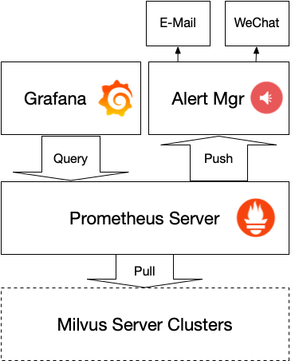
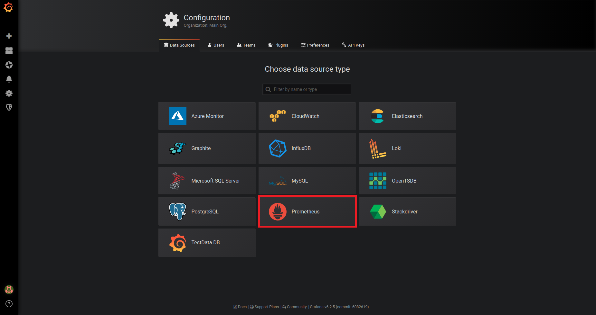
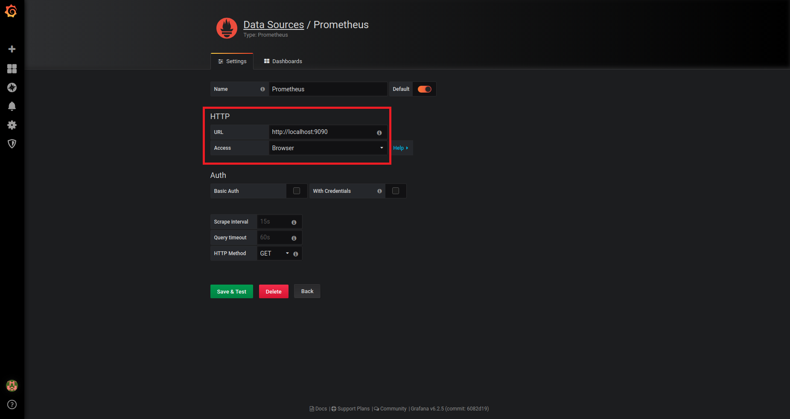
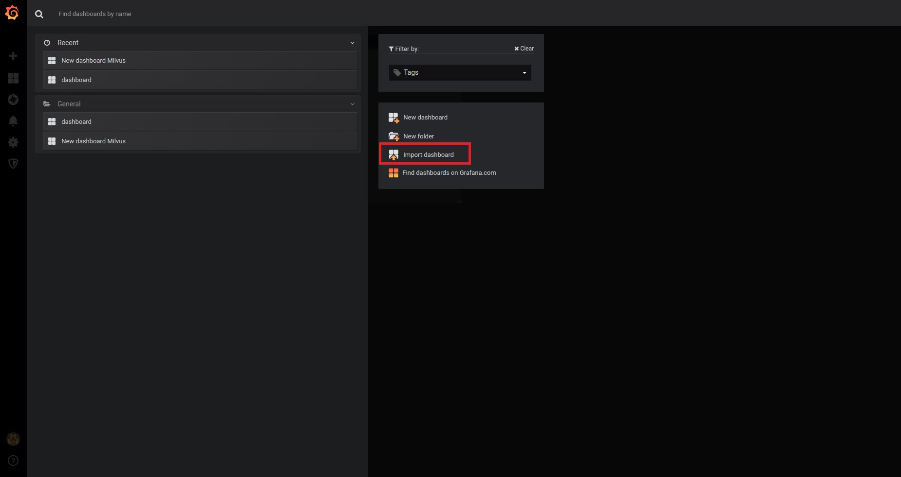
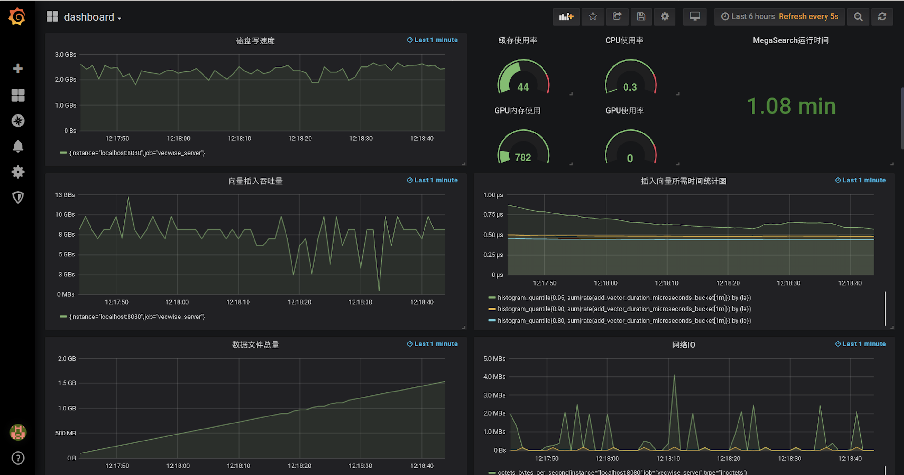

# Milvus User Guide

## Preface

### Overview
Milvus is a full-winged, reliable feature vector database that supports indexing large scale high-dimension vectors in seconds. About Milvus benefits and values, please visit [Product Benefits](https://github.com/milvus-io/docs/blob/dev/zh-CN/MilvusHighlights).

This guide introduces configuring and managing Milvus, helping you get a deeper understanding of Milvus charateristics and features.

If you need customer support, you may contact us by email: support@zilliz.com.

For more detailed knowledge about Milvus and feature vector database, go to [Feature Vector Database Introduction](https://github.com/milvus-io/docs/blob/dev/zh-CN/MilvusIntro.md).

### Statement
The documentation is for reference only. All content in the documentation doesn't constitue as any explicite or implicite guarantee.

### Key concepts
- Feature vector database

- Milvus file


### Conventions used in this guide

| Convention       |    Description                                |
|-----------|-----------------------------------------|
| bold      | Bold type indicates headlines, or content that needs to be emphasized.    |
| italic    | Italic type indicates file paths, file names, UI strings, or placeholder variables for which you supply particular values. |
| Consolas  | Consolas type indicates code examples within a paragraph |
| Note      | Note is a supplimentary explanation to an action or a logic.          |


## Quick start
For how to install Milvus and run an example program, you may read: [Milvus Quick Start](https://github.com/milvus-io/docs/blob/dev/zh-CN/QuickStart.md).


## Configuring Milvus

### Milvus file introduction
After you have successfully started Milvus server, you can see a Milvus file under the path *home/$USER/milvus*, which contains the following child files:

- *milvus/db* (database storage)
- *milvus/logs* (log storage)
- *milvus/conf* (configuration file)
    - *server_config.yaml* (service configuration file)
    - *log_config.conf* (log configuration file)
- *milvus/test* (test scripts)

### Configuring Milvus service

Follow these procedures to configure Milvus service:

1. Follow the path *home/$USER/milvus/conf*, and open Milvus service configuration file *server_config.yaml*.

2. Modify the parameters in the file.

   1) Click file *server_config*, and configure service parameters.
   
     | Parameter            | Description                          | Reference value           |
     |----------------|-----------------------------------|-------------------|
     | address        | The IP address that Milvus server monitors      | 0.0.0.0           |
     | port           | The port that Milvus server monitors, default is 19530 | 1025 ~ 65534 |            
     | gpu_index      | Current GPU, default is 0          | 0 ~ GPU number ~1                |
     | mode           | Milvus deployment method                    | single / cluster |            
                                                                                                                     
   2）Click file *db_config*, and configure database parameters.
   
     | Parameter               | Description                            | Reference value    |
     |-------------------|-------------------------------------|----------|
     | db_path           | Directory of Milvus database files            |    ？    |
     | db_backend_url    | Meta database URI                         | http://127.0.0.1  |
     | index_building_threshold | index building trigger value       |  1024（MB）  |

   3）Click file *metric_config*, and configure monitor parameters.
   
     |Parameter               |  Description                             | Reference value     |
     |-------------------|-------------------------------------|----------|
     | is_startup        | Select if or not to turn on the monitoring system          | on / off |
     | collector         | Connected monitoring system               | Prometheus             |
     | collect_type      | Data collecting type of Prometheus     |   pull / push          |
     | port              | Port to visit Prometheus       | 8080                   |
     | push_gateway_ip_address | IP address of push gateway   | 127.0.0.1             |
     | push_gateway_port       | Port of push gateway   |  9091                 |

   4）Click file *cache_config*, and configure the parameter.
   
     |  Parameter                | Description                             | Reference value     |
     |-------------------|-------------------------------------|----------|
     | cpu_cache_capacity |用于cache的内存量，默认值为16GB       |  0 ~ 机器内存总量 |

3. Restart Milvus Docker.

   ```
   $ docker restart <container id>
   ```


## Creating a table 
> Note：All the following actions are executed in Python. For other languages, Milvus supports RESTful and RPC.

### Prerequisites
When you have finished the installation and basic configuration of Milvus, you may go on and create a table to insert data into. Before that, ensure you have：

1. Imported pymilvus.

   ```python
   # Import pymilvus
   >>> from milvus import Milvus, Prepare, IndexType, Status

   ```
2. Connected Milvus to your local server.

   ```
   # Connect Milvus to server
   >>> milvus = Milvus()
   >>> milvus.connect(host='SERVER-HOST', port='SERVER-PORT')
   Status(message='connected!', code=0)

   ```
### Creating a table
This section shows you how to create a table in Milvus. To make it easier to understand, all task procedures are based on an example of  Table test01 creation. Here are all related parameters. You can set parameter values to your needs.

|  Parameter  |  Description  |  Type   |  Reference value   |
| ------------| --------------| --------| ---------|
| table_name  | Name of the table you want to create (table name is made of numbers, letters and _)| String | 'table name' |
| dimension   | Vector dimensions | Integer | 0 < dimension <= 10000, usually set to 128, 256 or 518
| index_type  |2 types of indexing methods: 1. `FLAT` - 精确向量索引类型；2. `INVALID` - 基于K-means的向量索引，精度有损失，但搜索速度更快；|IndexType|FLAT / IVFLAT / INVALID(default)|

> 注意：如果没有GPU，将index_type设置成`IVFLAT`，系统将报错。

1. Prepare table parameters.
  
   ```
   # Prepare param
   >>> param = {'table_name'='test01', 'dimension'=256, 'index_type'=IndexType.FLAT}
   ```
   
2. Create Table test01.

   ```
   # Create a table
   >>> milvus.create_table(param)
   Status(message='Table test01 created!', code=0)
   ```
   
3. Confirm the information of the table just created.
   ```
   # Confirm table info.
   >>> status, table = milvus.describe_table('test01')
   >>> status
   Status(message='Describe table successfully!')
   >>> table
   TableSchema(table_name='test01',dimension=256, index_type=1, store_raw_vector=False)
   
   ```                        


## Inporting vectors
When you have successfully tables in Milvus, you can start inserting data into the table. Of course, one prerequisite of this step is that you already have proper multi-dimensional vectors. Before importing vectors to the table, get familiar with the related parameters:

|Parameter|Description|Type|Reference value|
|---------|-----------|----|-----|
|table_name| Name of the table you want to create (table name is made of numbers, letters and _)| String| 'table name'|
|records| A list of vectors to insert into the table. Vector value should be a float (decimal), with the same dimension as that of the table |2-dimension type|[[0.1, 0.2, ...], ...]

Following the above mentioned example, below content demonstrates how to insert 20 256-dimensional vectors(represented by "records" in the code) into Table test01:

```
# Import vectors
>>> status, ids = milvus.add_vectors(table_name='test01', records=vectors)
>>> status
Status(code=0, message='Success')
>>> ids  # 20 ids returned
23455321135511233
12245748929023489
...
```


## Searching with Milvus
Now, you have inserted vectors into Table test01, you can start searching with Milvus. In addition, you are allowed not only to search multiple data sets, and also to search within a specific range. Before the search, familiarize yourself with seach related parameters:

|Parameter|Description|Type|Reference value|
|---------|-----------|----|-----|
|table_name|Name of the table you want to create (table name is made of numbers, letters and _)|String|'table name'|
|top_k| Top k most similar results of target vector| Integer | 0 < top_k <= 10000|
|query_records| A list of vectors to insert into the table. Vector value should be a float (decimal), with the same dimension as that of the table |2-dimension type | [[0.1, 0.2, ...], ...] |
|query_ranges (optional)| Search range, for example you can search within a specific date range. The default value is 'None' (no range), meaning to search the entire database|list[tuple]|[('2019-01-01', '2019-01-02'), ...]|

> Note: Currently, only date range is supported in query_ranges. The date format is 'yyyy-mm-dd'. The date range [2019.1.1, 2019.1.3) contains 2019.1.1 and 2019.1.3.

Suppose you want to search the top 10 most similar vectors of 5 256-dimensional vectors (represented by "query_records" in below codes), you may: 

   ```
   # Search 5 vectors
   >>> status, results = milvus.search_vectors(table_name='test01', query_records=q_records, top_k=10)
   >>> status
   Status(message='Search vectors successfully!', code=0)
   >>> results # Searched top_k vectors
   [[QueryResult(id=1561709418638204004, score=62.554189514479866), ..., ],
   [QueryResult(id=1561709418638204018, score=59.801433231755965), ..., ],
   ...
   ]
   ```
 

## Deleting a table
You may delete a table in Milvus when necessary. For example, to delete Table test01, you only need to: 

```
# Delete table
>>> milvus.delete_table(table_name='test01')
Status(message='Delete table successfully!', code=0)
```


## Searching a table

### Searching table name
通过以下操作，你可以查询Milvus数据库中所有表格的名字：

```python
>>> status, tables = milvus.show_tables()
>>> status
Status(message='Show tables successfully!', code=0)
>>> tables
['test01', 'others', ...]
```

### Searching table information
你可以按此方式查询数据库中某张表格的信息：

```python
>>> status, table = milvus.describe_table('test01')
>>> status
Status(message='Describe table successfully!')
>>> table
TableSchema(table_name='test01',dimension=256, index_type=1, store_raw_vector=False)
```

### 查询表格是否存在
请按照以下方式查询某张表格是否存在：

```python
>>> milvus.has_table(table_name='test01')
True
```
> 注意：如果查询的表格已经不存在，则以上代码中返回值为False。


> 注意：若要了解更多Milvus操作，你可以参照[Milvus Python SDK](https://pypi.org/project/pymilvus)和[使用示例](https://github.com/milvus-io/pymilvus/blob/master/examples/example.py)。


## 监控与告警
### 监控告警概述
如果你想跟踪数据库系统运行表现，你可以选择为Milvus创建监控中心。你可以自行搭建，也可以直接使用我们提供的基于开源监控框架Prometheus的Milvus监控中心。其主要工作流程如下：

Milvus server收集数据 > 利用pull模式把所有数据导入Prometheus > 通过Grafana展示各项监控指标。

一旦发生告警，Prometheus会将告警信息可以推送给AlertManager，并通过Email或者WeChat通知用户。告警系统架构如下：




### 监控安装设置

1. 安装Prometheus和Grafana。

   - [安装Prometheus Server](https://github.com/prometheus/prometheus#install)

   - [安装Grafana](http://docs.grafana.org)

2. 设置Prometheus。

   1）打开prometheus根目录下的prometheus.yml设置文件，并对alerting, rule_files和scrape_configs文件做如下跟新：
   
      ```yaml
      # my global config
      global:
        scrape_interval:     15s # Set the scrape interval to every 1 seconds. Default is every 1 minute.
        evaluation_interval: 15s # Evaluate rules every 15 seconds. The default is every 1 minute.
        # scrape_timeout is set to the global default (10s).

      # Alertmanager configuration
      alerting:
        alertmanagers:
        - static_configs:
          - targets: ['localhost:9093']

      # Load rules once and periodically evaluate them according to the global 'evaluation_interval'.
      rule_files:
         - "serverdown.yml" # add alerting rules

      # A scrape configuration containing exactly one endpoint to scrape:
      # Here it's Prometheus itself.
      scrape_configs:
        # The job name is added as a label `job=<job_name>` to any timeseries scraped from this config.
        - job_name: 'prometheus'

          # metrics_path defaults to '/metrics'
          # scheme defaults to 'http'.

          static_configs:
          - targets: ['localhost:9090']
  
  	   # scrape metrics of server
        - job_name: 'milvus_server'
          scrape_interval: 1s
          static_configs:
          - targets: ['localhost:8080']
    
  	      # under development
        - job_name: 'pushgateway'
          static_configs:
          - targets: ['localhost:9091']
      ```
   
   2）在prometheus根目录下创建serverdown.yml文件，内容如下：

      ```yaml
      groups:
      - name: milvus
        rules:
          - alert: MilvusServerDown
            expr: up{job="milvus_server"}
            for: 1s
            labels:
              serverity: page
      ```

3. 设置Grafana

   1）打开terminal，执行以下命令
   
      ```
      $ docker run -i -p 3000:3000 grafana/grafana
      ```
   
   2）登录Grafana网页(localhost:3000)，在data source type选项框选择Prometheus。
   
      
   
   3）在HTTP区域，将URL设置成Prometheus的服务器地址http://localhost:9090, 将ACCESS设置成Browser，点击Save & Test。
   
      
   
   4）点击页面左上角的New dashboard。
   
      
   
   5）点击右侧的Import dashboard。
   
      
   
   6）下载json配置文件，并将其导入系统。
   
      

   成功之后，将会出现我们提供的监控面板：
   
   


### 监控指标
在Milvus监控系统的GUI控制板上，你可以查看监控数据库的各项指标，实时了解数据库运行表现。

以下是控制板上可以查看的监控项：

|    监控项       |      说明                        |
|----------------|----------------------------------|
| **系统指标**    |                                  |
| GPU利用率       |    实例GPU的利用率                |
| 显存使用量      |    实例显存的使用量                |
| CPU利用率       |    CPU使用百分率                  |
| 内存使用量      |     内存使用量                     |
| 网络IO          |    每秒钟网口的读写速度            |
| 磁盘读写速度     |    磁盘写入速度                   | 
| **Milvus指标**  |                                  |
| 数据插入速度     |         每秒钟插入数据总量        |
| 数据文件总量     |       Milvus所存数据文件总量      |
| 数据总量        |Milvus所存数据总量                 |
| 每分钟查询率    |  每分钟完成的查询数量              |
| 查询响应时间     |      查询的返回时长               |
| 向量检索时间统计  |    单条向量查询的时长统计         |
| 连接数          |  当前连接到Milvus服务器的客户端数量 |
| 运行时长        |   Milvus服务器正常运行的分钟数      |
| 缓存利用率       |    已用缓存占比                   |

### 设置监控频率
目前，Milvus监控默认的监控频率为：1次/秒，你也可以[更改监控设置](https://prometheus.io/docs/prometheus/latest/configuration/configuration/)。


### 设置告警规则
你可以为Milvus设置告警规则，比如：当服务器无法正常工作时，会立即发邮件通知相关用户。你可以按照以下操作进行：

   1）在Alertmanager根目录下创建milvus.yml文件，内容如下：

      ```
      global:
        resolve_timeout: 1m
        smtp_smarthost: 'smtp.163.com:25' # smtp server config
        smtp_from: '×××@163.com'          # sender mail account
        smtp_auth_username: '×××@163.com' # sender mail account
        smtp_auth_password: '××××××××'    # sender mail password
        smtp_hello: '163.com'             # sender mail suffix
        smtp_require_tls: false
      route:
        group_by: ['alertname']
        receiver: default

      receivers:
        - name: 'default'
          email_configs:
          - to: '××××@××.com'             # receiver mail address
      ```
   
   2）指定--config.file=milvus.yml以启动Alertmanager，如下：

      ```
      ./alertmanager --config.file=milvus.yml
      ```
提示：如果你想自定义告警设置，请参考[告警设置](https://prometheus.io/docs/alerting/configuration/#configuration-file)


## 日志管理
### 日志类型


### 设置日志


## 应用场景
### 典型应用场景

在目前大部分的AI应用场景下，都可以使用Milvus来搭建智能应用系统：

- 图片识别
  以图搜图，通过图片检索图片。具体应用例如：人脸检索，人体检索，和车辆检索，以及商品图片检索，人脸支付等

- 视频处理
  针对视频信息的实时人脸检索和轨迹跟踪

- 自然语言处理
  基于语义的文本检索和推荐，通过文本检索近似文本。

- 声纹匹配，音频检索。

- 文件去重，通过文件指纹去除重复文件。


### 典型架构
Milvus做特征向量检索时典型应用架构如下：


非结构化数据(图像/视频/文字/音频等）首先通过特征提取模型产生特征向量，然后存入Milvus数据库系统。查询的时候，待查询的非结构化数据，也需要通过特征提取模型，提取特征向量。然后用该向量到Milvus中已存入的向量集里，查询匹配度最高的向量集合。最后，使用返回的向量ID，找到对应非结构化数据，结合上层应用，实现对应功能。

### 案例 1 - 基于Milvus的人脸搜索

#### 需求

- 敏感人群告警

敏感人群库中保存的是敏感人群的人脸特征，摄像头提取的人脸都要与敏感人群库中的人脸进行对比。一旦通过对于发现了敏感人群库中的在逃人员，系统需要给出告警。

- 一人一档

摄像头提取的人脸都会与证照库中的人脸特征进行对比，通过人脸找到关联的证件ID，进而找到个人的所有信息。

- 人像检索

对于无法在证照库中找到的人脸，则会将其保存在历史人像库中，保存时长为3个月，以备后续案件侦破时查询轨迹使用。

#### 系统实现架构图：


- **人脸获取设备**：摄像头拍到人脸图片后，把图片发到特征向量提取设备。

- **特征提取服务**：收到摄像头发过来的人脸图片后，利用深度学习系统训练的模型，转换为512维人脸特征向量。

- **应用层**：

  - 黑名单告警：收到人脸的特征向量后，会发往特征向量库比对，如果发现匹配度较高，则发出告警。
  - 以人脸查人员信息：可以通过人脸在人员信息库中，检索人员ID，找到后再去MySQL中把对应人员的所有信息展示出来。
  - 人员轨迹再现：用户可以使用人脸查找人员信息，然后把与他相关的历史轨迹展示出来。

- **数据层**：

  - 敏感人群库

    向量库，百万级，数据基本无更新。对于查询精度要求高，查询速度要求快，查询的QPS要求达到1000每秒，允许批量查询。

  - 人员库

    向量库，保存10亿条人脸特征数据，数据会有少量更新。每个摄像头拍到的人脸都需要与人员库中的人脸进行查询对比，查询率要求达到1000 QPS，允许批量查询。

  - 历史库

    向量库，每天产生2亿人脸数据，需要保存3个月（90天）的人脸向量数据即180亿向量数据。人脸检索时，到历史库中通过人脸特征检索人脸轨迹，允许批量查询。

  - 人员信息库

    结构化数据库，以MySQL存储，存储以个人ID号为主键的个人信息。

- **基础设施**：Milvus实现向量数据的存储，MySQL实现结构化数据存储，Minio实现非结构化数据(人脸图片)存储。


### 案例 2 - 基于Milvus的商品推荐系统

#### 需求：

- 基于用户画像推荐广告商品

#### 系统架构图


- **用户画像提取**：根据过往用户浏览新闻的内容，提取其关键词，然后利用关键词产生用户画像。
- **商品特征提取**：根据商品信息，提取关键词，然后产生商品的特征向量。
- **应用层**：
  - 商品推荐：收到用户画像对应的特征向量后，会发到商品特征库对比，将匹配度最高的10个商品，返回。
- **数据层**：
  - 商品特征库： 向量库，1亿级，每天更新100W。对于查询精度要求不高，但是要求查询速度快，且QPS要求达到1000每秒，允许批量查询。
  - 用户信息库：结构化数据库，10亿级，记录用户画像关键词，用户画像改变就需要更新。
- **基础设施**：
  - Milvus 实现向量数据的存储和检索。
  - Minio 实现商品图片的存储。
  - MySQL 实现用户画像信息存储。
  


## 障碍排查
- 连接服务器失败怎么办？
  请通过docker logs显示的日志，确认连接的服务器是否启动，连接的服务器地址、端口是否正确。


