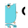

  

    Milvus APIs
  

  

    Find the languages and tools you need to develop on Milvus.
  

## APIs

  

    
    
Python SDK

    <ul class="api-list">Install pymilvus</ul>
    <ul class="api-list">Connect to milvus</ul>
    <ul class="api-list">Create Collection</ul>
    <ul class="api-list">Contribute, Question</ul>
  

  

    
    
Java

    <ul class="api-list">Install Java SDK</ul>
    <ul class="api-list">Connect to milvus</ul>
    <ul class="api-list">Create Collection</ul>
    <ul class="api-list">Contribute, Question</ul>
  

  

    
    
Golang

    <ul class="api-list">Install Golang SDK</ul>
    <ul class="api-list">Connect to milvus</ul>
    <ul class="api-list">Create Collection</ul>
    <ul class="api-list">Contribute, Question</ul>
  

  

    
    
Node.js

    <ul class="api-list">Install Node.js SDK</ul>
    <ul class="api-list">Connect to milvus</ul>
    <ul class="api-list">Create Collection</ul>
    <ul class="api-list">Contribute, Question</ul>
  

## Tools

  

    
Milvus CLI

    <ul class="api-list">Install Milvus CLI</ul>
    <ul class="api-list">Milvus CLI docs</ul>
    <ul class="api-list">Build an Index</ul>
  

  

    
Attu

    <ul class="api-list">Install Attu</ul>
    <ul class="api-list">Attu docs</ul>
    <ul class="api-list">Build an Index</ul>
  

## Join the community

  

    
    
Github Discussion

    <a href="https://github.com/milvus-io/milvus/discussions" class="secondaryBtnSm">
      Join now
    </a>
  

  

    
    
Slack Channel

    <a href="https://slack.milvus.io/" class="secondaryBtnSm">
      Join now
    </a>
  

  

    
    
Reddit

    <a href="https://www.reddit.com/r/vectordatabase/" class="secondaryBtnSm">
      Join now
    </a>
  

  

    
    
Social Media

    <a href="https://twitter.com/milvusio" class="secondaryBtnSm">
      Join now
    </a>
  

