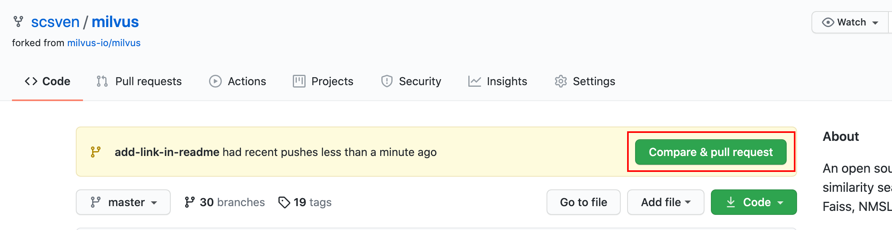

# Making your First contributions

Not sure where to make your first contribution? This document can help you get started!


## Find something to work on

The first step to getting starting contributing to Milvus is to find something to work on. Help is always welcome, and no contribution is too small!

Here are some things you can do to get started contributing without a technical background:

-   Help improve the Milvus documentation
-   Clarify code, variables, or functions that can be renamed or commented on
-   Write test coverage

In addition, you can also find an issue with [good-first-issue](https://github.com/milvus-io/milvus/issues?q=is%3Aopen+is%3Aissue+label%3A%22good+first+issue %22) label, good-first-issue is a label used to classify Issues suitable for new comtributors. Such Issues contain clear steps and expected output.


## Issue Assignment in GitHub

In the second step, when you find a suitable issue, you can assign the issue to yourself and let others know that you intend to solve the issue.

-   Reply with`/assign` or `/assign @yourself` on the issue you'd like to work on
-   The robot will automatically assign this Issue to you
-   Your name will then be listed under, `Assignees`.


## Solve this issue and submit a Pull Request

In the third step, you need to download the project locally to modify it, and then submit it to the Milvus project. This step requires you to have Git installed locally and a little command line experience.

>   There are different ways to install Git on different operating systems：https://git-scm.com/book/en/v2/Getting-Started-Installing-Git


### Fork this repository

Fork milvus repository by clicking on the fork button on the top of [this page](https://github.com/milvus-io/milvus). This will create a copy of this repository in your account.


### Clone this repository

Go to your GitHub account, open the forked repository, click on the code button and then click the *copy to clipboard* icon.


Open a terminal and run the following git command:

```shell
git clone "url you just copied"
```

For example：

```shell
git clone https://github.com/username/milvus.git
```

where `username` is your GitHub username. Here you're copying the contents of the milvus repository on GitHub to your computer.

### Create a branch

Change to the repository directory on your computer (if you are not already there):

```shell
cd milvus
```

Now create a branch using the `git checkout` command:

```shell
git checkout -b <your-new-branch-name>
```

Replace `<your-new-branch-name>` with your branch name (Branch name should best indicate what you want to do).

### Make changes and commit those changes

Now, you can start to modify. Open the editor, modify the content and save the file.

>   If you use Git for the first time, you need to configure your name and email address first, and git will use these two fields as the author's information when submitting content
>
>   ```shell
>   git config --global user.name "John Doe"
>   git config --global user.email johndoe@example.com
>   ```

Add the files you just modified using the `git add` command:

```shell
git add <filename1> <filename2>
```

You need to replace `<filenameN>` with the file you just modified.

Then, commit those changes using the `git commit` command:

```shell
git commit -m "<commit-message>" -s
```

Change `<commit-message>` to a brief description of this modification.

### Push changes to GitHub

Now, you need to use the `git push` command to push the local changes to GitHub:

```shell
git push origin <your-branch-name>
```

Replace `<your-branch-name>` with the branch name created above.

### Submit your changes to the Milvus repository

Go back to your own repository page on GitHub, you will see a prompt, click *Compare & pull request* to create a Pull Request, and then wait for review and merge.



