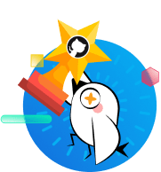
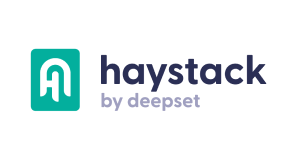
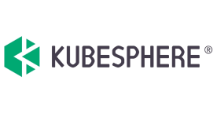

  <h1 class="title">
    Reinvent data science together
  </h1>

  <h2 class="sub-title">
    Join the Milvus community to stay connected, get help, and contribute!
  </h2>

<h2 class="about-title">About the Community</h2>

The Milvus community is comprised of users, contributors, and culture that unite our community and inspire new ideas, collaboration, and mutual learning. Our open-source community files issues and pull requests, attends events, advocates for greater adoption of Milvus, and makes many other valuable contributions. Read on to learn how you can get involved and become part of this amazing community.

  

    
    
Build

    
Build the cloud-native vector database through community collaboration.

  

  

    
    
Learn

    
Learn knowledge and skills as active community participants.

  

  

    
    
Grow

    
Grow into an expert on all things Milvus in community.

  

  

    
    
Share

    
Share best practices and lessons learned with the community at large.

  

  

    
  

  

    

      
Become a Milvus Advocate

      
Join the Milvus community to stay connected, get help, and contribute!

    

    <a href="/community/milvus_advocate.md" class="secondaryBtnSm">
      Learn how become one
    </a>
  

## Milvus Top Advocates

  

    

      
    

    
Guoqin Huang

    
Vip.com

    
Software Developer

  

  

    

      
    

    
Tingting Wang

    
Sohu

    
NLP engineer

  

  

    

      
    

    
Yang Li

    
Focus Technology

    
Software Developer

  

  

    

      
    

    
Wei Huang

    
TrendMicro

    
Software Developer

  

  

    

      
    

    
Anzhe Wen

    
Qichacha

    
Software Developer

  

## Join the community

  

    
    
Github Discussion

    <a href="https://github.com/milvus-io/milvus/discussions" class="secondaryBtnSm">
      Join now
    </a>
  

  

    
    
Slack Channel

    <a href="https://join.slack.com/t/milvusio/shared_invite/zt-1sbwc00jb-PbO7dCZziao4vWDBJxtRDg" class="secondaryBtnSm">
      Join now
    </a>
  

  

    
    
Reddit

    <a href="https://www.reddit.com/r/vectordatabase/" class="secondaryBtnSm">
      Join now
    </a>
  

  

    
    
Social Media

    <a href="https://twitter.com/milvusio" class="secondaryBtnSm">
      Join now
    </a>
  

## Resources

  

    
    
Milvus Technical Meeting

    
Join our next meeting to be involved in the discussion and decision making of Milvus‘ latest features and development timeline.

    <a href="https://wiki.lfaidata.foundation/pages/viewpage.action?pageId=43287098">
      Learn More 
    </a>
  

  

    
    
Events

    
We host events, often. Click to find out the upcoming events near you.

    <a href="https://www.meetup.com/milvus-meetup/">
      More Events 
    </a>
  

  

    
    
Video

    
We know some of you prefer video content over text! Visit our YouTube channel to watch talks, webinars, and tutorials.

    <a href="https://www.youtube.com/c/MilvusVectorDatabase">
      More Videos 
    </a>
  

## Community Partners

  

    
  

  

    
  

  

    
  

  

    
  

  

    
  

  

    
  

## Mailing Lists

  <a href="https://lists.lfaidata.foundation/g/milvus-technical-discuss" class="secondaryBtnSm" >
    
    Milvus Technical Discuss
  </a>

  <a href="https://lists.lfaidata.foundation/g/milvus-tsc" class="secondaryBtnSm" >
    
    Milvus TSC
  </a>

  <a href="https://lists.lfaidata.foundation/g/milvus-announce" class="secondaryBtnSm" >
    
    Milvus Announce
  </a>

