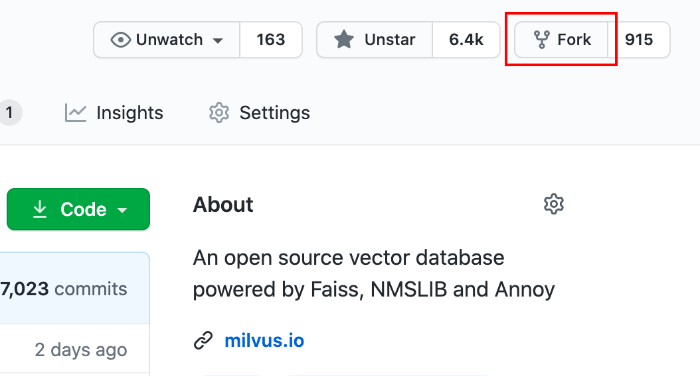
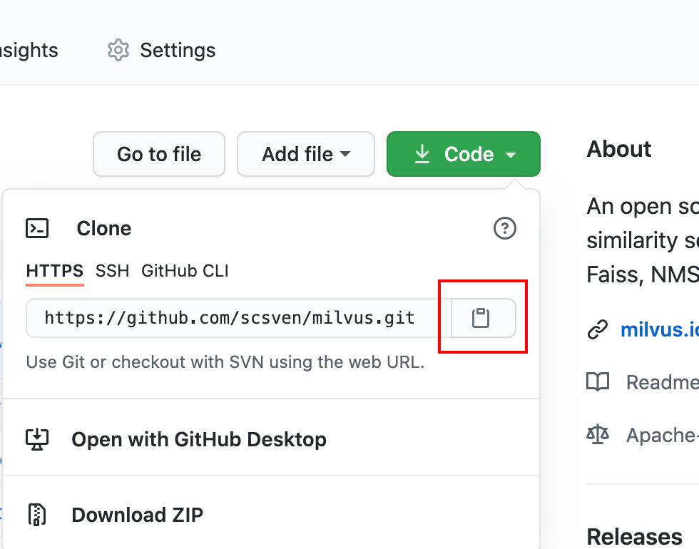
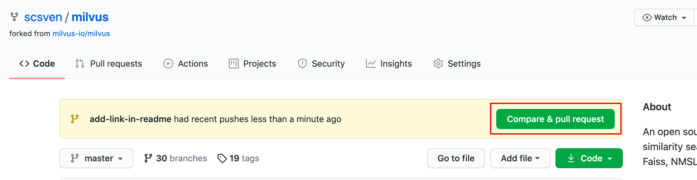

# 成为 Milvus 贡献者

感谢大家关注 Milvus 并加入开源社区，我们欢迎每一位贡献者。

本篇文档旨在帮助社区新成员熟悉 GitHub 贡献流程。

## 选择贡献内容

第一步，你需要了解自己可以哪些方向做出贡献。

作为你贡献的开始，你可以选择一些不需要深厚技术背景的问题着手：

- 为代码加注释

- 报告代码中的错误

- 帮助改进 Milvus 的文档

在开始贡献之前，你需要 [发起 issue](https://github.com/milvus-io/milvus/issues/new/choose) 说明问题。另外，还可以在设置了 [good-first-issue](https://github.com/milvus-io/milvus/issues?q=is:open+is:issue+label:"good+first+issue") 标签的 issue 中找到你感兴趣的。good-first-issue 标签下的 issue 都包含明确的步骤和预期产出，适合第一次做贡献的开发者。

## 分配 Issue

第二步，当你找到了一个合适的 issue，你需要将 issue 分配给你自己，并留言表示接下来你将着手解决这个 issue。

在 issue 页面下方的留言栏中回复 `/assign` 或 `/assign @your-github-id`，该 issue 就会由机器人自动分配至你的名下。你可以在页面右上方 *Assignees* 栏中找到自己的 GitHub ID。

## 安装 Git

为了在本地设备上使用 Git 命令，你需要为自己的操作系统 [安装 Git]()。

> 如果这是你第一次使用Git，你需要先在 Git 中配置 GitHub ID 和邮箱地址，Git在提交修改时会使用这两个字段作为作者信息。

```
git config --global user.name "<your-github-id>"

git config --global user.email <your-email@example.com>
```

## Fork 仓库

在 [Milvus 仓库](https://github.com/milvus-io/milvus) 的页面中，点击右上角的 **Fork** 按钮，在你的账户中创建一个这个仓库的副本。



## Clone 仓库

进入你创建的仓库副本，点击 *Code* 按钮，在弹出的页面点击 *复制到剪贴板* 按钮。



打开终端并运行以下命令：

```
git clone <剪贴板内容>
```

例如：

```
git clone https://github.com/<your-github-id>/milvus.git
```

此处 `<your-github-id>` 代表你的 GitHub ID。此命令会将一个名为 `milvus` 的仓库会下载至你的本地设备上。

## 创建分支

进入到代码仓库的本地目录：

```
cd milvus
```

使用 `git checkout` 命令创建一个新分支：

```
git checkout -b <your-new-branch-name>
```

将 `<your-new-branch-name>` 换成你的新分支名（分支名应当说明你即将进行的工作）。

## 修改和提交

现在，开始你的修改，在修改完之后记得保存文件。

使用 `git add` 命令选中刚才修改的文件：

```
git add <filename>
```

需要将 `<filename>` 替换成刚才修改的文件。

然后，使用 `git commit` 提交选中的文件：

```
git commit -m "<commit-message>" -s
```

把 `<commit-message>` 改为这次修改内容的简述。了解更多关于 [Commit message 格式]()。

> `-s` 代表为你的 commit message 添加 Sign-off 信息。

### 将修改上传到 GitHub

现在，需要使用 `git push` 命令将本地的改动上传到 GitHub：

```
git push origin <your-branch-name>
```

将 `<your-branch-name>` 替换成先前创建的分支名。

### 将改动提交到 Milvus 仓库

上传完成后回到 GitHub 上自己的仓库页面，你会看到一个提示，点击 *Compare & pull request* 创建 pull request，然后等待 review 和合并。



## 改进这篇文档

如果你在这篇文档中遇到了问题，也可以[在 GitHub 上修改它](https://github.com/milvus-io/docs/edit/master/community/site/zh-CN/communityArticles/contributor_group/making_your_first_contributions.md)！
