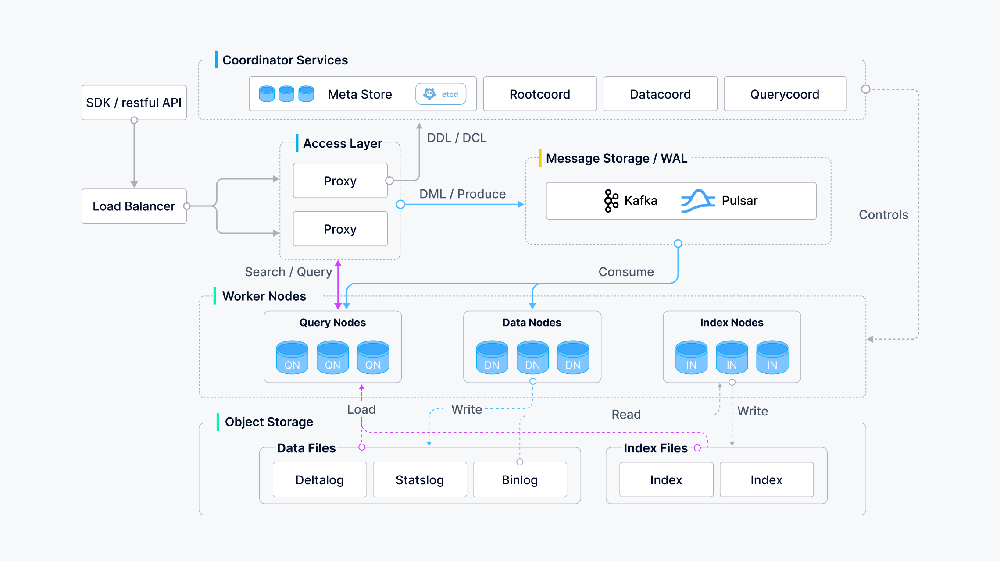

# Introduction

This page aims to give you an overview of Milvus by answering several questions. After reading this page, you will learn what Milvus is and how it works, as well as the key concepts, why use Milvus, supported indexes and metrics, example applications, the architecture, and relevant tools.

## What is Milvus vector database?

Milvus was created in 2019 with a singular goal: store, index, and manage massive [embedding vectors](#Embedding-vectors) generated by deep neural networks and other machine learning (ML) models. 

As a database specifically designed to handle queries over input vectors, it is capable of indexing vectors on a trillion scale. Unlike existing relational databases which mainly deal with structured data following a pre-defined pattern, Milvus is designed from the bottom-up to handle embedding vectors converted from [unstructured data](#Unstructured-data).

As the Internet grew and evolved, unstructured data became more and more common, including emails, papers, IoT sensor data, Facebook photos, protein structures, and much more. In order for computers to understand and process unstructured data, these are converted into vectors using embedding techniques. Milvus stores and indexes these vectors. Milvus is able to analyze the correlation between two vectors by calculating their similarity distance. If the two embedding vectors are very similar, it means that the original data sources are similar as well.

## Key concepts

In case you are new to the world of vector database and similarity search, read the following explanation of key concepts to gain a better understanding. 

Learn more about [Milvus glossary](glossary.md).

### Unstructured data

Unstructured data, including images, video, audio, and natural language, is information that doesn't follow a pre-defined model or manner of organization. This data type accounts for around 80% of the world's data, and can be converted into vectors using various artificial intelligence (AI) and machine learning (ML) models.

### Embedding vectors

An embedding vector is a feature abstraction of unstructured data, such as emails, IoT sensor data, Instagram photos, protein structures, and much more. Mathematically speaking, an embedding vector is an array of floating-point numbers or binaries. Modern embedding techniques are used to convert unstructured data to embedding vectors.

### Vector similarity search

Vector similarity search is the process of comparing a vector to a database to find vectors that are most similar to the query vector. Approximate nearest neighbor (ANN) search algorithms are used to accelerate the searching process. If the two embedding vectors are very similar, it means that the original data sources are similar as well.

## Why Milvus?

- High performance when conducting vector search on massive datasets.
- A developer-first community that offers multi-language support and toolchain.
- Cloud scalability and high reliability even in the event of a disruption.
- Hybrid search achieved by pairing scalar filtering with vector similarity search.

## What indexes and metrics are supported?

Indexes are an organization unit of data. You must declare the index type and similarity metric before you can search or query inserted entities. **If you do not specify an index type, Milvus will operate brute-force search by default.** 

### Index types

Most of the vector index types supported by Milvus use approximate nearest neighbors search (ANNS), including:

- **HNSW**: HNSW is a graph-based index and is best suited for scenarios that have a high demand for search efficiency. There is also a GPU version **GPU_CAGRA**, thanks to Nvidia's contribution.
- **FLAT**: FLAT is best suited for scenarios that seek perfectly accurate and exact search results on a small, million-scale dataset. There is also a GPU version **GPU_BRUTE_FORCE**.
- **IVF_FLAT**: IVF_FLAT is a quantization-based index and is best suited for scenarios that seek an ideal balance between accuracy and query speed. There is also a GPU version **GPU_IVF_FLAT**.
- **IVF_SQ8**: IVF_SQ8 is a quantization-based index and is best suited for scenarios that seek a significant reduction on disk, CPU, and GPU memory consumption as these resources are very limited.
- **IVF_PQ**: IVF_PQ is a quantization-based index and is best suited for scenarios that seek high query speed even at the cost of accuracy. There is also a GPU version **GPU_IVF_PQ**.
- **SCANN**: SCANN is similar to IVF_PQ in terms of vector clustering and product quantization. What makes them different lies in the implementation details of product quantization and the use of SIMD (Single-Instruction / Multi-data) for efficient calculation.
- **DiskANN**: Based on Vamana graphs, DiskANN powers efficient searches within large datasets.

See [Vector Index](index.md) for more details.

### Similarity metrics

In Milvus, similarity metrics are used to measure similarities among vectors. Choosing a good distance metric helps improve classification and clustering performance significantly. Depending on the input data forms, specific similarity metric is selected for optimal performance.

The metrics that are widely used for floating point embeddings include:

- **Cosine**: This metric is normalized IP, generally used in text similarity search (NLP).
- **Euclidean distance (L2)**: This metric is generally used in the field of computer vision (CV).
- **Inner product (IP)**: This metric is generally used in the field of natural language processing (NLP).
The metrics that are widely used for binary embeddings include:
- **Hamming**: This metric is generally used in the field of natural language processing (NLP).
- **Jaccard**: This metric is generally used in the field of molecular similarity search.

See [Similarity Metrics](metric.md#floating) for more information.

## Example applications 

Milvus makes it easy to add similarity search to your applications. Example applications of Milvus include:

- [Image similarity search](image_similarity_search.md): Images made searchable and instantaneously return the most similar images from a massive database.
- [Video similarity search](video_similarity_search.md): By converting key frames into vectors and then feeding the results into Milvus, billions of videos can be searched and recommended in near real-time.
- [Audio similarity search](audio_similarity_search.md): Quickly query massive volumes of audio data such as speech, music, sound effects, and surface similar sounds.
- [Recommender system](recommendation_system.md): Recommend information or products based on user behaviors and needs.
- [Question answering system](question_answering_system.md): Interactive digital QA chatbot that automatically answers user questions.
- [DNA sequence classification](dna_sequence_classification.md): Accurately sort out the classification of a gene in milliseconds by comparing similar DNA sequences.
- [Text search engine](text_search_engine.md): Help users find the information they are looking for by comparing keywords against a database of texts.

See [Milvus tutorials](https://github.com/milvus-io/bootcamp/tree/master/bootcamp) and [Milvus Adopters](milvus_adopters.md) for more Milvus application scenarios.

## How is Milvus designed?

As a cloud-native vector database, Milvus separates storage and computation by design. To enhance elasticity and flexibility, all components in Milvus are stateless.

The system breaks down into four levels:

- Access layer: The access layer is composed of a group of stateless proxies and serves as the front layer of the system and endpoint to users.
- Coordinator service: The coordinator service assigns tasks to the worker nodes and functions as the system's brain.
- Worker nodes: The worker nodes function as arms and legs and are dumb executors that follow instructions from the coordinator service and execute user-triggered DML/DDL commands.
- Storage: Storage is the bone of the system, and is responsible for data persistence. It comprises meta storage, log broker, and object storage.

For more information, see [Architecture Overview](architecture_overview.md).

## Developer tools

Milvus is supported by rich APIs and tools to facilitate DevOps.

### API access

Milvus has client libraries wrapped on top of the Milvus API that can be used to insert, delete, and query data programmatically from application code:

- [PyMilvus](https://github.com/milvus-io/pymilvus)
- [Node.js SDK](https://github.com/milvus-io/milvus-sdk-node)
- [Go SDK](https://github.com/milvus-io/milvus-sdk-go)
- [Java SDK](https://github.com/milvus-io/milvus-sdk-java)
- [Restful API](https://milvus.io/api-reference/restful/v2.4.x/About.md)

We are working on enabling more new client libraries. If you would like to contribute, go to the corresponding repository of [the Milvus Project](https://github.com/milvus-io).

### Milvus ecosystem tools

The Milvus ecosystem provides helpful tools including:

- [Attu](https://github.com/zilliztech/attu), a graphical management system for Milvus. 
- [Milvus sizing tool](https://milvus.io/tools/sizing/), which helps you estimate the raw file size, memory size, and stable disk size needed for a specified number of vectors with various index types.
- [Milvus CLI](https://github.com/zilliztech/milvus_cli#overview)

## What's next

- Get started with a 3-minute tutorial:
  - [Hello Milvus](quickstart.md)
- Install Milvus for your testing or production environment:
  - [Installation Prerequisites](prerequisite-docker.md)
  - [Install Milvus Standalone](install_standalone-docker.md)
- If you're interested in diving deep into the design details of Milvus:
  - Read about [Milvus architecture](architecture_overview.md)

