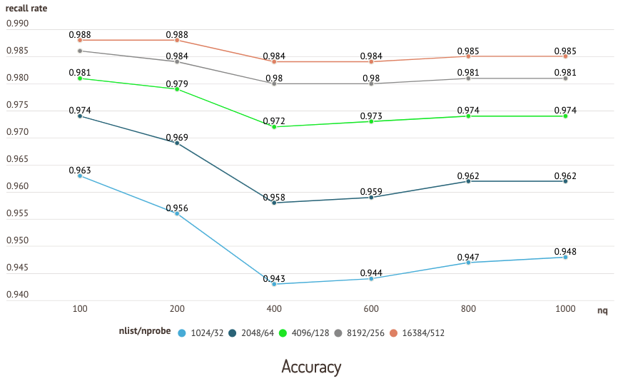
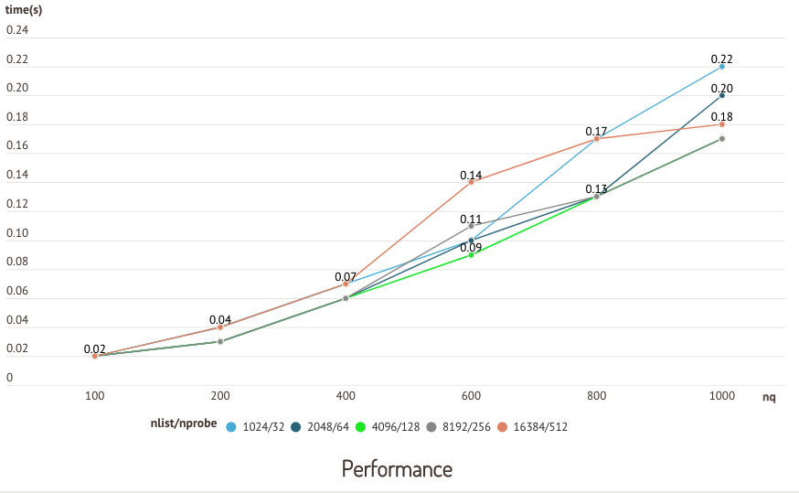

# Performance FAQ

<!-- TOC -->

<!-- /TOC -->

#### How to set `nlist` and `nprobe` for IVF indices?

Setting `nlist` is scenario-specific. As a rule of thumb, the recommended value of `nlist` is `4 × sqrt(n)`, where `n` is the total number of entities in a segment.

The size of each segment is determined by the `dataservice.segment.size` parameter, which is set to 512 MB by default. The total number of entities in a segment n can be estimated by dividing `dataservice.segment.size` by the size of each entity.

Setting `nprobe` is specific to the dataset and scenario, and involves a trade-off between accuracy and query performance. We recommend finding the ideal value through repeated experimentation.

The following charts are results from a test running on the sift50m dataset and IVF_SQ8 index, which compares recall and query performance of different `nlist`/`nprobe` pairs.

#### Why do queries sometimes take longer on smaller datasets?

Query operations are conducted on segments. indices reduce the amount of time it takes to query a segment. If a segment has not been indexed, Milvus resorts to brute-force search on the raw data—drastically increasing query time.

Therefore, it usually takes longer to query on a small dataset (collection) because it has not built index. This is because the sizes of its segments have not reached the index-building threshold set by `master.minSegmentSizeToEnable`. Call `create_index()` to force Milvus to index segments that do not meet the threshold, significantly improving query performance.

#### Why isn’t recently inserted data immediately searchable?

Recently inserted data cannot be searched until it is loaded to the query node.

Inserted data is loaded into the query node in two stages:

1. Data is inserted to the message queue. Completion of this step indicates successful data insertion.
2. Inserted data is consumed and loaded to the query node.

You can call `flush()` and then `load_collection()` to ensure inserted data is immediately searchable. Note that calling these two methods frequently creates a large number of small segments, diminishing query performance.

#### What factors impact CPU usage?

CPU usage increases when Milvus is building indices or running queries. In general, index building is CPU intensive except when using Annoy, which runs on a single thread.

When running queries, CPU usage is affected by `nq` and `nprobe`. When `nq` and `nprobe` are small, concurrency is low and CPU usage stays low.

#### Does simultaneously inserting data and searching impact query performance?

Insert operations are not CPU intensive. However, because new segments may not have reached the threshold for index building, Milvus resorts to brute-force search—significantly impacting query performance.

The `dataservice.segment.size` parameter determines the index-building threshold for a segment, and is set to 512 MB by default.

#### Still have questions?

You can:

- Check out [Milvus](https://github.com/milvus-io/milvus/issues) on GitHub. Feel free to ask questions, share ideas, and help others.
- Join our [Slack Channel](https://join.slack.com/t/milvusio/shared_invite/enQtNzY1OTQ0NDI3NjMzLWNmYmM1NmNjOTQ5MGI5NDhhYmRhMGU5M2NhNzhhMDMzY2MzNDdlYjM5ODQ5MmE3ODFlYzU3YjJkNmVlNDQ2ZTk) to find support and engage with our open-source community.
