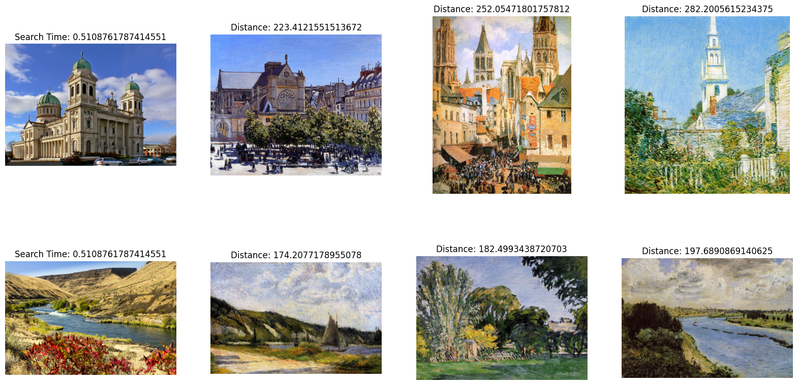

# Image Search with Milvus

On this page, we are going to be going over a simple image search example using Milvus. The dataset we are searching through is the Impressionist-Classifier Dataset found on [Kaggle](https://www.kaggle.com/datasets/delayedkarma/impressionist-classifier-data). For this example, we have rehosted the data in a public google drive.

For this example, we are just using the Torchvision pre-trained Resnet50 model for embeddings. Let's get started!

## Installing the requirements

For this example, we are going to be using `pymilvus` to connect to use Milvus, `torch` for running the embedding model, `torchvision` for the actual model and preprocessing, `gdown` to download the example dataset and `tqdm` for loading bars.

```shell
pip install pymilvus torch gdown torchvision tqdm
```

## Grabbing the data

We are going to use `gdown` to grab the zip from Google Drive and then decompress it with the built-in `zipfile` library.

```python
import gdown
import zipfile

url = 'https://drive.google.com/uc?id=1OYDHLEy992qu5C4C8HV5uDIkOWRTAR1_'
output = './paintings.zip'
gdown.download(url, output)

with zipfile.ZipFile("./paintings.zip","r") as zip_ref:
    zip_ref.extractall("./paintings")
```

<div class="alert note">

The size of the dataset is 2.35 GB, and the time spent downloading it depends on your network condition.

</div>

## Global Arguments

These are some of the main global arguments that we will be using for easier tracking and updating. 

```python
# Milvus Setup Arguments
COLLECTION_NAME = 'image_search'  # Collection name
DIMENSION = 2048  # Embedding vector size in this example
MILVUS_HOST = "localhost"
MILVUS_PORT = "19530"

# Inference Arguments
BATCH_SIZE = 128
TOP_K = 3
```

## Setting up Milvus

At this point, we are going to begin setting up Milvus. The steps are as follows:

1. Connect to the Milvus instance using the provided URI.

    ```python
    from pymilvus import connections

    # Connect to the instance
    connections.connect(host=MILVUS_HOST, port=MILVUS_PORT)
    ```

2. If the collection already exists, drop it.

    ```python
    from pymilvus import utility

    # Remove any previous collections with the same name
    if utility.has_collection(COLLECTION_NAME):
        utility.drop_collection(COLLECTION_NAME)
    ```

3. Create the collection that holds the ID, the file path of the image, and its embedding.

    ```python
    from pymilvus import FieldSchema, CollectionSchema, DataType, Collection

    # Create collection which includes the id, filepath of the image, and image embedding
    fields = [
        FieldSchema(name='id', dtype=DataType.INT64, is_primary=True, auto_id=True),
        FieldSchema(name='filepath', dtype=DataType.VARCHAR, max_length=200),  # VARCHARS need a maximum length, so for this example they are set to 200 characters
        FieldSchema(name='image_embedding', dtype=DataType.FLOAT_VECTOR, dim=DIMENSION)
    ]
    schema = CollectionSchema(fields=fields)
    collection = Collection(name=COLLECTION_NAME, schema=schema)
    ```

4. Create an index on the newly created collection and load it into memory.

    ```python
    # Create an AutoIndex index for collection
    index_params = {
    'metric_type':'L2',
    'index_type':"IVF_FLAT",
    'params':{'nlist': 16384}
    }
    collection.create_index(field_name="image_embedding", index_params=index_params)
    collection.load()
    ```

Once these steps are done, the collection is ready to be inserted into and searched. Any added data will be indexed automatically and be available to search immediately. If the data is very fresh, the search might be slower as brute force searching will be used on data that is still in process of being indexed.

## Inserting the data

For this example, we are going to use the ResNet50 model provided by `torch` and its model hub. To get the embeddings, we are taking off the final classification layer, which results in the model giving us embeddings of 2048 dimensions. All the vision models found on `torch` use the same preprocessing that we have included here.

In these next few steps we will be: 

1. Loading the data.

    ```python
    import glob

    # Get the filepaths of the images
    paths = glob.glob('./paintings/paintings/**/*.jpg', recursive=True)
    len(paths)
    ```

2. Preprocessing the data into batches.

    ```python
    import torch

    # Load the embedding model with the last layer removed
    model = torch.hub.load('pytorch/vision:v0.10.0', 'resnet50', pretrained=True)
    model = torch.nn.Sequential(*(list(model.children())[:-1]))
    model.eval()
    ```

3. Embedding the data.

    ```python
    from torchvision import transforms

    # Preprocessing for images
    preprocess = transforms.Compose([
        transforms.Resize(256),
        transforms.CenterCrop(224),
        transforms.ToTensor(),
        transforms.Normalize(mean=[0.485, 0.456, 0.406], std=[0.229, 0.224, 0.225]),
    ])
    ```

4. Inserting the data.

    ```python
    from PIL import Image
    from tqdm import tqdm

    # Embed function that embeds the batch and inserts it
    def embed(data):
        with torch.no_grad():
            output = model(torch.stack(data[0])).squeeze()
            collection.insert([data[1], output.tolist()])

    data_batch = [[],[]]

    # Read the images into batches for embedding and insertion
    for path in tqdm(paths):
        im = Image.open(path).convert('RGB')
        data_batch[0].append(preprocess(im))
        data_batch[1].append(path)
        if len(data_batch[0]) % BATCH_SIZE == 0:
            embed(data_batch)
            data_batch = [[],[]]

    # Embed and insert the remainder
    if len(data_batch[0]) != 0:
        embed(data_batch)

    # Call a flush to index any unsealed segments.
    collection.flush()
    ```

   <div class="alert note">
   
   - This step is relatively time-consuming because embedding takes time. Take a sip of coffee and relax.
   - PyTorch may not work well with Python 3.9 and earlier versions. Consider using Python 3.10 and later versions instead.
   
   </div>

## Performing the search

With all the data inserted into Milvus, we can start performing our searches. In this example, we are going to search for two example images. Because we are doing a batch search, the search time is shared across the images of the batch.

```python
import glob

# Get the filepaths of the search images
search_paths = glob.glob('./paintings/test_paintings/**/*.jpg', recursive=True)
len(search_paths)
```

```python
import time
from matplotlib import pyplot as plt

# Embed the search images
def embed(data):
    with torch.no_grad():
        ret = model(torch.stack(data))
        # If more than one image, use squeeze
        if len(ret) > 1:
            return ret.squeeze().tolist()
        # Squeeze would remove batch for single image, so using flatten
        else:
            return torch.flatten(ret, start_dim=1).tolist()

data_batch = [[],[]]

for path in search_paths:
    im = Image.open(path).convert('RGB')
    data_batch[0].append(preprocess(im))
    data_batch[1].append(path)

embeds = embed(data_batch[0])
start = time.time()
res = collection.search(embeds, anns_field='image_embedding', param={'nprobe': 128}, limit=TOP_K, output_fields=['filepath'])
finish = time.time()
```

```python
# Show the image results
f, axarr = plt.subplots(len(data_batch[1]), TOP_K + 1, figsize=(20, 10), squeeze=False)

for hits_i, hits in enumerate(res):
    axarr[hits_i][0].imshow(Image.open(data_batch[1][hits_i]))
    axarr[hits_i][0].set_axis_off()
    axarr[hits_i][0].set_title('Search Time: ' + str(finish - start))
    for hit_i, hit in enumerate(hits):
        axarr[hits_i][hit_i + 1].imshow(Image.open(hit.entity.get('filepath')))
        axarr[hits_i][hit_i + 1].set_axis_off()
        axarr[hits_i][hit_i + 1].set_title('Distance: ' + str(hit.distance))

# Save the search result in a separate image file alongside your script.
plt.savefig('search_result.png')
```

The search result image should be similar to the following:

