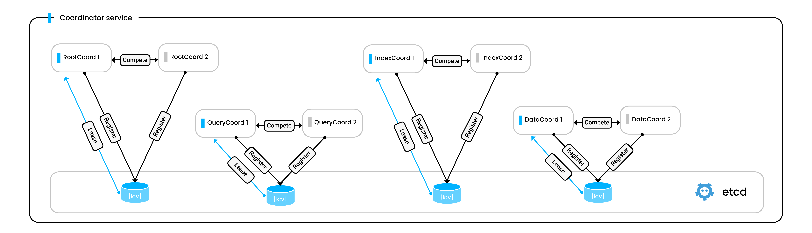

# Coordinator HA

As shown in the [Milvus architecture](architecture_overview.md), Milvus consists of many components and has them work in a distributed manner. Among all the components, Milvus ensures the high availability of the workers through [scaling up and scaling out](scaleout.md) of the nodes, making coordinators the only weak link in the chain. 

## Overview

In the 2.2.3 release, Milvus implements high availability for coordinators to make them work in the active-standby mode, mitigating possible single points of failure (SPoFs) that can result in service unavailability.



The figure above illustrates how coordinators work in the active-standby mode. When a pair of coordinators start, they register with etcd using their server ID and compete for the active role. The coordinator who succeeds in leasing the active role from the etcd will start serving, and the other coordinator in the pair will remain on standby, watching the active role and ready to serve if the active coordinator dies. 

## Enable coordinator HA

### With Helm

To start multiple coordinators and have them work in active-standby mode, you should make the following changes to your `values.yaml` file.

- Set `xxxCoordinator.replicas` to `2`.
- Set `xxxCoordinator.activeStandby.enabled` to `true`.

The following code snippet uses RootCoord as an example. You can do the same to coordinators of other types.

```yaml
rootCoordinator:
  enabled: true
  # You can set the number of replicas greater than 1 only if you also need to set activeStandby.enabled to true.
  replicas: 2  # Otherwise, remove this configuration item.
  resources: {}
  nodeSelector: {}
  affinity: {}
  tolerations: []
  extraEnv: []
  heaptrack:
    enabled: false
  profiling:
    enabled: false  # Enable live profiling
  activeStandby:
    enabled: true  # Set this to true to have RootCoordinators work in active-standby mode.
```

### With Docker

To start multiple coordinators and have them work in active-standby mode, you can add some definitions to the `docker-compose` file that you use to start your Milvus cluster.

The following code snippet uses RootCoord as an example. You can do the same to coordinators of other types.

```yaml
  rootcoord:
    container_name: milvus-rootcoord
    image: milvusdb/milvus:v2.2.3
    command: ["milvus", "run", "rootcoord"]
    environment:
      ETCD_ENDPOINTS: etcd:2379
      MINIO_ADDRESS: minio:9000
      PULSAR_ADDRESS: pulsar://pulsar:6650
      ROOT_COORD_ADDRESS: rootcoord:53100
      # add ROOT_COORD_ENABLE_ACTIVE_STANDBY to enable active standby
      ROOT_COORD_ENABLE_ACTIVE_STANDBY: true
    depends_on:
      - "etcd"
      - "pulsar"
      - "minio"

#   add the following to have RootCoords work in active-standby mode
#   rootcoord-1:
#    container_name: milvus-rootcoord-1
#    image: milvusdb/milvus:v2.2.3
#    command: ["milvus", "run", "rootcoord"]
#    environment:
#      ETCD_ENDPOINTS: etcd:2379
#      MINIO_ADDRESS: minio:9000
#      PULSAR_ADDRESS: pulsar://pulsar:6650
#      ROOT_COORD_ADDRESS: rootcoord-1:53100
#      # add ROOT_COORD_ENABLE_ACTIVE_STANDBY to enable active standby
#      ROOT_COORD_ENABLE_ACTIVE_STANDBY: true
#    depends_on:
#      - "etcd"
#      - "pulsar"
#      - "minio"
```

### With Mac/Linux shell

To start multiple coordinators and have them work in active-standby mode, you can 

1. Download the Milvus source code to your local drive, and [start up a Milvus cluster from the source code](https://github.com/milvus-io/milvus/blob/master/DEVELOPMENT.md) as follows:

    ```shell
    sudo ./scripts/start_cluster.sh
    ```

    Milvus runs with only one coordinator of each type at the end of this step.

2. Update `milvus.yaml` to change the port number of the coordinator of each type. The following uses **rootCoord** as an example.

    ```yaml
    rootCoord:
      address: localhost
      port: 53100 # change to 53001
    ```

3. Start the standby coordinator.

    ```shell
    sudo nohup ./bin/milvus run rootcoord > /tmp/rootcoord2.log 2>&1 &
    ```

    At the end of this step, run the following command to verify that two coordinator processes exists.

    ```shell
    ps aux|grep milvus
    ```

    The output should be similar to 

    ```shell
    > ps aux|grep milvus
    root        12813   0.7 0.2 410709648   82432   ??  S   5:18PM  0:33.28 ./bin/milvus run rootcoord
    root        12816   0.5 0.2 409487968   62352   ??  S   5:18PM  0:22.69 ./bin/milvus run proxy
    root        17739   0.1 0.3 410289872   91792 s003  SN  6:01PM  0:00.30 ./bin/milvus run rootcoord
    ...
    ```

    And the standby coordinator outputs a log entry every ten seconds as follows:

    ```shell
    [INFO] [sessionutil/session_util.go:649] ["serverName: rootcoord is in STANDBY ..."]
    ```

4. Kill the active coordinator in a pair and watch the behavior of the standby coordinator.

    You can find that it takes 60 seconds for the standby coordinator to take over the active role.

    ```shell
    [2022/09/21 11:58:33.855 +08:00] [DEBUG] [sessionutil/session_util.go:677] ["watch the ACTIVE key"] [DELETE="key:\"by-dev/meta/session/rootcoord\" mod_revision:167 "]
    [2022/09/21 11:58:33.856 +08:00] [DEBUG] [sessionutil/session_util.go:677] ["watch the ACTIVE key"] [DELETE="key:\"by-dev/meta/session/rootcoord-15\" mod_revision:167 "]
    [2022/09/21 11:58:33.856 +08:00] [INFO] [sessionutil/session_util.go:683] ["stop watching ACTIVE key"]
    [2022/09/21 11:58:33.856 +08:00] [INFO] [sessionutil/session_util.go:655] ["start retrying to register as ACTIVE service..."]
    [2022/09/21 11:58:33.859 +08:00] [INFO] [sessionutil/session_util.go:641] ["register ACTIVE service successfully"] [ServerID=19]
    [2022/09/21 11:58:33.859 +08:00] [INFO] [sessionutil/session_util.go:690] ["quit STANDBY mode, this node will become ACTIVE"]
    [2022/09/21 11:58:33.859 +08:00] [INFO] [rootcoord/root_coord.go:638] ["rootcoord switch from standby to active, activating"]
    [2022/09/21 11:58:33.859 +08:00] [INFO] [rootcoord/root_coord.go:306] ["RootCoord Register Finished"]
    [2022/09/21 11:58:33.859 +08:00] [DEBUG] [rootcoord/service.go:148] ["RootCoord start done ..."]
    [2022/09/21 11:58:33.859 +08:00] [DEBUG] [components/root_coord.go:58] ["RootCoord successfully started"]
    ```

## Related configuration items

Coordinator HA is disabled by default. You can enable this feature manually by changing the following items in your Milvus configuration file.

- [rootCoord.activeStandby.enabled](configure_rootcoord.md#rootCoordactiveStandbyenabled)
- [queryCoord.activeStandby.enabled](configure_querycoord.md#queryCoordactiveStandbyenabled)
- [dataCoord.activeStandby.enabled](configure_datacoord.md#dataCoordactiveStandbyenabled)

## Limits

Currently, there is no strong consistency guarantee between the active and standby service. Therefore, the standby coordinator needs to reload the metadata while taking over the active role.

Etcd releases a lease only after the current session has timed out. The session timeout defaults to 60 seconds. Therefore, there is a 60-second gap between when the active coordinator dies and when the standby coordinator takes over the active role.
