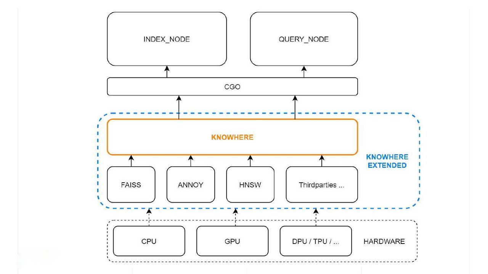
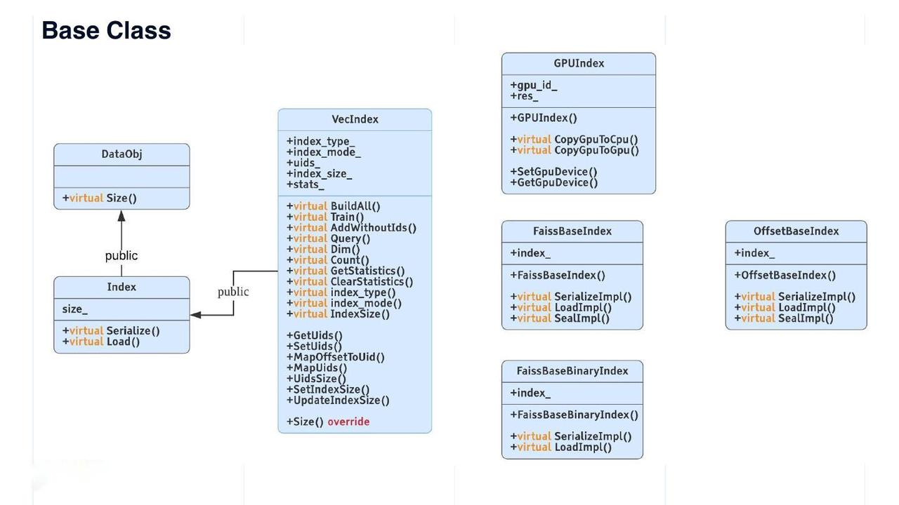

# Knowhere

This topic introduces Knowhere, the core vector execution engine of Milvus.

## Overview

Knowhere is the core vector execution engine of Milvus which incorporates several vector similarity search libraries including [Faiss](https://github.com/facebookresearch/faiss), [Hnswlib](https://github.com/nmslib/hnswlib) and [Annoy](https://github.com/spotify/annoy). Knowhere is also designed to support heterogeneous computing. It controls on which hardware (CPU or GPU) to execute index building and search requests. This is how Knowhere gets its name - knowing where to execute the operations. More types of hardware including DPU and TPU will be supported in future releases.

## Knowhere in the Milvus architecture

The figure below illustrates the position of Knowhere in the Milvus architecture.

The bottom-most layer is the system hardware. The third-party index libraries are on top of the hardware. Then Knowhere interacts with the index node and query node on the top via CGO, which allows Go packages to call C code.

## Knowhere advantages

The following are the advantages of Knowhere over Faiss.

#### Support for BitsetView

Milvus introduces a bitset mechanism to realize "soft deletion". A soft-deleted vector still exists in the database but will not be computed during a vector similarity search or query. 

Each bit in a bitset corresponds to an indexed vector. If a vector is marked as "1" in the bitset, it means this vector is soft-deleted and will not be involved during a vector search. The bitset parameter is applied to all the exposed Faiss index query APIs in Knowhere, including CPU and GPU indexes.

For more information about the bitset mechanism, check out [bitset](bitset.md).

#### Support for multiple similarity metrics for indexing binary vectors

Knowhere supports [Hamming](metric.md#Hamming-distance), [Jaccard](metric.md#Jaccard-distance), [Tanimoto](metric.md#Tanimoto-distance), [Superstructure](metric.md#Superstructure), and [Substructure](metric.md#Substructure). Jaccard and Tanimoto can be used to measure the similarity between two sample sets while Superstructure and Substructure can be used to measure the similarity of chemical structures.

#### Support for AVX512 instruction set

Apart from [AArch64](https://en.wikipedia.org/wiki/AArch64), [SSE4.2](https://en.wikipedia.org/wiki/SSE4#SSE4.2) and [AVX2](https://en.wikipedia.org/wiki/Advanced_Vector_Extensions), the instruction sets already supported by Faiss, Knowhere also supports [AVX512](https://en.wikipedia.org/wiki/AVX-512), which can [improve the performance of index building and query by 20% to 30%](https://milvus.io/blog/milvus-performance-AVX-512-vs-AVX2.md) compared to AVX2.

#### Automatic SIMD-instruction selection

Knowhere supports automatically invoking the suitable SIMD instructions (e.g., SIMD SSE, AVX, AVX2, and AVX512) on any CPU processor (both on-premises and cloud platforms), so that users do not need to manually specify the SIMD flag (e.g., “-msse4”) during compilation. 

Knowhere is built by refactoring the codebase of Faiss. Common functions (e.g., similarity computing) that rely on SIMD accelerations are factored out. Then for each function, four versions (i.e., SSE, AVX, AVX2, AVX512) are implemented and each put into a separate source file. Then the source files are further compiled individually with the corresponding SIMD flag. Therefore, at runtime, Knowhere can automatically choose the best-suited SIMD instructions based on the current CPU flags and then link the right function pointers using hooking.

#### Other performance optimization

Read [Milvus: A Purpose-Built Vector Data Management System](https://www.cs.purdue.edu/homes/csjgwang/pubs/SIGMOD21_Milvus.pdf) for more about Knowhere's performance optimization.

## Knowhere code structure

Computation in Milvus mainly involves vector and scalar operations. Knowhere only handles the operations on vector indexing. 

An index is a data structure independent from the original vector data. Generally, indexing requires four steps: create an index, train data, insert data and build an index. In some AI applications, dataset training is separated from vector search. Data from datasets are first trained and then inserted into a vector database like Milvus for similarity search. For example, open datasets sift1M and sift1B differentiate data for training and data for testing. 

However, in Knowhere, data for training and for searching are the same. Knowhere trains all the data in a [segment](https://milvus.io/blog/deep-dive-1-milvus-architecture-overview.md#Segments) and then inserts all the trained data and builds an index for them.

#### `DataObj`: base class

`DataObj` is the base class of all data structures in Knowhere. `Size()` is the only virtual method in `DataObj`. The Index class inherits from `DataObj` with a field named "size_". The Index class also has two virtual methods - `Serialize()` and `Load()`. The `VecIndex` class derived from `Index` is the virtual base class for all vector indexes. `VecIndex` provides methods including `Train()`, `Query()`, `GetStatistics()`, and `ClearStatistics()`.

Some other index types are listed on the right in the figure above.

- The Faiss index has two base classes: `FaissBaseIndex` for all indexes on float point vectors, and `FaissBaseBinaryIndex` for all indexes on binary vectors.

- `GPUIndex` is the base class for all Faiss GPU indexes.

- `OffsetBaseIndex` is the base class for all self-developed indexes. Given that only vector IDs are stored in an index file, the file size for 128-dimensional vectors can be reduced by 2 orders of magnitude. 

#### `IDMAP`: brute-force search

Technically speaking, `IDMAP` is not an index, but rather used for brute-force search. When vectors are inserted into the database, neither data training nor index building is required. Searches will be conducted directly on the inserted vector data.

However, for code consistency, `IDMAP` also inherits from the `VecIndex` class with all its virtual interfaces. The usage of `IDMAP` is the same as other indexes.

#### IVF indexes

The IVF (inverted file) indexes are the most frequently used. The `IVF` class is derived from `VecIndex` and `FaissBaseIndex`, and further extends to `IVFSQ` and `IVFPQ`. `GPUIVF` is derived from `GPUIndex` and `IVF`. Then `GPUIVF` further extends to `GPUIVFSQ` and `GPUIVFPQ`.

`IVFSQHybrid` is a self-developed hybrid index. Coarse quantizer is executed on GPU while search in the bucket on CPU. This type of index can reduce the occurrence of memory copy between CPU and GPU by leveraging the computing power of GPU. `IVFSQHybrid` has the same recall rate as `GPUIVFSQ` but comes with better performance.

The base class structure for binary indexes is relatively simpler. `BinaryIDMAP` and `BinaryIVF` are derived from `FaissBaseBinaryIndex` and `VecIndex`.

#### Third-party indexes

Currently, only two types of third-party indexes are supported apart from Faiss: tree-based index `Annoy`, and graph-based index `HNSW`. These two common and frequently used third-party indexes are both derived from `VecIndex`.

## Adding indexes to Knowhere

If you want to add new indexes to Knowhere, first you can refer to existing indexes:

- To add quantization-based indexes, refer to `IVF_FLAT`.

- To add graph-based indexes, refer to `HNSW`.

- To add tree-based indexes, refer to `Annoy`.

After referring to the existing index, you can follow the steps below to add a new index to Knowhere.

1. Add the name of the new index in `IndexEnum`. The data type is string.

2. Add data validation check on the new index in the file `ConfAdapter.cpp`. The validation check is mainly to validate the parameters for data training and query.

3. Create a new file for the new index. The base class of the new index should include `VecIndex`, and the necessary virtual interface of `VecIndex`.

4. Add the index building logic for new index in `VecIndexFactory::CreateVecIndex()`.

5. Add unit test under the `unittest` directory.

## What's next

After learning how Knowhere works in Milvus, you might also want to:

- Learn about [the various types of indexes Milvus supports](index.md).
- Learn about [the bitset mechanism](bitset.md).

- Understand [how data are processed](data_processing.md) in Milvus.