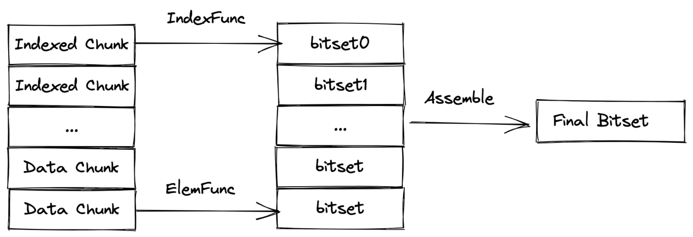

# Scalar Index

Milvus supports filtered searches combining both scalar and vector fields. To enhance the efficiency of searches involving scalar fields, Milvus introduced scalar field indexing starting from version 2.1.0. This article provides an overview of scalar field indexing in Milvus, helping you understand its significance and implementation.

## Overview

Once conducting vector similarity searches in Milvus, you can use logical operators to organize scalar fields into boolean expressions.

When Milvus receives a search request with such a boolean expression, it parses the boolean expression into an abstract syntax tree (AST) to generate a physical plan for attribute filtering. Milvus then applies the physical plan in each segment to generate a [bitset](bitset.md) as the filtering result and includes the result as a vector search parameter to narrow down the search scope. In this case, the speed of vector searches relies heavily on the speed of attribute filtering.

Scalar field indexing is a way of ensuring the speed of attribute filtering by sorting scalar field values in a particular way to accelerate information retrieval.

## Scalar field indexing algorithms

Milvus aims to achieve low memory usage, high filtering efficiency, and short loading time with its scalar field indexing algorithms. These algorithms are categorized into two main types: [auto indexing](#auto-indexing) and [inverted indexing](#inverted-indexing).

### Auto indexing

Milvus automatically creates an auto index for a scalar field based on its data type, without requiring manual intervention. Auto indexing is suitable for prefix match queries and frequent retrieval scenarios.

The following table lists the data types that Milvus supports and their corresponding auto indexing algorithms.

| Data type |   Auto indexing algorithm  |
|-----------|----------------------------|
| VARCHAR   | Inverted index             |
| INT8      | Inverted index             |
| INT16     | Inverted index             |
| INT32     | Inverted index             |
| INT64     | Inverted index             |
| FLOAT     | Inverted index             |
| DOUBLE    | Inverted index             |

### Inverted indexing

Inverted indexing offers a flexible way to create an index for a scalar field by manually specifying index parameters. This method works well for various scenarios, including point queries, pattern match queries, full-text searches, JSON searches, Boolean searches, and even prefix match queries.

The inverted indexes implemented in Milvus are powered by [Tantivy](https://github.com/quickwit-oss/tantivy), a full-text search engine library. Tantivy ensures that inverted indexing in Milvus is both efficient and fast.

An inverted index has two main components: a term dictionary and an inverted list. The term dictionary includes all tokenized words sorted alphabetically, while the inverted list contains the list of documents where each word appears. This setup makes point queries and range queries much faster and more efficient than brute-force searches.

The advantages of using an inverted index are particularly evident in the following operations:

- **Point query**: For example, when searching for documents containing the word **Milvus**, the process begins by checking if **Milvus** is present in the term dictionary. If it is not found, no documents contain the word. However, if it is found, the inverted list associated with **Milvus** is retrieved, indicating the documents that contain the word. This method is far more efficient than a brute-force search through a million documents, as the sorted term dictionary significantly reduces the time complexity of finding the word **Milvus**.
- **Range query**: The efficiency of range queries, such as finding documents with words alphabetically greater than **very**, is also enhanced by the sorted term dictionary. This approach is more efficient than a brute-force search, providing quicker and more accurate results.

### Test results

To demonstrate the performance improvements provided by scalar indexes in Milvus, an experiment was conducted comparing the performance of several expressions using inverted indexing and brute-force search on raw data.

The experiment involved testing various expressions under two conditions: with an inverted index and with a brute-force search. To ensure fairness, the same data distribution was maintained across tests, using the same collection each time. Before each test, the collection was released, and the index was dropped and rebuilt. Additionally, a warm query was performed before each test to minimize the impact of cold and hot data, and each query was executed multiple times to ensure accuracy.

For a dataset of **1 million** records, using an **inverted index** can provide up to a **30x** performance improvement for point queries. The performance gains can be even more significant for larger datasets.

## Performance recommandations

To take full advantage of Milvus' capability in scalar field indexing and unleash its power in vector similarity searches, you may need a model to estimate the size of memory required based on the data you have.

The following tables list the estimation functions for all the data types that Milvus supports.

- Numeric fields

    | Data type                      | Memory estimation function (MB)      |
    | ------------------------------ | ------------------------------------ |
    | INT8                           | numOfRows * **12** / 1024 / 1024     |
    | INT16                          | numOfRows * **12** / 1024 / 1024     |
    | INT32                          | numOfRows * **12** / 1024 / 1024     |
    | INT64                          | numOfRows * **24** / 1024 / 1024     |
    | FLOAT32                        | numOfRows * **12** / 1024 / 1024     |
    | DOUBLE                         | numOfRows * **24** / 1024 / 1024     |

- String fields

    | String length                  | Memory estimation function (MB)      |
    | ------------------------------ | ------------------------------------ |
    | (0, 8]                         | numOfRows * **128** / 1024 / 1024    |
    | (8, 16]                        | numOfRows * **144** / 1024 / 1024    |
    | (16, 32]                       | numOfRows * **160** / 1024 / 1024    |
    | (32, 64]                       | numOfRows * **192** / 1024 / 1024    |
    | (64, 128]                      | numOfRows * **256** / 1024 / 1024    |
    | (128, 65535]                   | numOfRows * **strLen * 1.5** / 1024 / 1024    |

## What's next

- To index a scalar field, read [Build an Index on Scalars](index-scalar-fields.md).
- To learn more about the related terms and rules mentioned above, read

    - [Bitset](bitset.md)
    - [Hybrid search](multi-vector-search.md)
    - [Boolean expression rules](boolean.md)
    - [Supported data types](schema.md#Supported-data-type)
