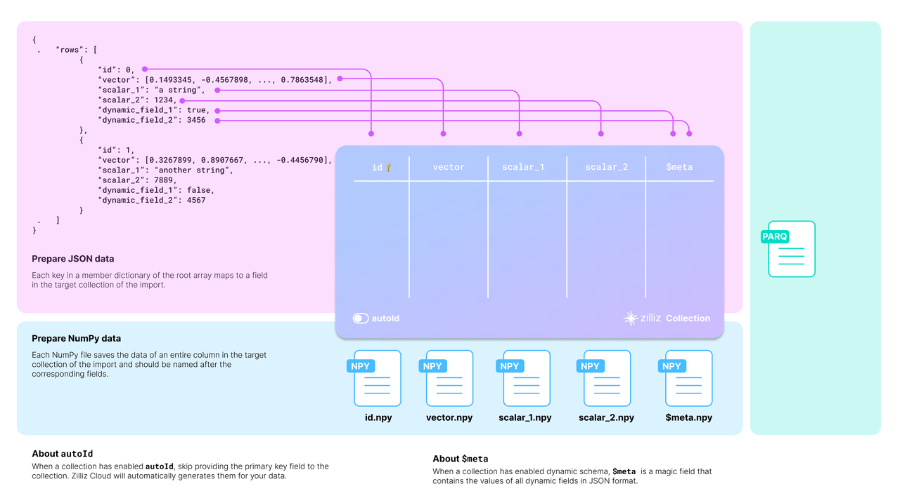

# Prepare Source Data

This page discusses something you should consider before you start bulk-inserting data into your collection.

## Before you start

The target collection requires mapping the source data to its schema. The diagram below shows how acceptable source data is mapped to the schema of a target collection.



You should carefully examine your data and design the schema of the target collection accordingly.

Taking the JSON data in the above diagram as an example, there are two entities in the rows list, each row having six fields. The collection schema selectively includes four: **id**, **vector**, **scalar_1**, and **scalar_2**.

There are two more things to consider when designing the schema:

- **Whether to enable AutoID**

    The **id** field serves as the primary field of the collection. To make the primary field automatically increment, you can enable **AutoID** in the schema. In this case, you should exclude the **id** field from each row in the source data.

- **Whether to enable dynamic fields**

    The target collection can also store fields not included in its pre-defined schema if the schema enables dynamic fields. The **$meta** field is a reserved JSON field to hold dynamic fields and their values in key-value pairs. In the above diagram, the fields **dynamic_field_1** and **dynamic_field_2** and the values will be saved as key-value pairs in the **$meta** field.

The following code shows how to set up the schema for the collection illustrated in the above diagram.

<div class="language-python">

To obtain more information, refer to [`create_schema()`](https://milvus.io/api-reference/pymilvus/v2.4.x/MilvusClient/Collections/create_schema.md) and [`add_field()`](https://milvus.io/api-reference/pymilvus/v2.4.x/MilvusClient/CollectionSchema/add_field.md) in the SDK reference.

</div>

<div class="language-java">

To obtain more information, refer to [`CollectionSchema`](https://milvus.io/api-reference/java/v2.4.x/v2/CollectionSchema/CollectionSchema.md) in the SDK reference.

</div>

<div class="multipleCode">
  <a href="#python">Python </a>
  <a href="#java">Java</a>
</div>

```python
from pymilvus import MilvusClient, DataType

# You need to work out a collection schema out of your dataset.
schema = MilvusClient.create_schema(
    auto_id=False,
    enable_dynamic_field=True
)

schema.add_field(field_name="id", datatype=DataType.INT64, is_primary=True)
schema.add_field(field_name="vector", datatype=DataType.FLOAT_VECTOR, dim=768)
schema.add_field(field_name="scalar_1", datatype=DataType.VARCHAR, max_length=512)
schema.add_field(field_name="scalar_2", datatype=DataType.INT64)

schema.verify()
```

```java
import io.milvus.grpc.DataType;
import io.milvus.param.collection.CollectionSchemaParam;
import io.milvus.param.collection.FieldType;

// Define schema for the target collection
FieldType id = FieldType.newBuilder()
        .withName("id")
        .withDataType(DataType.Int64)
        .withPrimaryKey(true)
        .withAutoID(false)
        .build();

FieldType vector = FieldType.newBuilder()
        .withName("vector")
        .withDataType(DataType.FloatVector)
        .withDimension(768)
        .build();

FieldType scalar1 = FieldType.newBuilder()
        .withName("scalar_1")
        .withDataType(DataType.VarChar)
        .withMaxLength(512)
        .build();

FieldType scalar2 = FieldType.newBuilder()
        .withName("scalar_2")
        .withDataType(DataType.Int64)
        .build();

CollectionSchemaParam schema = CollectionSchemaParam.newBuilder()
        .withEnableDynamicField(true)
        .addFieldType(id)
        .addFieldType(vector)
        .addFieldType(scalar1)
        .addFieldType(scalar2)
        .build();
```

## Set up BulkWriter

**BulkWriter** is a tool designed to convert raw datasets into a format suitable for importing via the RESTful Import API. It offers two types of writers:

- **LocalBulkWriter**: Reads the designated dataset and transforms it into an easy-to-use format.
- **RemoteBulkWriter**: Performs the same task as the LocalBulkWriter but additionally transfers the converted data files to a specified remote object storage bucket.

**RemoteBulkWriter** differs from **LocalBulkWriter** in that **RemoteBulkWriter** transfers the converted data files to a target object storage bucket.

### Set up LocalBulkWriter

A **LocalBulkWriter** appends rows from the source dataset and commits them to a local file of the specified format.

<div class="multipleCode">
  <a href="#python">Python </a>
  <a href="#java">Java</a>
</div>

```python
from pymilvus.bulk_writer import LocalBulkWriter, BulkFileType
# Use `from pymilvus import LocalBulkWriter, BulkFileType` 
# when you use pymilvus earlier than 2.4.2 

writer = LocalBulkWriter(
    schema=schema,
    local_path='.',
    segment_size=512 * 1024 * 1024, # Default value
    file_type=BulkFileType.PARQUET
)
```

```java
import io.milvus.bulkwriter.LocalBulkWriter;
import io.milvus.bulkwriter.LocalBulkWriterParam;
import io.milvus.bulkwriter.common.clientenum.BulkFileType;

LocalBulkWriterParam localBulkWriterParam = LocalBulkWriterParam.newBuilder()
    .withCollectionSchema(schema)
    .withLocalPath(".")
    .withChunkSize(512 * 1024 * 1024)
    .withFileType(BulkFileType.PARQUET)
    .build();

LocalBulkWriter localBulkWriter = new LocalBulkWriter(localBulkWriterParam);
```

<div class="language-python">

When creating a **LocalBulkWriter**, you should:

- Reference the created schema in `schema`.
- Set `local_path` to the output directory.
- Set `file_type` to the output file type.
- If your dataset contains a large number of records, you are advised to segment your data by setting `segment_size` to a proper value.

For details on parameter settings, refer to [LocalBulkWriter](https://milvus.io/api-reference/pymilvus/v2.4.x/DataImport/LocalBulkWriter/LocalBulkWriter.md) in the SDK reference.

</div>

<div class="language-java">

When creating a **LocalBulkWriter**, you should:

- Reference the created schema in `CollectionSchema()`.
- Set the output directory in `withLocalPath()`.
- Set the output file type in `withFileType()`.
- If your dataset contains a large number of records, you are advised to segment your data by setting `withChunkSize()` to a proper value.

For details on parameter settings, refer to LocalBulkWriter in the SDK reference.

</div>

### Set up RemoteBulkWriter

Instead of committing appended data to a local file, a **RemoteBulkWriter** commits them to a remote bucket. Therefore, you should set up a **ConnectParam** object before creating a **RemoteBulkWriter**.

<div class="multipleCode">
  <a href="#python">Python </a>
  <a href="#java">Java</a>
</div>


```python
from pymilvus.bulk_writer import RemoteBulkWriter
# Use `from pymilvus import RemoteBulkWriter` 
# when you use pymilvus earlier than 2.4.2 

# Third-party constants
ACCESS_KEY="minioadmin"
SECRET_KEY="minioadmin"
BUCKET_NAME="milvus-bucket"

# Connections parameters to access the remote bucket
conn = RemoteBulkWriter.S3ConnectParam(
    endpoint="localhost:9000", # the default MinIO service started along with Milvus
    access_key=ACCESS_KEY,
    secret_key=SECRET_KEY,
    bucket_name=BUCKET_NAME,
    secure=False
)
```

```java
import io.milvus.bulkwriter.common.clientenum.BulkFileType;
import io.milvus.bulkwriter.connect.S3ConnectParam;
import io.milvus.bulkwriter.connect.StorageConnectParam;

String ACCESS_KEY = "minioadmin";
String SECRET_KEY = "minioadmin";
String BUCKET_NAME = "milvus-bucket";

StorageConnectParam storageConnectParam = S3ConnectParam.newBuilder()
    .withEndpoint(MINIO_URI)
    .withAccessKey(ACCESS_KEY)
    .withSecretKey(SECRET_KEY)
    .withBucketName(BUCKET_NAME)
    .build();
```

Once the connection parameters are ready, you can reference it in the **RemoteBulkWriter** as follows:

<div class="multipleCode">
  <a href="#python">Python </a>
  <a href="#java">Java</a>
</div>

```python
from pymilvus.bulk_writer import BulkFileType
# Use `from pymilvus import BulkFileType` 
# when you use pymilvus earlier than 2.4.2 

writer = RemoteBulkWriter(
    schema=schema,
    remote_path="/",
    connect_param=conn,
    file_type=BulkFileType.PARQUET
)
```

```java
import io.milvus.bulkwriter.RemoteBulkWriter;
import io.milvus.bulkwriter.RemoteBulkWriterParam;

RemoteBulkWriterParam remoteBulkWriterParam = RemoteBulkWriterParam.newBuilder()
    .withCollectionSchema(schema)
    .withConnectParam(storageConnectParam)
    .withChunkSize(512 * 1024 * 1024)
    .withRemotePath("/")
    .withFileType(BulkFileType.PARQUET)
    .build();

RemoteBulkWriter remoteBulkWriter = new RemoteBulkWriter(remoteBulkWriterParam);
```

<div class="language-python">

The parameters for creating a **RemoteBulkWriter** are barely the same as those for a **LocalBulkWriter**, except `connect_param`. For details on parameter settings, refer to [RemoteBulkWriter](https://milvus.io/api-reference/pymilvus/v2.4.x/DataImport/RemoteBulkWriter/RemoteBulkWriter.md) and [ConnectParam](https://milvus.io/api-reference/pymilvus/v2.4.x/DataImport/RemoteBulkWriter/S3ConnectParam.md) in the SDK reference.

</div>

<div class="language-java">

The parameters for creating a **RemoteBulkWriter** are barely the same as those for a **LocalBulkWriter**, except `StorageConnectParam`. For details on parameter settings, refer to RemoteBulkWriter and StorageConnectParam in the SDK reference.

</div>

## Start writing

<div class="language-python">

A **BulkWriter** has two methods: `append_row()` adds a row from a source dataset, and `commit()` commits added rows to a local file or a remote bucket.

</div>

<div class="language-java">

A **BulkWriter** has two methods: `appendRow()` adds a row from a source dataset, and `commit()` commits added rows to a local file or a remote bucket.

</div>

For demonstration purposes, the following code appends randomly generated data.

<div class="multipleCode">
  <a href="#python">Python </a>
  <a href="#java">Java</a>
</div>

```python
import random
import string

def generate_random_str(length=5):
    letters = string.ascii_uppercase
    digits = string.digits
    
    return ''.join(random.choices(letters + digits, k=length))

for i in range(10000):
    writer.append_row({
        "id": i, 
        "vector": [random.uniform(-1, 1) for _ in range(768)],
        "scalar_1": generate_random_str(random.randint(1, 20)),
        "scalar_2": random.randint(0, 100)
    })
    
writer.commit()
```

```java
import com.alibaba.fastjson.JSONObject;

for (int i = 0; i < 10000; i++) {
    JSONObject json = new JSONObject();
    json.put("id", i);
    json.put("vector", get_random_vector(768));
    json.put("scalar_1", get_random_string(20));
    json.put("scalar_2", (long) (Math.random() * 100));

    // localBulkWriter.appendRow(json);
    remoteBulkWriter.appendRow(json);
}

// localBulkWriter.commit(false);
remoteBulkWriter.commit(false);
```

Since the schema defined permits dynamic fields, you can also include non-schema-defined fields in the data to insert as follows.

<div class="multipleCode">
  <a href="#python">Python </a>
  <a href="#java">Java</a>
</div>

```python
import random
import string

def generate_random_string(length=5):
    letters = string.ascii_uppercase
    digits = string.digits
    
    return ''.join(random.choices(letters + digits, k=length))

for i in range(10000):
    writer.append_row({
        "id": i, 
        "vector":[random.uniform(-1, 1) for _ in range(768)],
        "scalar_1": generate_random_string(),
        "scalar_2": random.randint(0, 100),
        "dynamic_field_1": random.choice([True, False]),
        "dynamic_field_2": random.randint(0, 100)
    })
    
writer.commit()
```

```java
for (int i = 0; i < 10000; i++) {
    JSONObject json = new JSONObject();
    json.put("id", i);
    json.put("vector", get_random_vector(768));
    json.put("scalar_1", get_random_string(20));
    json.put("scalar_2", (long) (Math.random() * 100));
    json.put("dynamic_field_1", get_random_boolean());
    json.put("dynamic_field_2", (long) (Math.random() * 100));

    // localBulkWriter.appendRow(json);
    remoteBulkWriter.appendRow(json);
}

// localBulkWriter.commit(false);
remoteBulkWriter.commit(false);
```

## Verify the results

<div class="language-python">

To check the results, you can get the actual output path by printing the `batch_files` property of the writer.

</div>

<div class="language-java">

To check the results, you can get the actual output path by printing the `getBatchFiles()` method of the writer.

</div>

<div class="multipleCode">
  <a href="#python">Python </a>
  <a href="#java">Java</a>
</div>

```python
print(writer.batch_files)

# [['d4220a9e-45be-4ccb-8cb5-bf09304b9f23/1.parquet'],
#  ['d4220a9e-45be-4ccb-8cb5-bf09304b9f23/2.parquet']]
``` 

```java
// localBulkWriter.getBatchFiles();
remoteBulkWriter.getBatchFiles();

// 

// Close the BulkWriter
try {
    localBulkWriter.close();
    remoteBulkWriter.close();            
} catch (Exception e) {
    // TODO: handle exception
    e.printStackTrace();
}
```

**BulkWriter** generates a UUID, creates a sub-folder using the UUID in the provided output directory, and places all generated files in the sub-folder. [Click here](https://assets.zilliz.com/bulk_writer.zip) to download the prepared sample data.

Possible folder structures are as follows:

```bash
# JSON
├── folder
│   └── 45ae1139-1d87-4aff-85f5-0039111f9e6b
│       └── 1.json 

# Parquet
├── folder
│   └── 45ae1139-1d87-4aff-85f5-0039111f9e6b
│       └── 1.parquet 
```
