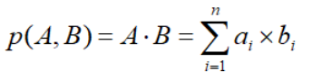
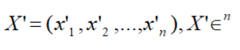
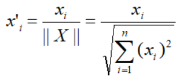

# 距离计算方式

Milvus 基于不同的距离计算方式比较向量间的距离。选择合适的距离计算方式能极大地提高数据分类和聚类性能。

以下表格列出了 Milvus 目前支持的距离计算方式与数据格式、索引类型之间的兼容关系。

<a href="#floating">浮点型向量</a> <a href="#binary">二值型向量</a>

<table class="tg">
<thead>
  <tr>
    <th class="tg-0pky">距离计算方式</th>
    <th class="tg-0pky">索引类型</th>
  </tr>
</thead>
<tbody>
  <tr>
    <td class="tg-0pky">欧氏距离 (L2)</td>
    <td class="tg-0pky" rowspan="2"><ul><li>FLAT</li><li>IVF_FLAT</li><li>IVF_SQ8</li><li>IVF_SQ8H</li><li>IVF_PQ</li><li>RNSG</li><li>HNSW</li><li>ANNOY</li></ul></td>
  </tr>
  <tr>
    <td class="tg-0pky">内积 (IP)</td>
  </tr>
</tbody>
</table>

<table class="tg">
<thead>
  <tr>
    <th class="tg-0pky">距离计算方式</th>
    <th class="tg-0pky">索引类型</th>
  </tr>
</thead>
<tbody>
  <tr>
    <td class="tg-0pky">杰卡德距离 (Jaccard) 谷本距离 (Tanimoto) 汉明距离 (Hamming)</td>
    <td class="tg-0pky"><ul><li>FLAT</li><li>IVF_FLAT</li></ul></td>
  </tr>
  <tr>
    <td class="tg-0pky">超结构 (superstructure) 子结构 (substructure)</td>
    <td class="tg-0pky">FLAT</td>
  </tr>
</tbody>
</table>

### 欧氏距离（L2）

欧氏距离计算的是两点之间最短的直线距离。

欧氏距离的计算公式为：

其中 **a** = (a1, a2,..., an) 和 **b** = (b1, b2,..., bn) 是 n 维欧氏空间中的两个点。

欧氏距离是最常用的距离计算方式之一，应用广泛，适合数据完整，数据量纲统一的场景。

### 内积 （IP）

两条向量内积距离的计算公式为：

假设有 A 和 B 两条向量，则 `||A||` 与 `||B||` 分别代表 A 和 B 归一化后的值。

内积更适合计算向量的方向而不是大小。

如需使用点积计算向量相似度，则必须对向量作归一化处理。处理后点积与余弦相似度等价。

假设 X' 是向量 X 的归一化向量：

两者之间的关系为：

### 杰卡德距离

杰卡德相似系数计算数据集之间的相似度，计算方式为：数据集交集的个数和并集个数的比值。计算公式可以表示为：

杰卡德距离是用来衡量两个数据集差异性的一种指标，被定义为 1 减去杰卡德相似系数。对于二值变量，杰卡德距离等价于谷本系数。

杰卡德距离适合字符串相似性度量。

### 谷本距离

对于二值变量，谷本距离公式可表示为：

在 Milvus 中，谷本距离仅支持二值变量。

值域从 0 到正无穷。

对于二值变量，谷本系数等价于杰卡德距离：

对于二值变量，谷本系数值域为 0 到 +1（+1 的相似度最高）

### 汉明距离

汉明距离计算二进制字符串之间的距离。两个等长字符串之间的汉明距离定义为将其中一个变为另外一个所需要作的最小替换次数。

比如，假设有两条字符串 1101 1001 和 1001 1101。比较时，如果字符相同用 0 表示，如果字符不同则用 1 表示。

11011001 ⊕ 10011101 = 01000100

所以以上两条字符串之间的汉明距离为 2。

### 超结构

超结构主要用来计算某化学结构与其超结构的相似度。值越小则相似度越大。Milvus 目前只返回距离为 0 的结果。

超结构的公式可表示为：

其中

- 分子式 B 是分子式 A 的超结构。
- NA 表示分子式 A 的化学指纹中二进制位的数量。
- NB 表示分子式 B 的化学指纹中二进制位的数量。
- NAB 表示分子式 A 和 B 的化学指纹中共有的二进制位的数量。

### 子结构

子结构主要用来计算某化学结构与其子结构的相似度。值越小则相似度越大。Milvus 目前只返回距离为 0 的结果。

子结构的公式可表示为：

其中

- 分子式 B 是分子式 A 的子结构。
- NA 表示分子式 A 的化学指纹中二进制位的数量。
- NB 表示分子式 B 的化学指纹中二进制位的数量。
- NAB 表示分子式 A 和 B 的化学指纹中共有的二进制位的数量。

