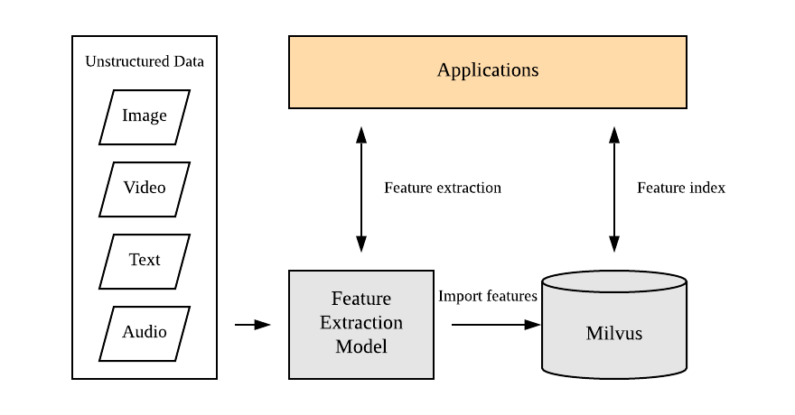
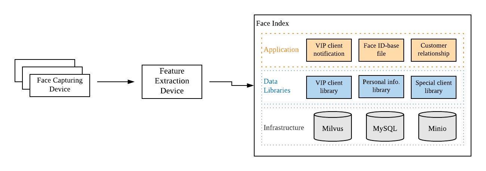
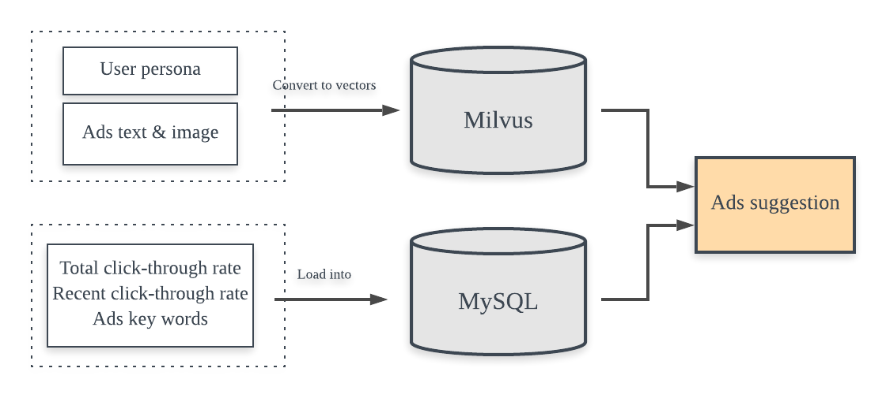

# Application Scenarios

## Typical scenarios

Milvus can be used to build intelligent systems in most AI application scenarios:

- Image search

  Query by image content，including content-based image retrieval such as bio-identification, object detection and recognition, and payment authentication powered by facial identification, etc.

- Video processing

  Real-time object detection and tracing.

- Natural language analysis

  Semantics-based text analysis and suggestion, and text similarity search.

- Voiceprint recognition and audio search

- Remove duplicated files by file fingerprint

## Application architecture

The application architecture of Milvus as a feature vector search engine is as follows:

Unstructured data (images/videos/texts/audios) are transformed to feature vectors by feature extraction models, and saved to Milvus database. When you input a target vector, it is saved  to the current vector collection, and the search begins, until the most similar vectors are matched, and their IDs returned.

## Use case 1 - Human face search

### Background

The competition for customer resources among commercial banks has changed from product-oriented to service-oriented. More and more banks tend to compete for enhanced customer experience through personalized services.

Human face search can help recognize a customer and find his/her personal file. When a customer comes into a store it can be quickly determined whether the customer is an existing customer through face recognition, and the customer's personal file, including such information as name, age, product transactions, trading records, business habits, can be instantly obtained so that the bank staff can provide personalized services.

### User requirements

- VIP customer notification

VIP customer library contains human face features of VIP customers. All human faces captured by the camera are to be compared to those in the library. Once a similar face is matched, an notification is sent to the system.

- One customer one file

A human face captured by the camera will be compared to those in the library to find the corresponding file containing all the information of the customer.

### Application

- **Face capture device**: When human face images are captured by the camera, they are sent to feature vector collection devices.

- **Feature extraction service**: The human face images are further transformed and represented by 512-dimensional feature vectors by machine learning models.

- **Application**

  - VIP client notification: If a human face within the VIP group library is found, an notification is sent to the system.
  - Customer file search: Search for customer's personal file based on face ID. 

- **Data libraries**

  - VIP customer library

    - Vector library with million datasets
    - High search precision and fast indexing speed (QPS >= 1000) 
    - Batch search supported
    
  - Ordinary customer library

    - Vector library with billions of human face feature vectors
    - High indexing speed with a QPS of 1000
    - Batch search supported
    
  - Information library

    - Relational database with MySQL storage
    - Mainly keeps ID-based personal information files

- **Basic architecture**
  - Milvus for vector storage
  - MySQL for relational data storage

## Use case 2 - Personalized recommendation

### Background

Nowadays, when you shop or view pages online, you will often see such words as "You may also like" or "Related products". In fact, many tech companies have embedded recommendation algorithms into their mobile Apps. Some examples include the Toutiao news, NetEase news, Pinduoduo, and WeChat, etc. With Milvus, you can implement your own personalized recommendation system.

### User requirements

Recommend personalized content based on user persona.

### Application

Take personalized advertising content recommendation as an example, the application architecture is:

1. Create user persona by data analysis and key feature extraction

   By analyzing user history data and extracting key features, the user persona can be built. For example: The user history data contains news content about tennis, Wimbledon Championships, sports and Tennis Masters. So we can conclude from these keywords that the user is a tennis fan.

2. Convert user keywords to vectors, load them to Milvus, and extract user feature vectors.

3. Recommend content to users based on feature vectors and logistic regression model.

   1) Search and filter out the top 100 ads that the user might be interested in and has not yet viewed.
   2) Extract the keywords and click-through rate of the top 100 ads.
   3) Locate and recommend the ads content to the user based on logistic regression model (which arises from user history data).
  
## Use case 3 - Product feature extraction and multimodal search

### Background

Online sellers need to prepare product images and tag product categories to help buyers better learn the product. As product categories grow, there will be a large sum of product images to be managed. If these product images are not well organized and utilized, it is often the case that you can't find the previously prepared image and need to retake it. 

### User requirements

Manage product images, and run multimodal similarity search based on keywords, for example, find out the most similar images of the most popular products.

### Application 

Milvus helps you realize product feature extraction and multimodal search by the following procedures: 

1. Convert product images to vectors.

2. Load these vectors, together with other structured data such as product prices, publish date, sold quantity into Milvus.

3. Begin multimodal search, specifying the query range as "among the top 10 products that sold the most".

4. Find out the most similar images that belong to the top 10 products.

## Use case 4 - Video deduplication

### Background

Today, online shopping and product trading has becoming a daily routine. On commodity trading platforms such as Taobao and Xianyu, sellers can display products to customers more fully and intuitively through product videos. Meanwhile, product video copying and plagiarism have also appeared. One solution to find a duplicate video is by vector similarity search.

Take Xianyu, the second-hand commodity trading platform as an example. According to its current product size and business development trend, the vector index system needs to support billions of videos with an average length of 20 seconds, and a 1024-dimensional vector per second.

### User requirements

Recognize and remove duplicate videos

### Application

The core of video deduplication is high-dimensional vector index. Milvus helps you recognize duplicate videos through these steps:

1. Video vectorization

   Convert video data to vectors according to certain algorithms. The converting algorithm determines how precisely the original video is represented by vectors.

2. Vector distance computation

   When the video is represented by vectors, the similarity of videos can be measured by similarity of vectors. The distance between vectors can be calculated by the angle cosine, Euclidean distance and vector inner product.

3. Vector index

   Search the most similar vector by multiple vector indexing methods such as tree-based, hash-based and vector quantization, etc.
