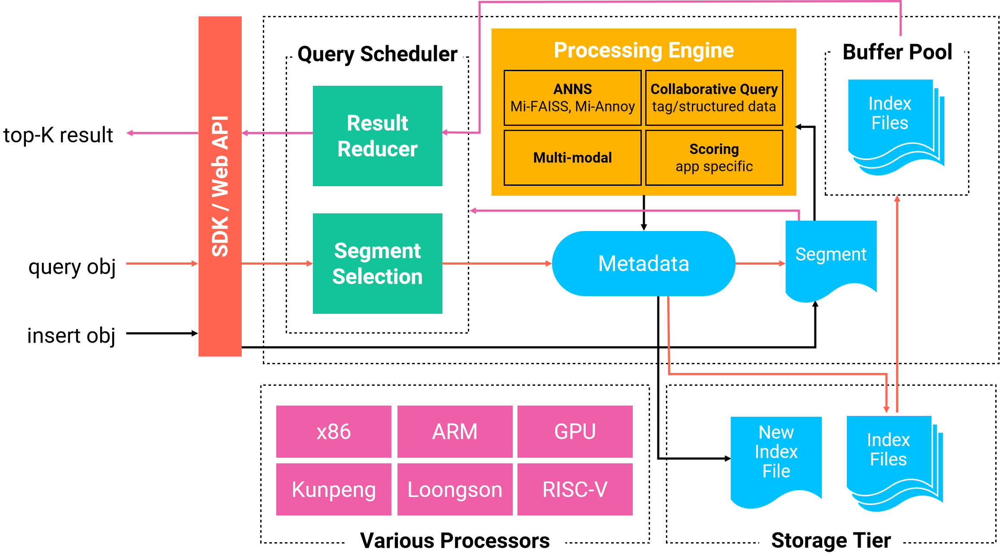

# Milvus Overview

## What is Milvus 

As an open source vector similarity search engine, Milvus is easy-to-use, highly reliable, scalable, robust, and blazing fast. It integrates vector index libraries such as Faiss, NMSLIB, and Annoy, hides their complexity, and provides simple and consistent APIs. Milvus offers efficient means of managing vector data, including adding, deleting, and modifying vector and non-vector data. Aside from near real-time search for vectors, Milvus also supports filtering scalar data. With the increase of data and query scale, Milvus also provides a solution for cluster sharding, which supports functions such as read/write separation, horizontal scalability, and dynamic scalability, to cope with large data volume. These capabilities facilitate the extensive use of Milvus in hundreds of organizations and institutions worldwide in the following scenarios:

- Image, video, and audio search
- Text search, recommender system, interactive question answering system, and other text search fields
- Drug discovery, genetic screening, and other biomedical fields

In addition to core functions such as data management and vector search, Milvus also provides

- JSON-based DSL that contains flexible and convenient search methods,
- SDK and RESTful APIs based on Python / Java / Go / C++,
- monitoring and alarm system based on Prometheus,
- deployment methods based on Docker and Kubernetes.

The above features have greatly enhanced the ease of use of Milvus.

Milvus is a user-friendly product out of the box because all configuration parameters have default values. With the growing understanding of Milvus, you will find that Milvus is flexible and configurable in its entirety. You can explore the advanced features of Milvus to optimize the storage and search of vectors to better serve your business.

Milvus was released under the Apache 2.0 License and officially open sourced in October 2019. It is an incubation project of the [LF AI](https://lfai.foundation/) Foundation. The source code of Milvus is hosted on GitHub: [Milvus · An Open Source Vector Similarity Search Engine](https://github.com/milvus-io/milvus). If you want to join our developer community, welcome to visit: [Contribute to Milvus](https://github.com/milvus-io/milvus/blob/master/CONTRIBUTING.md#contributing-to-milvus).

If you have any questions about the functions or SDK of Milvus, you are welcomed to join [Slack](https://join.slack.com/t/milvusio/shared_invite/zt-e0u4qu3k-bI2GDNys3ZqX1YCJ9OM~GQ) and talk with us.

## Key features

- Comprehensive Similarity Metrics

  Milvus offers frequently used similarity metrics, including Euclidean distance, inner product, Hamming distance, Jaccard distance, etc, allowing you to explore vector similarity in the most effective and efficient way possible.

- Leading-Edge Performance

  Milvus is built on top of multiple optimized Approximate Nearest Neighbor Search (ANNS) indexing libraries, such as faiss, annoy, and hnswlib, ensuring that you always get the best performance across various scenarios.

- Dynamic Data Management
  
  No longer troubled by static data, you can operate data with insertion, deletion, search and update whenever needed. 

- Near Real Time Search
  
  Data is available for search almost immediately after being inserted and updated. Milvus does the heavy lifting in your best interests in terms of both result accuracy and data consistency.

- Cost-Efficient
  
  Milvus harnesses the parallelism of modern processors and enables billion-scale similarity searches in milliseconds on a single off-the-shelf server. 

- Rich Data Type and Advanced Search (coming soon)
  
  Milvus supports various data types for fields in a record. You can also use advanced search methods, such as filtering, sorting and aggregation for one or multiple fields.

- Highly Scalable and Robust
  
  You can deploy Milvus in a distributed environment. To increase the capacity and reliability of a Milvus cluster, you can simply add more nodes.

- Cloud Native
  
  We make it easy for you to run Milvus on public cloud, private cloud, or anywhere in between.

- Ease of Use

  Milvus provides easy-to-use SDKs in Python, Java, Go and C++, as well as RESTful APIs.

## Overall architecture

## What's next

- Explore more concepts of [vectors](vector.md), [vector search](index_method.md) and [vector database](vector_db.md)
- [Install Milvus](../guides/get_started/install_milvus/install_milvus.md) and start to explore around

