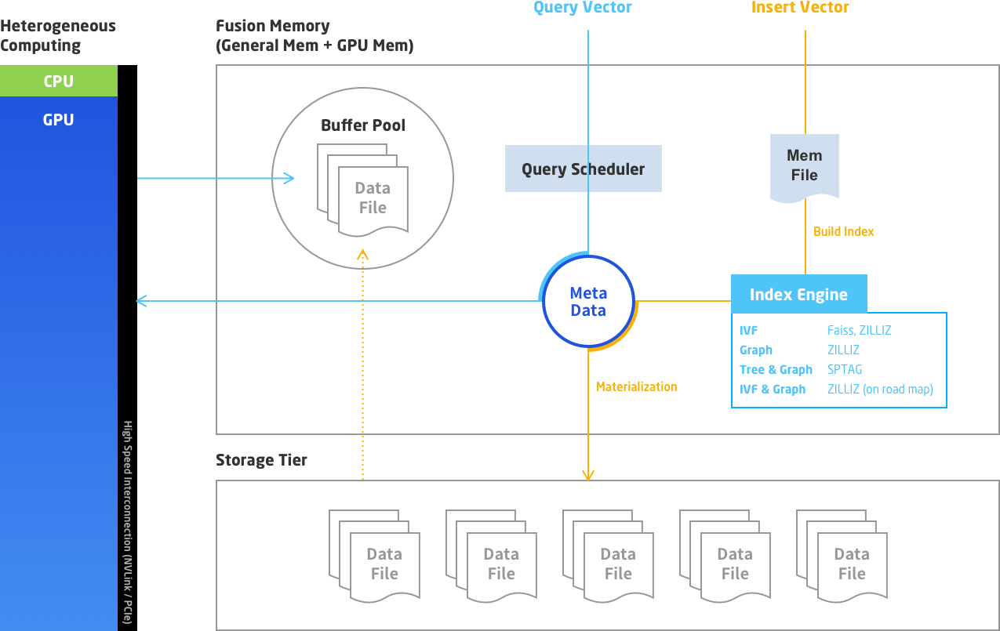

# Milvus 简介

## Milvus 是什么

Milvus 是一款开源向量相似度搜索引擎，建立在 Faiss、NMSLIB、Annoy 等向量索引库基础之上，具有功能强大、稳定可靠以及易于使用等特点。Milvus 集成了这些向量索引库，隐藏了他们的复杂性，提供了一套简单而一致的 API。此外，Milvus 能够有效的管理向量数据，提供针对向量和非向量数据的增删改查的能力。除了提供针对向量的近实时搜索能力外，Milvus 可以对标量数据进行过滤。随着数据和查询规模的增加，Milvus 还提供了集群分片的解决方案，支持读写分离、水平扩展、动态扩容等功能，实现了对于超大数据规模的支持。这些能力使得 Milvus 可以广泛地应用于以下场景：

- 图像、视频、音频等音视频搜索领域
- 文本搜索、推荐和交互式问答系统等文本搜索领域
- 新药搜索、基因筛选等生物医药领域

除了提供核心的数据管理和搜索功能外，Milvus 还提供了

- 基于 JSON 的 DSL，提供用户灵活方便的搜索方式
- 基于 Python / Java / Go / C++ 的 SDK 和 RESTful API
- 对接基于 Prometheus 的监控与告警系统
- 基于 Docker和 Kubernetes 的部署方式

以上功能都极大地增强了 Milvus 的易用性。

Milvus 是开箱即用的产品，所有配置参数都有默认值。因此对初学者来说使用体验非常友好。随着深入了解 Milvus，你会发现整个 Milvus 都是灵活可配置的。你可以利用 Milvus 的高级特性来优化向量的存储与搜索，更好地服务于你的业务。

Milvus 在 Apache 2 License 协议下发布，于 2019 年 10 月正式开源，是 [LF AI](https://lfai.foundation/) 基金会的孵化项目。Milvus 的源代码被托管于 Github 之上：[Milvus · 开源的特征向量相似度搜索引擎](https://github.com/milvus-io/milvus)。如果你想加入我们的开发者社区，欢迎访问：[Contribute to Milvus](https://github.com/milvus-io/milvus/blob/master/CONTRIBUTING.md#contributing-to-milvus)。

如果你对 Milvus 有任何与功能、SDK 等相关的问题，欢迎加入 [Slack](https://join.slack.com/t/milvusio/shared_invite/zt-e0u4qu3k-bI2GDNys3ZqX1YCJ9OM~GQ) 参与讨论。

## 主要特性

- 全面的相似度指标
  
  Milvus 支持各种常用的相似度计算指标，包括欧氏距离、内积、汉明距离和杰卡德距离等。你可以根据应用需求来选择最有效的向量相似度计算方式。

- 业界领先的性能

  Milvus 基于高度优化的 Approximate Nearest Neighbor Search (ANNS) 索引库构建，包括 faiss、 annoy、和 hnswlib 等。你可以针对不同使用场景选择不同的索引类型。

- 动态数据管理
  
  你可以随时对数据进行插入、删除、搜索、更新等操作而无需受到静态数据带来的困扰。

- 近实时搜索
  
  在插入或更新数据之后，你可以几乎立刻对插入或更新过的数据进行搜索。Milvus 负责保证搜索结果的准确率和数据一致性。

- 高成本效益
  
  Milvus 充分利用现代处理器的并行计算能力，可以在单台通用服务器上完成对十亿级数据的毫秒级搜索。

- 支持多种数据类型和高级搜索（即将上线）
  
  Milvus 的数据记录中的字段支持多种数据类型。你还可以对一个或多个字段使用高级搜索，例如过滤、排序和聚合。

- 高扩展性和可靠性
  
  你可以在分布式环境中部署 Milvus。如果要对集群扩容或者增加可靠性，你只需增加节点。

- 云原生

  你可以轻松在公有云、私有云、或混合云上运行 Milvus。

- 简单易用

  Milvus 提供了易用的 Python、Java、Go 和 C++ SDK，另外还提供了 RESTful API。

## 整体架构

## 接下来你可以

- 了解 [特征向量](vector.md), [向量数据库](vector_db.md) 的发展现状和 [向量检索算法](index_method.md)
- 几分钟轻易搞定 [Milvus 安装](../guides/get_started/install_milvus/install_milvus.md)
