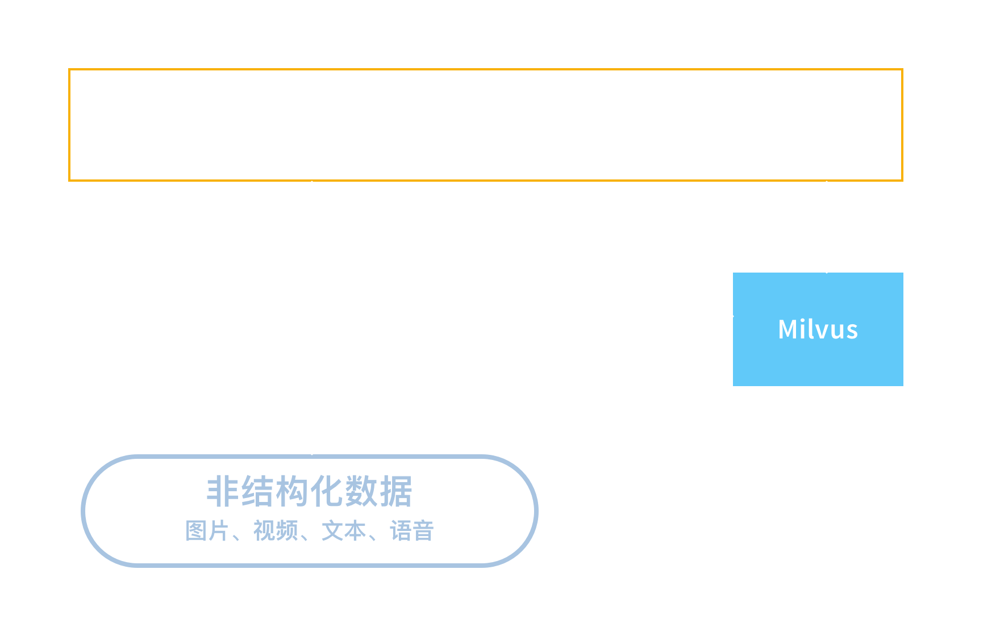

# 应用场景

## 典型场景

在目前大部分的 AI 应用场景下，都可以使用 Milvus 来搭建智能应用系统：

- 图片识别

  以图搜图，通过图片检索图片。具体应用例如：车辆检索和商品图片检索等。

- 视频处理

  针对视频信息的实时轨迹跟踪

- 自然语言处理

  基于语义的文本检索和推荐，通过文本检索近似文本。

- 声纹匹配，音频检索。

- 文件去重，通过文件指纹去除重复文件。

## 典型架构

Milvus 做特征向量检索时典型应用架构如下：

非结构化数据（图像/视频/文字/音频等）首先通过特征提取模型产生特征向量，然后存入Milvus数据库系统。查询的时候，待查询的非结构化数据，也需要通过特征提取模型，提取特征向量。然后用该向量到Milvus中已存入的向量集里，查询匹配度最高的向量集合。最后，使用返回的向量ID，找到对应非结构化数据，结合上层应用，实现对应功能。

## 案例 1 - 个性化推荐系统

#### 背景

互联网时代个性化推荐已经渗透到人们生活的方方面面，例如常见的“猜你喜欢”、“相关商品”等。目前很多成功的手机 APP 都引入了个性化推荐算法，实时精准地把握用户兴趣，推荐他们最感兴趣的内容。例如，新闻类的有今日头条新闻客户端、网易新闻客户端等；商品广告类的有拼多多、微信等。Milvus 向量分析可以帮助你实现上述个性化推荐系统。

#### 用户需求

基于用户画像推荐个性化内容

#### 实现方案

以个性化广告内容推荐为例，Milvus 实现架构如下：

具体实现步骤为：

1. 分析用户数据，找出关键词，构建相应用户画像。

   通过分析用户历史浏览数据，从中提取关键词，构建相应的用户画像。例如，某用户浏览了多条美容护肤产品或关注了相关公众号，浏览内容中包含了美容文章、护肤产品、防晒、美白等关键词，通过这些关键词可以得出该用户是一个热衷美容护肤的人。

2. 将用户关键词转换为向量，并将它们导入 Milvus，得到用户特征向量。

3. 基于用户特征向量，结合逻辑回归模型，将用户感兴趣的广告推荐给用户。

   1）Milvus 可以从互联网检索出前100条用户没有浏览过的广告，但是这100条广告却是该用户最感兴趣的广告。
   2）从这100条广告中提取每条广告的关键词和点击率。
   3）根据逻辑回归模型（该模型来自于用户以往的浏览的历史记录中），将用户感兴趣的广告推荐给用户。

## 案例 2 - 商品属性提取与多模搜索

#### 背景

为了方便买家更好地了解商品，电商卖家通常需要提供商品照片、标注商品类别和属性。随着商品种类的增加，将积累大量的图片素材。如果不能很好地管理这些图片，则容易出现找不到之前已经准备好的图片，需要重新拍摄的情况。

#### 用户需求

管理商品图片。根据关键词，对相似图片进行多模搜索。比如，搜索与目标图片最相似，且最近畅销度最高的所有商品图片。

#### 实现方案

Milvus 主要通过以下步骤实现商品属性提取与多模搜索：

1. 将商品图片转化为向量。

2. 连同其它商品数据如价格、上市日期、卖出件数等结构化数据一并存入 Milvus。

3. 启动多模检索，并指定搜索范围为“卖出件数最多的商品”。

4. 在最畅销商品图片中中搜索出相似度最高的图片。

## 案例 3 - 视频去重

#### 背景

如今，在线商品交易已经成为人们购物的日常，在诸如淘宝、咸鱼等商品交易平台上，卖家可以通过商品视频来更全面直观地向顾客展示商品。但与此同时也出现了一些视频拷贝、抄袭等不好的现象。其中一种解决方案时通过向量检索视频相似性，进而判断视频是否重复。

以二手商品交易平台闲鱼为例，根据其当前商品规模及业务发展的预估，闲鱼向量检索系统需支持检索亿级别平均时长为20秒，每秒向量维度是1024维的视频。

#### 用户需求

去除重复视频

#### 实现方案

视频去重本质是高维向量检索，Milvus 主要通过以下步骤实现：

1. 视频向量化

   将视频数据按照一定的算法转换为向量，转换算法决定了向量表达原始视频数据的准确性。

2. 计算向量距离

   将视频转化为向量之后，计算视频的相似性就相当于计算向量的相似性。可以通过计算夹角余弦、欧氏距离和向量内积等方式计算向量间的距离。

3. 向量检索

   通过基于树的算法，哈希算法，矢量量化等，对向量进行检索，找出与目标向量（目标视频）相似度最高的向量。
