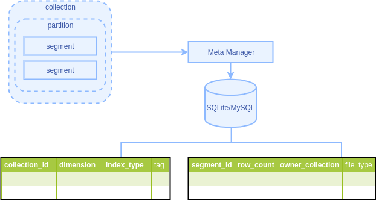

# Storage Concepts

## Partition and segment

When creating a collection, Milvus controls the size of a data segment according to the `index_file_size`. Also, Milvus provides partition function, you can divide the data into multiple partitions as needed. Reasonable organization and division of data can effectively improve query performance.

#### Segment

To process massive data, Milvus segments the data and each segment of data has tens or even hundreds of thousands of entities. Milvus separates the data in each segment by fields and stores the data in each field a data file. In the current version, an entity contains only one ID field and one vector field, so each segmented data file mainly includes a UID file and an original vector data file.

The size of a segment is determined by the `index_file_size` (by default 1024 MB) when Milvus is creating the collection.

When building indexes, Milvus builds an index for each segment in the collection in order and stores the index into a separate file. Index files are independent of each other. Indexing can significantly improve retrieval performance.

#### Partition

After a collection has accumulated massive data, the query performance gradually declines. In some scenarios, only part of the data in a collection needs to be queried, so Milvus divides the data in the collection into multiple parts on physical storage based on certain rules. Such operation is called partitioning. Each partition can contain multiple segments.

A partition is identified by a tag. When inserting vector data, you can use the tag to specify  which partition to insert the data into. When querying vector data, you can use the tag to specify the partition where the query should be executed. Milvus supports both the exact matching and regular expression matching for partition tags.

Each collection can have 4096 partitions at most.

#### The relationship between collections, partitions and segments

The relationship between collections, partitions, and segments is as follows:

Each collection has a <code>_default</code> section. If no partition is specified when inserting data, Milvus inserts the data into the <code>_default</code> partition.

## Metadata

Both the partition or segment are organizational forms of data in physical storage. When querying data, Milvus must know the location and status information of each data file on the physical storage, including the collection it belongs to, the number of entities it contains, the file size, the globally unique identifier, and the creation date, which are called metadata. In addition, the metadata also contains collection and partition information, including collection name, collection dimension, index type, partition label, and so on. 

When data changes, the metadata should change accordingly and be easy to obtain. Therefore, it is an ideal choice to use a transactional database to manage metadata. Milvus provides SQLite or MySQL as a backend service for metadata and MySQL is recommended for production environments or distributed services.

The metadata back-end service is not responsible for storing entity data and indexes.

