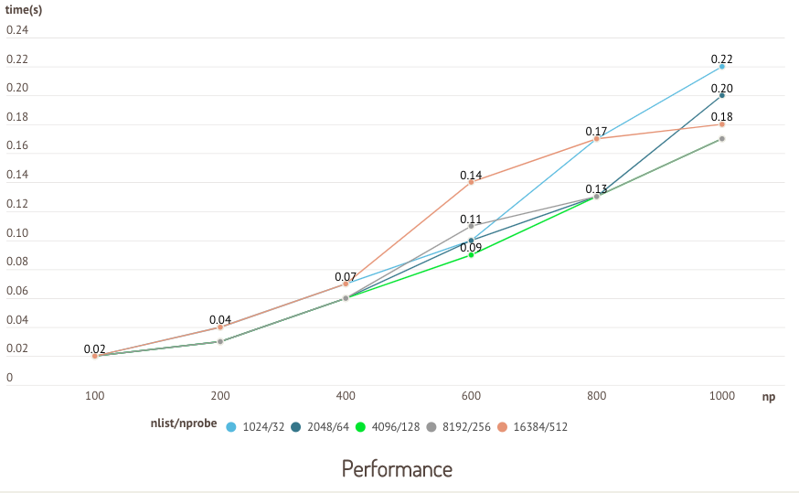

# 安装、启动 Milvus 服务

<div class="tab-wrapper"><a href="milvus_docker-cpu.md" class=''>CPU 版 Milvus</a><a href="milvus_docker-gpu.md" class='active '>GPU 版 Milvus</a></div>

## 安装前提

#### 操作系统

| 操作系统    | 版本      |
| -------------- | ------------ |
| CentOS         | 7.5 或以上    |
| Ubuntu LTS     | 18.04 或以上  |

#### 硬件

| 硬件  | 建议配置                               |
| ---- | ------------------------------------- |
| CPU  | Intel CPU Sandy Bridge 或以上          |
| CPU 指令集 | <ul><li>SSE42</li><li>AVX</li><li>AVX2</li><li>AVX512</li></ul> |
| GPU  | NVIDIA Pascal 或以上                   |
| 内存  | 8 GB 或以上（取决于具体向量数据规模）     |
| 硬盘  | SATA 3.0 SSD 或以上                    |

#### 软件

| 软件            | 版本                                |
| -------------- | -------------------------------------- |
| Docker         | 19.03 或以上                            |
| NVIDIA Driver  | 418 或以上                              |
| NVIDIA Container Toolkit  | [NVIDIA-Container-Toolkit](https://github.com/NVIDIA/nvidia-docker)                              |

## 确认 Docker 状态

确认 Docker daemon 正在运行：

```shell
$ sudo docker info
```

<div class="alert note">
<ul>
<li>如果无法正常打印 Docker 相关信息，请启动 Docker daemon。</li>
<li>在 Linux 上需要使用 <code>sudo</code> 执行 Docker 命令。若要在没有 <code>sudo</code> 的情况下运行 Docker 命令，请创建 <code>docker</code> 组并添加用户，详见 <a href="https://docs.docker.com/install/linux/linux-postinstall/">Linux 安装步骤</a>。</li>
</ul>
</div>

## 拉取 Milvus 镜像

拉取支持 GPU 的镜像：

```shell
$ sudo docker pull milvusdb/milvus:1.1.1-gpu-d061621-330cc6
```

<div class="alert note">
<ul>
<li>如果你的主机由于网络限制无法在线获得 Docker 镜像和配置文件，请从其他主机在线获取镜像，保存为 TAR 文件传输回本地，传输完成后重新加载为 Docker 镜像：
<details>
<summary><font color="#3ab7f8">点击查看离线传输相关代码示例。</font></summary>
<ol>
 <li>将 Docker 镜像保存为 TAR 文件再使用合适的方式传输。</br>

<code class="language-shell">
    $ docker save milvusdb/milvus > milvus_image.tar
</code>
</li>

<li>将 TAR 文件传输完成后使用以下命令重新加载成 Docker 镜像。</br>

<code class="language-shell">
    $ docker load < milvus_image.tar
</code>
</li></ol>
</details></li>
<li>如果拉取镜像的速度过慢或一直失败，请参考 <a href="operational_faq.md">部署运维问题</a> 中提供的解决办法。</li>
</ul>
</div>

## 下载并修改配置文件

```shell
$ mkdir -p /home/$USER/milvus/conf
$ cd /home/$USER/milvus/conf
$ wget http://raw.githubusercontent.com/milvus-io/milvus/v1.1.1/core/conf/demo/server_config.yaml
```

<div class="alert note">
如果无法通过 <code>wget</code> 命令正常下载，你也可以在 <b>/home/$USER/milvus/conf</b> 目录下创建 <b>server_config.yaml</b> 文件，然后将 <a href="https://github.com/milvus-io/milvus/blob/v1.1.1/core/conf/demo/server_config.yaml">server config 文件</a> 的内容复制到你创建的配置文件中。
</div>

配置文件下载完成后，你需要将 **server_config.yaml** 中的 `gpu` 区域的 `enable` 参数设置为 `true`。

## 启动 Milvus Docker 容器

<div class="alert note">
启动 Docker 容器之前，你必须将 <b>server_config.yaml</b> 中 <code>gpu</code> 部分的 <code>enable</code> 设为 <code>true</code>。
</div>

启动 Docker 容器，将本地的文件路径映射到容器中：

```shell
$ sudo docker run -d --name milvus_gpu_1.1.1 --gpus all \
-p 19530:19530 \
-p 19121:19121 \
-v /home/$USER/milvus/db:/var/lib/milvus/db \
-v /home/$USER/milvus/conf:/var/lib/milvus/conf \
-v /home/$USER/milvus/logs:/var/lib/milvus/logs \
-v /home/$USER/milvus/wal:/var/lib/milvus/wal \
milvusdb/milvus:1.1.1-gpu-d061621-330cc6
```

上述命令中用到的参数定义如下：

- `-d`: 在后台运行容器。
- `--name`: 为容器指定一个名字。
- `--gpus`: 指定可用的 GPU。如填写 `all` 则表示所有 GPU 均可用。
- `-p`: 指定端口映射。
- `-v`: 将宿主机路径挂载至容器。

最后，确认 Milvus 运行状态：

```shell
$ sudo docker ps
```

如果 Milvus 服务没有正常启动，执行以下命令查询错误日志：

```shell
$ sudo docker logs milvus_gpu_1.1.1
```

## 常见问题

<details>
<summary><font color="#4fc4f9">可以在 Windows 上安装 Milvus 吗？</font></summary>
理论上只要能够支持 Docker 的操作系统都可以运行 Milvus。
</details>
<details>
<summary><font color="#4fc4f9">为什么 Milvus 在启动时返回 <code>Illegal instruction</code>？</font></summary>
如果你的 CPU 不支持 SSE42、AVX、AVX2、AVX512 其中任何一个指令集，则 Milvus 无法正常启动。可以通过 <code>cat /proc/cpuinfo</code> 查看 CPU 支持的指令集。
</details>
<details>
<summary><font color="#4fc4f9">Milvus 中如何实现数据迁移？</font></summary>
详见<a href="data_migration.md">数据迁移</a>。

<div class="alert note">
注意：不同版本之间，数据可能会不兼容。目前数据格式兼容到 Milvus v0.7.0。
</div>

</details>
<details>
<summary><font color="#4fc4f9">Milvus 只能使用 Docker 部署吗？</font></summary>
Milvus 还支持源码编译，该方法仅支持 Linux 系统。详见 <a href="https://github.com/milvus-io/milvus/blob/master/INSTALL.md">从源代码编译 Milvus</a>。

</details>
<details>
<summary><font color="#4fc4f9">应如何设置 IVF 索引的 <code>nlist</code> 和 <code>nprobe</code> 参数？</font></summary>
IVF 索引的 <code>nlist</code> 值需要根据具体的使用情况去设置。一般来说，推荐值为 <code>4 &times; sqrt(n)</code>，其中 n 为 segment 内的 entity 总量。

`nprobe` 的选取需要根据数据总量和实际场景在速度性能和准确率之间进行取舍。建议通过多次实验确定一个合理的值。

以下是使用公开测试数据集 sift50m 针对 `nlist` 和 `nprobe` 的一个测试。以索引类型 IVF\_SQ8 为例，针对不同 `nlist`/`nprobe` 组合的搜索时间和召回率分别进行对比。

<div class="alert note">

因 CPU 版 Milvus 和 GPU 版 Milvus 测试结果类似，此处仅展示基于 GPU 版 Milvus 测试的结果。

</div>


在本次测试中，`nlist` 和 `nprobe` 的值成比例增长，召回率随 `nlist`/`nprobe` 组合增长呈现上升的趋势。



在 `nlist` 为 4096 和 `nprobe` 为 128 时，速度性能最佳。
</details>
<details>
<summary><font color="#4fc4f9">如何为建立索引和检索分配GPU？</font></summary>
在 /home/$USER/milvus/conf 路径下的 <b>server_config.yaml</b> 文件中，你可以为建立索引以及检索分配 GPU。如下代码所示：

```
gpu:
  enable: true
  cache_size: 10GB
  gpu_search_threshold: 0
  search_devices:
    - gpu0
    - gpu1
  build_index_devices:
    - gpu2
    - gpu3
```
<div class="alert note">
gpu 0, 1, 2, 3是分配给 Docker 容器的 GPU 中的前四个。
</div>

</details>


## 接下来你可以

- 如果你刚开始了解 Milvus：

  - [运行示例程序](example_code.md)
  - [了解更多 Milvus 基础操作](connect_milvus_python.md)
  - [体验 Milvus 在线训练营](https://github.com/zilliz-bootcamp)

- 如果你已准备好在生产环境中部署 Milvus：

  - 创建 [监控与报警系统](monitor.md) 实时查看系统表现
  - [设置 Milvus 参数](milvus_config.md)
  
- 如果你想在仅有 CPU 的环境下使用 Milvus：

  - [安装仅需 CPU 的 Milvus](milvus_docker-cpu.md)

