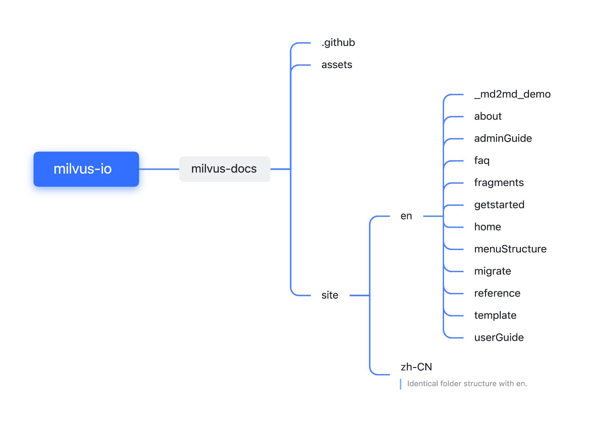

# Contributing to Milvus Documentation

The Milvus docs are open-source just like the database itself and welcome contributions from everyone in the Milvus community.

> Up-to-date technical documentation can be found at [milvus.io](https://www.milvus.io/).

## What contributions can I make?

Basically anything you can think of to improve our documentation and make it more user friendly! Below are some straightforward examples:


- Fix a typo or a grammatical error.

- Translate English content into other languages.

- Update or extend existing documentation.

- Add new pages to Milvus documentation.

## Before you start

Before you contribute please take a minute to familiarize yourself with basic [Markdown](https://www.markdownguide.org/basic-syntax/) syntax and have a look at our [Code of Conduct](https://github.com/milvus-io/milvus/blob/master/CODE_OF_CONDUCT.md) and the [Google Developer Documentation Style Guide](https://developers.google.com/style/) for some guidance on how to write accessible, consistent and inclusive documentation.

## Get started

If you are just correcting a typo or grammatical error, feel free to go ahead and [create a pull request](https://github.com/milvus-io/milvus-docs/pulls). 

For more substantial changes, please follow the following steps:

1. [File an issue](https://github.com/milvus-io/milvus-docs/issues/new/choose) and assign it to yourself by commenting `/assign` or `/assign @your_github_id`. 

2. Fork the [milvus-docs repository](https://github.com/milvus-io/milvus-docs) to your own GitHub account.

3. Fetch to make sure your local branch is up-to-date.
 
4. Once you complete your changes, create a pull request. Your changes will be reviewed by a technical writer as soon as possible.

For detailed information on this workflow, see [Make Your First Contribution](https://milvus.io/community/making_your_first_contributions.md).

## Docs structure



- [Languages](#languages)
- [Pages](#pages)
- [Sidebar](#sidebar)

### Languages

All documentation is originally written in English and translated into other language(s). Currently, the official website only supports two language versions: English and Chinese, stored in their corresponding **site/en** and **site/zh-CN** directories in each branch. Nevertheless, you are more than welcome to make a huge contribution to the community by translating the documentation into other languages you know! 

### Pages

We provide documentation for each major version of Milvus. The pages for each version are found in a directory named for the version. For example, docs for Milvus v2.0.0 are in the `v2.0.0` directory, whereas docs for Milvus v1.1.0 are in the `v1.1.0` directory.


Within each version directory, each page must be a **.md** file written in Markdown. File names should be lowercase with an underscore between words, and should be brief but descriptive.

Example:

- `install_offline.md`

Markdown pages start with the following front-matter with `id` as the mandatory field:

```
---

id: page_id.md

title: Title of Page

summary: Short description of the page for SEO

related_key: keyword

---
```

| Field                | Description                                              |
| ------------------------ | ------------------------------------------------------------ |
| `id`                     | The unique ID assigned to each page.                         |
| `title` (optional)       | Used as the h1 header and written in title-case.             |
| `summary` (optional)     | Used as the page's `meta description` for SEO. Keep this under 143 characters. Consider using the first sentence of the page, or something similar. |
| `related_key` (optional) | Used as the keyword to pull related questions from the FAQ database to show at the bottom of the page. |

#### Templates 

In general there are four types of documentation: 

- [How-to docs](site/how-to-doc-template.md)
- [Conceptual docs](site/conceptual-doc-template.md)
- [Reference docs](site/reference-doc-template.md)
- [Tutorials](site/tutorial-doc-template.md)

When drafting a document, you should follow these types of definitions with a degree of flexibility, as there is some amount of cross-over between them. 

#### Images

*Images* are housed under the **/assets** folder and can be referenced with ``.

#### Fragments

*Fragments* let you split the markdown into independent, reusable pieces and are defined in the **site/en/fragments** and **site/zh-CN/fragments** folders. Use the **{{fragments/xxx.md}}** syntax to reference a specific fragment.

#### Variables

*Variables* are used to store version information to be referenced in code or paths. They are defined in **Variables.json** and can be used in Markdown (**.md**) files, fragments, and templates. 

> The defined variables implement within the current folder and its subfolders. The **en** and **Zh-CN** folders each contain a Variables.json file.

### Sidebar

For each documented version of Milvus, the JSON file in the **menuStructure** directory defines the pages that appear in the Docs sidebar. 

If you're adding a page that you think should appear in the sidebar, please mention this in your pull request. Please follow the established practice when changing this file.

In the JSON file for a version's sidebar, there are six possible fields:


| Field | Type | Description |
| ------|------|------------ |
| `id` | String | The unique ID (within en/zh-CN folder) is given to a page (defined in the front-matter of the corresponding Markdown file) or a section. |
| `title` | String | This field defines the title for a section of the sidenav, e.g., "Get Started", for a subsection, e.g., "Install Milvus", or for a page, e.g., "Milvus Standalone". See the [JSON Example](#json-example) below for more clarity. |
| `label<n>` (e.g., label1, label2, label3) | String | This field defines the hierarchical structure of pages and sections.  |
| `order` | Integar | The sorting order of pages and sections under the current label, starting from 0. |
| `isMenu` | Boolean | This field defines whether it is a section/subsection of the sidenav. |
| `outlink` | Array of strings | The URL of a page that is not rendered by any Markdown file in the **milvus-docs** repository. |


#### JSON Example

This example shows some of the "Get Started" section of the sidenav:


\``` json

{

     "menuList": [

     ...,

     {

      "id": "getstarted",

      "title": "Get Started",

      "label1": "",

      "label2": null,

      "label3": null,

      "order": 1,

      "isMenu": true

},

     {

       "id": "prerequisite-docker.md",

       "title": "Before you Begin",

       "label1": "getstarted",

       "label2": null,

       "label3": null,

       "order": 0

     },  

     {

      "id": "installmilvus",

      "title": "Install Milvus",

      "label1": "getstarted",

      "label2": null,

      "label3": null,

      "order": 1,

      "isMenu": true


    },

    {

      "id": "install_standalone-docker.md",

      "title": "Milvus Standalone",

      "label1": "getstarted",

      "label2": "installmilvus",

      "label3": null,

      "order": 0

    },

    {

      "id": "install_cluster-docker.md",

      "title": "Milvus Cluster",

      "label1": "getstarted",

      "label2": "installmilvus",

      "label3": null,

      "order": 1

    }, 

    {

      "id": "install_offline-docker.md",

      "title": "Install Offline",

      "label1": "getstarted",

      "label2": "installmilvus",

      "label3": null,

      "order": 2

    }, 

    {

      "id": "example_code.md",

      "title": "Hello Milvus",

      "label1": "getstarted",

      "label2": "",

      "label3": "",

      "order": 2

    },

     ...

     ]

}

\```
