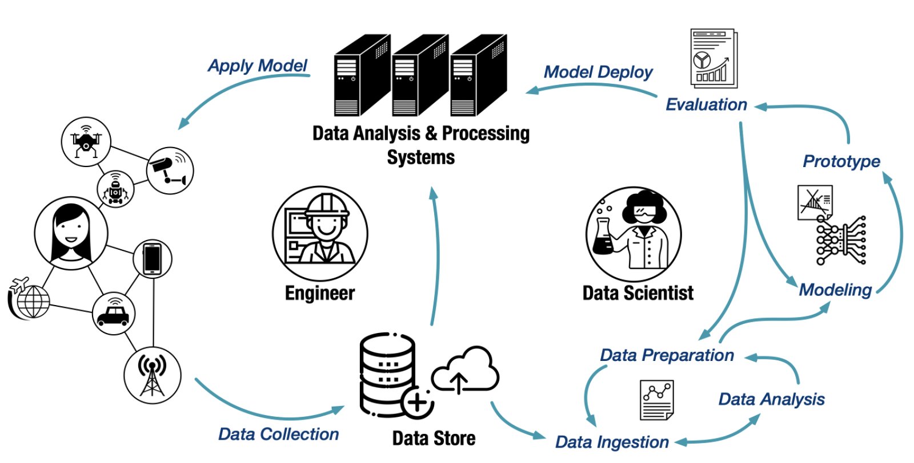

# What is New in Milvus 2.0

With the release of Milvus 2.0, Milvus 1.x will be phasing out and we highly recommend you try out the newest version. Here is why:

## Design concepts
As our next-generation cloud-native vector database, Milvus 2.0 is built around the following three principles:

**Cloud-native first:** We believe that only architectures supporting storage and computing separation can scale on demand and take the full advantage of cloud's elasticity. We'd also like to bring your attention to the microservice design of Milvus 2.0, which features read and write separation, incremental and historical data separation, and CPU-intensive, memory-intensive, and IO-intensive task separation. Microservices help optimize allocation of resources for the ever-changing heterogeneous workload.  

**Logs as data:** In Milvus 2.0, the log broker serves as the system' backbone: All data insert and update operations must go through the log broker, and worker nodes execute CRUD operations by subscribing to and consuming logs. This design reduces system complexity by moving core functions such as data persistence and flashback down to the storage layer, and log pub-sub make the system even more flexible and better positioned for future scaling.

**Unified batch and stream processing:** Milvus 2.0 implements the unified Lambda architecture, which integrates the processing of the incremental and historical data. Compared with the Kappa architecture, Milvus 2.0 introduces log backfill, which stores log snapshots and indexes in the object storage to improve failure recovery efficiency and query performance. To break unbounded (stream) data down into bounded windows, Milvus embraces a new watermark mechanism, which slices the stream data into multiple message packs according to write time or event time, and maintains a timeline for users to query by time.

## Product highlights
The costs of running a database involve not only runtime resource consumption, but also the potential learning costs and the operational and maintenance costs. Practically speaking, the more user-friendly a database is, the more likely it is going to save such potential costs. From Milvus' calendar day one, ease of use is always put on the top of our list, and the latest Milvus 2.0 has quite a few to offer in the way of reducing such costs.

#### Always online
Data reliability and service sustainability are the basic requirements for a database, and our strategy is "fail cheap, fail small, and fail often".  
- "Fail cheap" refers to storage and computing separation, which makes the handling of node failure recovery straightforward and at a low cost. 
- "Fail small" refers to the "divide and conquer" strategy, which simplifies the design complexity by having each coordinator service handle only a small portion of read/write/incremental/historical data. 
- "Fail often" refers to the introduction of chaos testing, which uses fault injection in a testing environment to simulate situations such as hardware failures and dependency failures and accelerate bug discovery.

#### Hybrid search between scalar and vector data
To leverage synergy between structured and unstructured data, Milvus 2.0 supports both scalar and vector data and enables hybrid search between them. Hybrid search helps users find the approximate nearest neighbors that match a filter criteria. Currently, Milvus supports relational operations such as EQUAL, GREATER THAN, and LESS THAN, and logical operations such as NOT, AND, OR, and IN.

#### Tunable consistency
As a distributed database abiding by the PACELC theorem, Milvus 2.0 has to trade off between consistency and availability & latency. In most scenarios, overemphasizing data consistency in production can overkill because allowing a small portion of data to be invisible has little impact on the overall recall but can significantly improve the query performance. Still, we believe that consistency levels, such as strong, bounded staleness, and session, have their own unique application. Therefore, Milvus supports tunable consistency at the request level. Taking testing as an example, users may require strong consistence to ensure test results are absolutely correct. 

#### Time travel
Data engineers often need to do data rollback to fix dirty data and code bugs. Traditional databases usually implement data rollback through snapshots or even data retrain. This could bring excessive overhead and maintenance costs. Milvus maintains a timeline for all data insert and delete operations, and users can specify a timestamp in a query to retrieve a data view at a specified point in time. With time travel, Milvus can also implement a lightweight data backup or data clone.

#### ORM Python SDK：
Object relational mapping (ORM) allows users to focus more on the upper-level business model than on the underlying data model, making it easier for developers to manage relations between collections, fields, and programs. To close the gap between proof of concept (PoC) for AI algorithms and production deployment, we engineered PyMilvus ORM APIs, which can work with an embedded library, a standalone deployment, a distributed cluster , or even a cloud service. With a unified set of APIs, we provide users with a consistent user experience and reduce code migration or adaptation costs.

#### Support tools
- **Milvus Insight** is Milvus's graphical user interface offering practical functionalities such as cluster state management, meta management, and data query. The source code of Milvus Insight will also be open sourced as an independent project. We are looking for more contributors to join this effort.

- **Out-of-box experience (OOBE), faster deployment:** Milvus 2.0 can be deployed using helm or Docker Compose.

- Milvus 2.0 uses Prometheus, an open-source time-series database, to store performance and monitor data, and Grafana, an open observability platform, for metrics visualization.

## Milvus 2.0 vs. 1.x: Cloud-native, distributed architecture, highly scalable, and more

<table class="comparison">
<thead>
	<tr>
		<th>&nbsp;</th>
		<th>Milvus 2.0</th>
		<th>Milvus 1.x</th>
	</tr>
</thead>
	<tr>
		<th>Architecture</th>
		<td>Cloud native</td>
		<td>Shared storage</td>
	</tr>
<tbody>
	<tr>
		<th>Scalability</th>
		<td>500+ nodes</td>
		<td>1 to 32 read nodes with only one write node</td>
	</tr>
  	<tr>
		<th>Durability</th>
		<td><li>Object storage service (OSS)</li><li>Distributed file system (DFS)</li></td>
		<td><li>Local disk</li><li>Network file system (NFS)</li></td>
	</tr>
  	<tr>
		<th>Availability</th>
		<td>99.9%</td>
		<td>99%</td>		
	</tr>
	<tr>
		<th>Data consistency</th>
		<td>Three levels of consistency:<li>Strong</li><li>Bounded Staleness</li><li>Session</li><li>Consistent prefix</li></td>
		<td>Eventual consistency</td>
	</tr>
	<tr>
		<th>Data types supported</th>
		<td><li>Vectors</li><li>Fixed-length scalars</li><li>String and text (in planning)</li></td>
		<td>Vectors</td>
	</tr>
	<tr>
		<th>Basic operations supported</th>
		<td><li>Data insertion</li><li>Data deletion (in planning)</li><li>Data query</li><li>Approximate nearest neighbor (ANN) Search</li><li>Recurrent neural network (RNN) search (in planning)</li></td>
		<td><li>Data insertion</li><li>Data deletion</li><li>Approximate nearest neighbor (ANN) Search</li></td>
	</tr>
	<tr>
		<th>Advanced features</th>
		<td><li>Scalar filtering</li><li>Time Travel</li><li>Multi-site deployment and multi-cloud integration</li><li>Data management tools</li></td>
		<td><li>Mishards</li><li>Milvus DM</li></td>
	</tr>
	<tr>
		<th>Index types and libraries</th>
		<td><li>Faiss</li><li>Annoy</li><li>Hnswlib</li><li>RNSG</li><li>ScaNN (in planning)</li><li>On-disk index (in planning)</li></td>
		<td><li>Faiss</li><li>Annoy</li><li>Hnswlib</li><li>RNSG</li></td>
	</tr>
	<tr>
		<th>SDKs</th>
		<td><li>Python</li><li>Go (in planning)</li><li>RESTful (in planning)</li><li>C++ (in planning)</li></td>
		<td><li>Python</li><li>Java</li><li>Go</li><li>RESTful</li><li>C++</li></td>
	</tr>
	<tr>
		<th>Release status</th>
		<td>Release candidate. A stable version will be released in August.</td>
		<td>Long-term support (LTS)</td>
	</tr>
</tbody>
</table>
