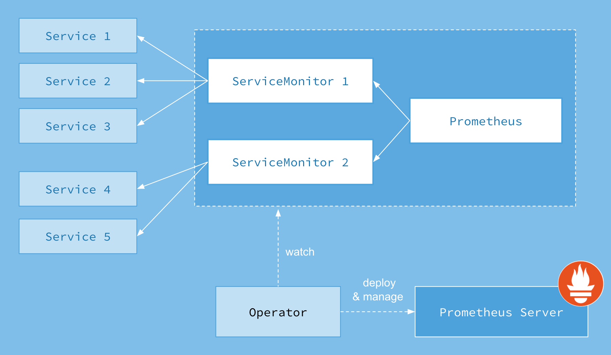
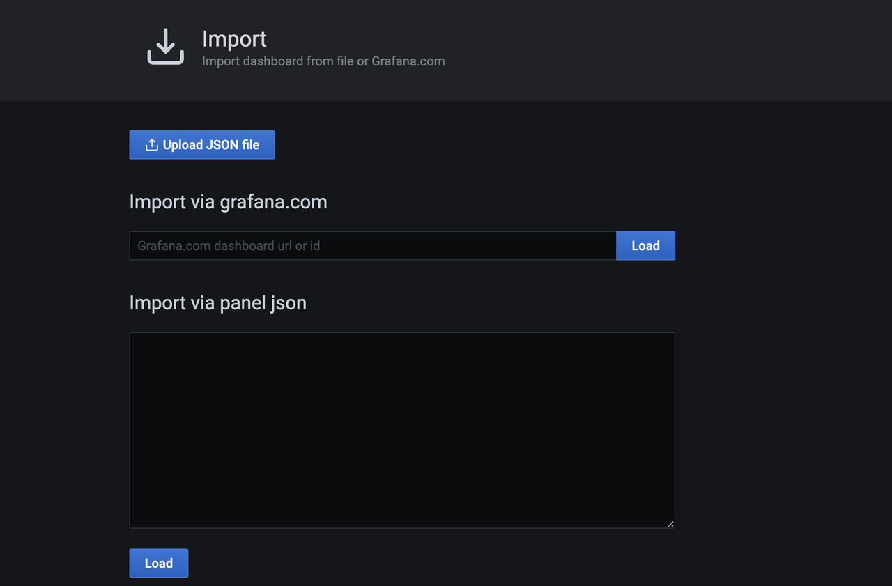
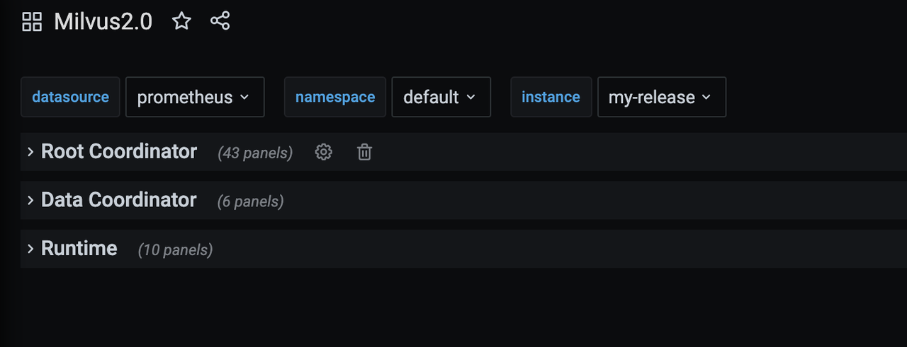
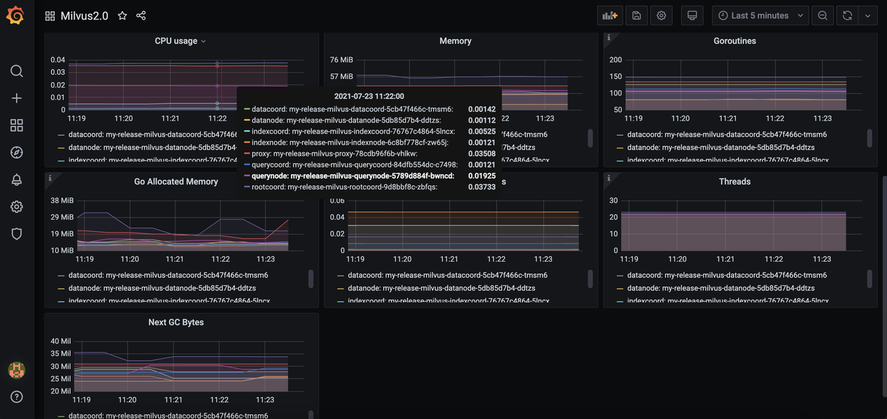
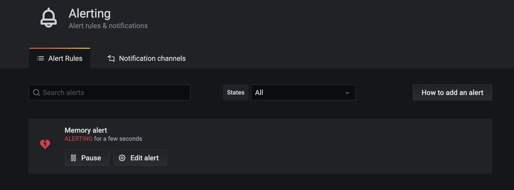
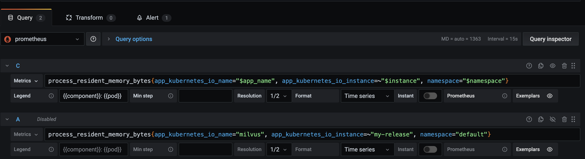

# Monitor Milvus2.0 with Prometheus Operator on Kubernetes

## Prometheus endpoint
Prometheus is an open-source toolkit for monitoring Kubernetes implementations. Prometheus exports metrics of each Milvus 2.0 component at *http://<component-host>:9091/metrics*. Use Prometheus to pull data from endpoints set by exporters.

## Prometheus Operator
[Prometheus Operator](https://github.com/prometheus-operator/prometheus-operator) is an extension to Kubernetes for automated and effective management of  Prometheus monitoring instances. Using Prometheus Operator saves you the trouble of manually adding metric targets and service providers.

### Overall architecture:
The ServiceMonitor Custom Resource Definition (CRD) allows you to declaratively define how a dynamic set of services should be monitored, and select which services to monitor with the desired configuration using label selections. With Prometheus Operator, you can introduce conventions around how metrics are exposed. New services can be automatically discovered following the convention you set without the need for manual reconfiguration.



## Kube-prometheus
[Kube-prometheus](https://github.com/prometheus-operator/kube-prometheus) collects Kubernetes manifests, [Grafana](http://grafana.com/) dashboards, and [Prometheus rules](https://prometheus.io/docs/prometheus/latest/configuration/recording_rules/) combined with documentation and scripts to provide easy to operate end-to-end Kubernetes cluster monitoring with [Prometheus](https://prometheus.io/) using the Prometheus Operator.

### Create a monitoring stack using the config in the manifests directory

``` 
git clone https://github.com/prometheus-operator/kube-prometheus.git
kubectl create -f manifests/setupuntil kubectl get servicemonitors --all-namespaces ; do date; sleep 1; echo ""; done
kubectl create -f manifests/
```

### Teardown the stack
```
kubectl delete --ignore-not-found=true -f manifests/ -f manifests/setup
```

### Access the dashboards
```
kubectl --namespace monitoring port-forward svc/prometheus-k8s 9090
kubectl --namespace monitoring port-forward svc/grafana 3000
```

Now you can access Prometheus via http://localhost:9090, and Grafana via http://localhost:3000. You can also access Grafana using the default Grafana user:password of `admin:admin`. 

## Enable ServiceMonitor with Miluvs Helm Chart

The ServiceMonitor is not enabled for Miluvs Helm by default. After installing Prometheus Operator in the Kubernetes cluster, you can enable it by adding `metrics.serviceMontior.enabled=true` parameter.

```
helm install my-release milvus/milvus --set cluster.enabled=true --set metrics.serviceMonitor.enabled=true
```

When Helm installation completes, use `kubectl` to check the ServiceMonitor resource.

```
kubectl get servicemonitor
NAME                           AGE
my-release-milvus-datacoord    54s
my-release-milvus-datanode     54s
my-release-milvus-indexcoord   54s
my-release-milvus-indexnode    54s
my-release-milvus-proxy        54s
my-release-milvus-querycoord   54s
my-release-milvus-querynode    54s
my-release-milvus-rootcoord    54s
```

## Visualize metrics in Grafana

While Prometheus shows metrics in a graph, Grafana is a more powerful visualization tool that can be easily integrated with Prometheus. 

### Download and import Milvus dashboard from json
```
wget https://raw.githubusercontent.com/milvus-io/milvus/master/deployments/monitor/grafana/milvus-dashboard.json
```


### Select Milvus instance



You can see the Milvus components panel.



### Add an alert in Grafana

To add an alert for the memory usage of Milvus components, edit the `Memory` panel, and add a new query with the following metric `process_resident_memory_bytes{app_kubernetes_io_name="milvus", app_kubernetes_io_instance=~"my-release", namespace="default"}`:


Save the dashboard, and wait a few minutes to see the alert.



<div class="alert note">

1. Grafana alert query does not support template variables. Therefore, you should add a second query without any template variables in the labels and rename the second query as `A`.



2. To receive alert notifications, add a `notification channel`, and then specify the channel in the field `Send to`.

</div>