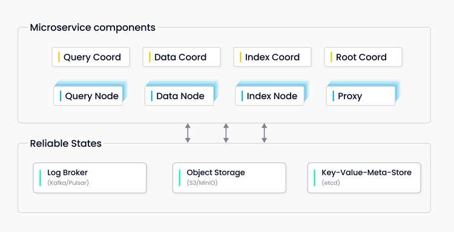

# Scale Out Milvus Cluster on Kubernetes

Milvus cluster includes eight microservice components and three third-party infrastructure service components. 



Due to the separation of storage and computation, we can scale out the Milvus cluster easily. There are 4 types of nodes which are stateless:

- Query node
- Data node
- Index node
- Proxy

<div class="alert note">
Milvus does not support scaling out the coordinator components.
</div>

## Install a Milvus cluster with helm:
```
helm repo add milvus https://milvus-io.github.io/milvus-helm/
helm repo update
helm install my-release milvus/milvus --set cluster.enabled=true
```
If Milvus boots successfully, each Milvus' pod shows `1/1 `under `READY`:

```
kubectl get pods
NAME                                            READY   STATUS       RESTARTS   AGE
my-release-etcd-0                               1/1     Running      0          1m
my-release-milvus-datacoord-7b5d84d8c6-rzjml    1/1     Running      0          1m
my-release-milvus-datanode-665d4586b9-525pm     1/1     Running      0          1m
my-release-milvus-indexcoord-9669d5989-kr5cm    1/1     Running      0          1m
my-release-milvus-indexnode-b89cc5756-xbpbn     1/1     Running      0          1m
my-release-milvus-proxy-7cbcc8ffbc-4jn8d        1/1     Running      0          1m
my-release-milvus-pulsar-6b9754c64d-4tg4m       1/1     Running      0          1m
my-release-milvus-querycoord-75f6c789f8-j28bg   1/1     Running      0          1m
my-release-milvus-querynode-7c7779c6f8-pnjzh    1/1     Running      0          1m
my-release-milvus-rootcoord-75585dc57b-cjh87    1/1     Running      0          1m
my-release-minio-5564fbbddc-9sbgv               1/1     Running      0          1m
```

## Scale out worker nodes for Milvus cluster

### Scale out query node
```
helm upgrade my-release milvus/milvus --set queryNode.replicas=3 --reuse-values
NAME                                            READY   STATUS    RESTARTS   AGE
my-release-etcd-0                               1/1     Running   0          2m
my-release-milvus-datacoord-7b5d84d8c6-rzjml    1/1     Running   0          2m
my-release-milvus-datanode-665d4586b9-525pm     1/1     Running   0          2m
my-release-milvus-indexcoord-9669d5989-kr5cm    1/1     Running   0          2m
my-release-milvus-indexnode-b89cc5756-xbpbn     1/1     Running   0          2m
my-release-milvus-proxy-7cbcc8ffbc-4jn8d        1/1     Running   0          2m
my-release-milvus-pulsar-6b9754c64d-4tg4m       1/1     Running   0          2m
my-release-milvus-querycoord-75f6c789f8-j28bg   1/1     Running   0          2m
my-release-milvus-querynode-7c7779c6f8-czq9f    1/1     Running   0          5s
my-release-milvus-querynode-7c7779c6f8-jcdcn    1/1     Running   0          5s
my-release-milvus-querynode-7c7779c6f8-pnjzh    1/1     Running   0          2m
my-release-milvus-rootcoord-75585dc57b-cjh87    1/1     Running   0          2m
my-release-minio-5564fbbddc-9sbgv               1/1     Running   0          2m
```

You can see three query node pods running.

### Scale out data node
```
helm upgrade my-release milvus/milvus --set dataNode.replicas=3 --reuse-values
NAME                                            READY   STATUS    RESTARTS   AGE
my-release-etcd-0                               1/1     Running   0          5m
my-release-milvus-datacoord-7b5d84d8c6-rzjml    1/1     Running   0          5m
my-release-milvus-datanode-665d4586b9-525pm     1/1     Running   0          5m
my-release-milvus-datanode-665d4586b9-7rjqp     1/1     Running   0          5s
my-release-milvus-datanode-665d4586b9-jwd8w     1/1     Running   0          5s
my-release-milvus-indexcoord-9669d5989-kr5cm    1/1     Running   0          5m
my-release-milvus-indexnode-b89cc5756-xbpbn     1/1     Running   0          5m
my-release-milvus-proxy-7cbcc8ffbc-4jn8d        1/1     Running   0          5m
my-release-milvus-pulsar-6b9754c64d-4tg4m       1/1     Running   0          5m
my-release-milvus-querycoord-75f6c789f8-j28bg   1/1     Running   0          5m
my-release-milvus-querynode-7c7779c6f8-czq9f    1/1     Running   0          2m55s
my-release-milvus-querynode-7c7779c6f8-jcdcn    1/1     Running   0          2m55s
my-release-milvus-querynode-7c7779c6f8-pnjzh    1/1     Running   0          5m
my-release-milvus-rootcoord-75585dc57b-cjh87    1/1     Running   0          5m
my-release-minio-5564fbbddc-9sbgv               1/1     Running   0          5m
```

You can see three data node pods running.

### Scale out index node
```
helm upgrade my-release milvus/milvus --set indexNode.replicas=3 --reuse-values
NAME                                            READY   STATUS    RESTARTS   AGE
my-release-etcd-0                               1/1     Running   0          10m
my-release-milvus-datacoord-7b5d84d8c6-rzjml    1/1     Running   0          10m
my-release-milvus-datanode-665d4586b9-525pm     1/1     Running   0          10m
my-release-milvus-datanode-665d4586b9-7rjqp     1/1     Running   0          3m45s
my-release-milvus-datanode-665d4586b9-jwd8w     1/1     Running   0          3m45s
my-release-milvus-indexcoord-9669d5989-kr5cm    1/1     Running   0          10m
my-release-milvus-indexnode-b89cc5756-7vp5h     1/1     Running   0          5s
my-release-milvus-indexnode-b89cc5756-r74kd     1/1     Running   0          5s
my-release-milvus-indexnode-b89cc5756-xbpbn     1/1     Running   0          10m
my-release-milvus-proxy-7cbcc8ffbc-4jn8d        1/1     Running   0          10m
my-release-milvus-pulsar-6b9754c64d-4tg4m       1/1     Running   0          10m
my-release-milvus-querycoord-75f6c789f8-j28bg   1/1     Running   0          10m
my-release-milvus-querynode-7c7779c6f8-czq9f    1/1     Running   0          7m35s
my-release-milvus-querynode-7c7779c6f8-jcdcn    1/1     Running   0          7m35s
my-release-milvus-querynode-7c7779c6f8-pnjzh    1/1     Running   0          10m
my-release-milvus-rootcoord-75585dc57b-cjh87    1/1     Running   0          10m
my-release-minio-5564fbbddc-9sbgv               1/1     Running   0          10m
```

You can see three index node pods running.

### Scale out proxy
```
helm upgrade my-release milvus/milvus --set proxy.replicas=3 --reuse-values
NAME                                            READY   STATUS    RESTARTS   AGE
my-release-etcd-0                               1/1     Running   0          13m
my-release-milvus-datacoord-7b5d84d8c6-rzjml    1/1     Running   0          13m
my-release-milvus-datanode-665d4586b9-525pm     1/1     Running   0          13m
my-release-milvus-datanode-665d4586b9-7rjqp     1/1     Running   0          7m29s
my-release-milvus-datanode-665d4586b9-jwd8w     1/1     Running   0          7m29s
my-release-milvus-indexcoord-9669d5989-kr5cm    1/1     Running   0          13m
my-release-milvus-indexnode-b89cc5756-7vp5h     1/1     Running   0          3m49s
my-release-milvus-indexnode-b89cc5756-r74kd     1/1     Running   0          3m49s
my-release-milvus-indexnode-b89cc5756-xbpbn     1/1     Running   0          13m
my-release-milvus-proxy-7cbcc8ffbc-4jn8d        1/1     Running   0          13m
my-release-milvus-proxy-7cbcc8ffbc-67vkd        1/1     Running   0          5s
my-release-milvus-proxy-7cbcc8ffbc-7bkj2        1/1     Running   0          5s
my-release-milvus-pulsar-6b9754c64d-4tg4m       1/1     Running   0          13m
my-release-milvus-querycoord-75f6c789f8-j28bg   1/1     Running   0          13m
my-release-milvus-querynode-7c7779c6f8-czq9f    1/1     Running   0          11m
my-release-milvus-querynode-7c7779c6f8-jcdcn    1/1     Running   0          11m
my-release-milvus-querynode-7c7779c6f8-pnjzh    1/1     Running   0          13m
my-release-milvus-rootcoord-75585dc57b-cjh87    1/1     Running   0          13m
my-release-minio-5564fbbddc-9sbgv               1/1     Running   0          13m
```

You can see proxy pods running.