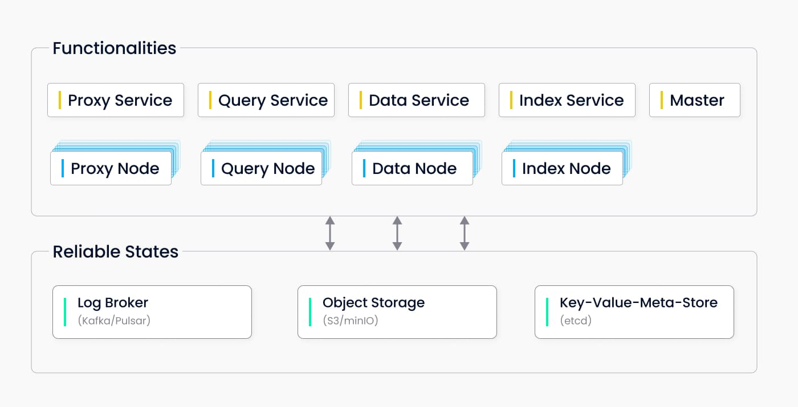

# What’s Inside Milvus Cluster?

In Milvus Cluster mode, all microservices can be deployed independently on different physical nodes.

A Milvus Cluster includes eight microservice components and three third-party infrastructure service components.

The eight microservice components are:

- **RootCoord**

Handles requests relating to definitions, such as creating or deleting a collection, a partition, or an index, as well as managing collection metadata.

- **Proxy**
  - Manages connections to the clients, converting system-level API requests to a combination of method calls between internal components.
  - Conducts static and the basic dynamic check on requests from the clients.
- **QueryCoord and query node**
  - Handles query-related requests. The query node handles in-memory index queries
  - The QueryCoord deals with load balancing between query nodes.
- **IndexCoord and index node**
  - Handles index building. The IndexCoord manages index file metadata
  - The index node implements index building tasks.
- **DataCoord and Data Node**
  - Handles requests relating to data manipulation, such as inserting or deleting entities. 
  - The data node manages logs; the DataCoord manages entity metadata.

The three third-party infrastructure service components are:

- **etcd**

Stores metadata for various components in the cluster.

- **MinIO**

Handles data persistence for large files in the cluster, such as index files and full binary log files.

- **Pulsar**

Manages logs of recent collection update operations, and provides streaming log output and log subscription services.
