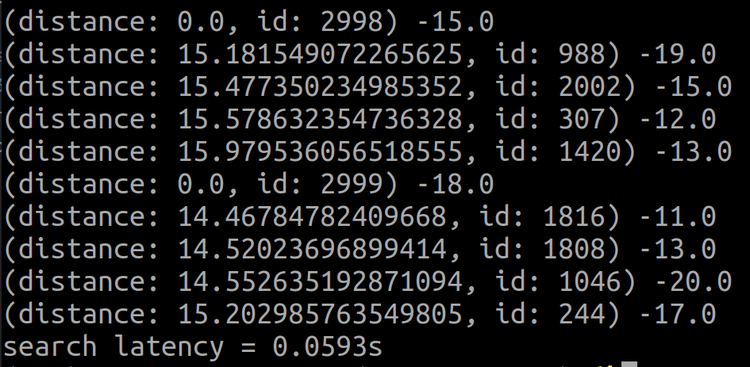

# Run Milvus using Python

After the Milvus server boots successfully, test the platform using our Python sample code.

1. Install pymilvus_orm and its dependencies:

```
pip install pymilvus-orm==2.0.0rc2
```
<div class="alert note">
Python version 3.6 or higher is required. View <a href="https://wiki.python.org/moin/BeginnersGuide/Download">Python documentation</a> for information about installing the correct version for your system.
</div>

2. Download sample code **hello_milvus.py**:

```
$ wget https://raw.githubusercontent.com/milvus-io/pymilvus-orm/v2.0.0rc2/examples/hello_milvus.py
```

3. Scan **hello_milvus.py**. This sample code does the following:

- Imports the pymilvus package:
```
from pymilvus_orm import connections, FieldSchema, CollectionSchema, DataType, Collection
```

- Connects to the Milvus server:
```
connections.connect()
```

- Creates a collection:
```
dim = 128
default_fields = [
    FieldSchema(name="count", dtype=DataType.INT64, is_primary=True),
    FieldSchema(name="random_value", dtype=DataType.DOUBLE),
    FieldSchema(name="float_vector", dtype=DataType.FLOAT_VECTOR, dim=dim)
]
default_schema = CollectionSchema(fields=default_fields, description="test collection")

print(f"\nCreate collection...")
collection = Collection(name="hello_milvus", schema=default_schema)
```

- Inserts vectors in the new collection:
```
import random
nb = 3000
vectors = [[random.random() for _ in range(dim)] for _ in range(nb)]
collection.insert(
    [
        [i for i in range(nb)],
        [float(random.randrange(-20,-10)) for _ in range(nb)],
        vectors
    ]
)
```

- Builds an IVF_FLAT index and loads the collection to memory:
```
default_index = {"index_type": "IVF_FLAT", "params": {"nlist": 128}, "metric_type": "L2"}
collection.create_index(field_name="float_vector", index_params=default_index)
collection.load()
```

- Conducts a vector similarity search:
```
topK = 5
search_params = {"metric_type": "L2", "params": {"nprobe": 10}}
# define output_fields of search result
res = collection.search(
    vectors[-2:], "float_vector", search_params, topK,
    "count > 100", output_fields=["count", "random_value"]
)
```

4. Run **hello_milvus.py**:
```
$ python3 hello_pymilvus.py
```

*The returned results and query latency show as follows:*




<br/>


*Congratulations! You have successfully booted Milvus Standalone and run your first vector similarity search.*

