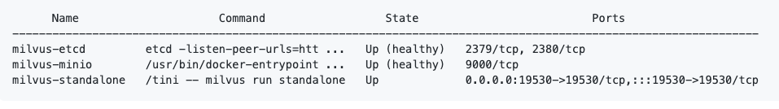

# Install Milvus Standalone
You can install Milvus standalone with Docker Compose or Helm.

You can also [build Milvus from source code](https://github.com/milvus-io/milvus/blob/master/INSTALL.md).

<div class="alert note">
Installing Milvus with Docker Compose can only be used for testing and cannot be used in production.
</div>

<div class="tab-wrapper"><a href="install_standalone-docker.md" class='active '>Install with Docker Compose</a><a href="install_standalone-helm.md" class=''>Install with Helm</a></div>

## Before You Begin

Before moving forward to installation, you must check the eligibility of your Docker, Docker Compose, and hardware in line with Milvus' requirement.

<details><summary>Check your Docker and Docker Compose version</summary>

<li>Docker version 19.03 or higher is required. </li>
<li>Docker Compose version 1.25.1 or higher is required. </li>
</details>

<details><summary>Check whether your CPU supports SIMD extension instruction set</summary>

Milvus' computing operations depend on CPU’s support for SIMD (Single Instruction, Multiple Data) extension instruction set. Whether your CPU supports SIMD extension instruction set is crucial to index building and vector similarity search within Milvus. Ensure that your CPU supports at least one of the following SIMD instruction sets:

- SSE4.2
- AVX
- AVX2
- AVX512

Run the lscpu command to check if your CPU supports the SIMD instruction sets mentioned above:

```
$ lscpu | grep -e sse4_2 -e avx -e avx2 -e avx512
```
</details>


## Install Milvus Standalone


1. Pull the Docker image:

```
wget https://raw.githubusercontent.com/milvus-io/milvus/master/deployments/docker/standalone/docker-compose.yml -O docker-compose.yml
```

2. Start Milvus Standalone:

```
$ sudo docker-compose up -d
Docker Compose is now in the Docker CLI, try `docker compose up`
Creating milvus-etcd  ... done
Creating milvus-minio ... done
Creating milvus-standalone ... done
```

*If Milvus Standalone boots successfully, three running docker containers appear (two infrastructure services and one Milvus service):*

```
$ sudo docker-compose ps
```


<div class="alert note">
To stop Milvus Standalone, run <code> $ sudo docker-compose down</code>.
</div>