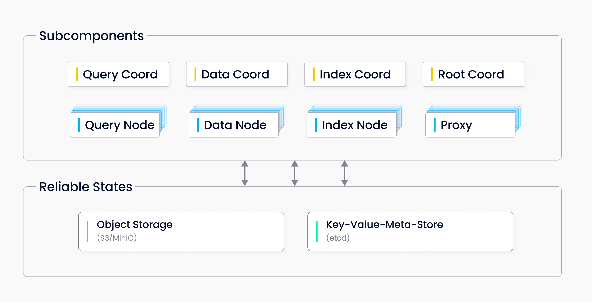

# Main Components

There are two modes for running Milvus: Standalone and Cluster. These two modes share the same features. You can choose a mode that best fits your dataset size, traffic data, and more. For now, Milvus standalone cannot be "online" upgraded to Milvus cluster. 

## Milvus standalone

 Milvus standalone includes three components:

- **Milvus:** The core functional component. 

- **etcd:** The metadata engine, which accesses and stores metadata of Milvus' internal components, including proxy nodes, index nodes, and more. 

- **MinIO:** The storage engine, which is responsible for data persistence for Milvus.

## Milvus cluster

**Milvus cluster** includes eight microservice components and three third-party dependencies. All microservices can be deployed on Kubernetes, independently from each other. 

### Microservice components

- Root coord
- Proxy 
- Query coord 
- Query node 
- Index coord 
- Index node 
- Data coord 
- Data node

### Third-party dependencies

- **etcd:** Stores metadata for various components in the cluster. 
- **MinIO:**  Responsible for data persistence of large files in the cluster, such as index and binary log files. 
- **Pulsar:** Manages logs of recent mutation operations, outputs streaming log, and provides log publish-subscribe services.

