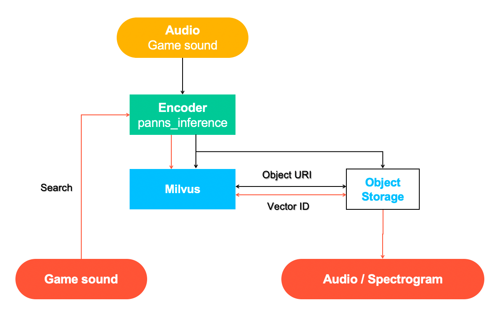
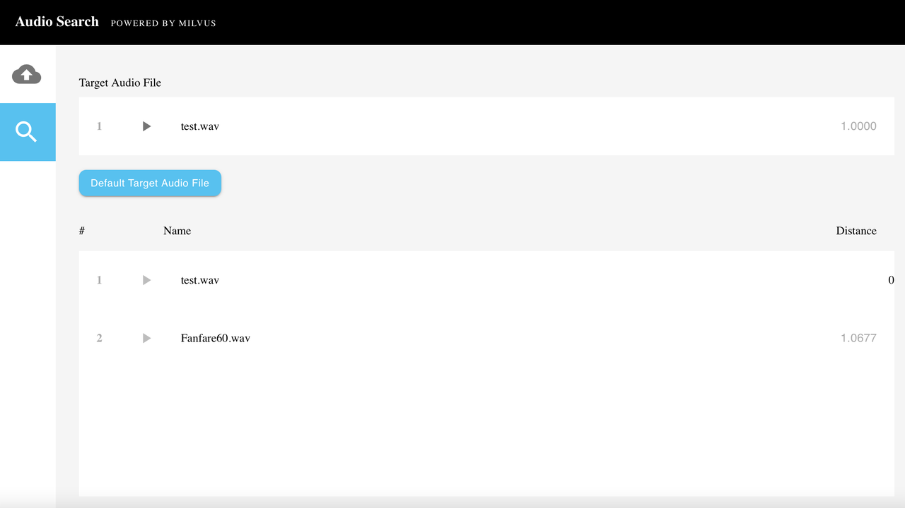

# Audio Similarity Search

Living in the era of big data, people find their lives abound with all sorts of information. To make better sense of it, traditional text retrieval no long cuts it. Today's information retrieval technology is in urgent need of the retrieval of various unstructured data types, such as videos, images, and audio.

 

Speech, music, sound effects, and other types of audio search makes it possible to quickly query massive volumes of audio data and surface similar sounds. Applications include identifying similar sound effects, minimizing IP infringement, and more. 

 

Audio retrieval can be used to search and monitor online media in real-time to crack down on infringement of intellectual property rights. It also assumes an important role in the classification and statistical analysis of audio data.

 

Visit the [github repo](https://github.com/milvus-io/bootcamp/tree/master/solutions/audio_similarity_search) to learn how to build an audio similarity search engine using Milvus paired with PANNs for audio pattern recognition.

 

You can also learn more about how to use Milvus to build other systems for various application scenarios in our [bootcamp repo](https://github.com/milvus-io/bootcamp) on Github.
