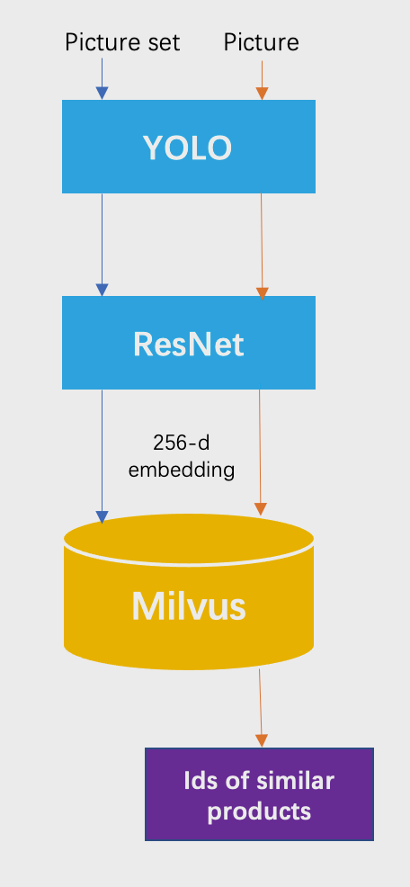
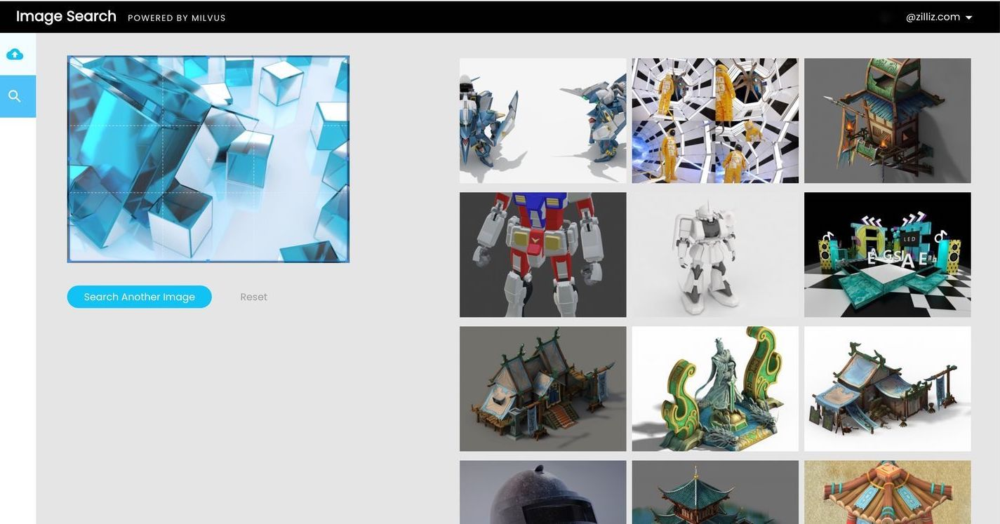

# Image Similarity Search 

Major search engines like Google already give users the option to search by image. Additionally, e-commerce platforms have realized the benefits this functionality offers online shoppers, with Amazon incorporating image search into its smartphone applications.

 

Milvus, the open-source vector database, makes it possible for any business to create their own reverse image search system, lowering the barriers to entry for this increasingly in-demand feature. You can use pre-trained AI models to convert your own image datasets into vectors, and then leverage Milvus to enable searching for similar products by image.

 

Try out the [demo](https://zilliz.com/milvus-demos/reverse-image-search) or visit the [github repo](https://github.com/milvus-io/bootcamp/tree/master/solutions/reverse_image_search) to learn how to build a reverse image search system using Milvus paired with YOLOv3 for object detection and ResNet-50 for feature extraction.

 

You can also learn more about how to use Milvus to build other systems for various application scenarios in our [bootcamp repo](https://github.com/milvus-io/bootcamp) on Github.
