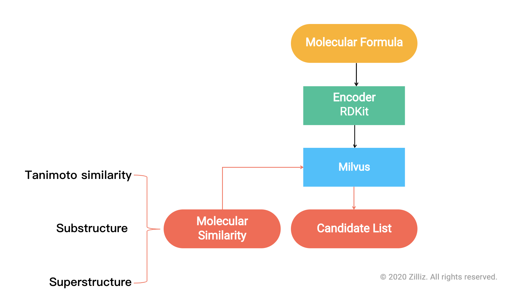
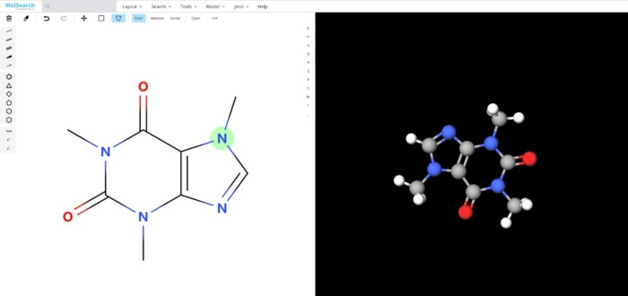

# Molecular Similarity Search 

Drug discovery is an important part of new medicine research and development. The process of drug discovery includes target selection and confirmation. When fragments or lead compounds are discovered, researchers usually search for similar compounds in internal or commercial libraries in order to discover structure-activity relationship (SAR), compound availability. Ultimately, they will evaluate the potential of the lead compounds to be optimized to candidate compounds.

 

In order to discover available compounds from billion-scale compound libraries, chemical fingerprint is usually retrieved for substructure search and molecule similarity search.

 

Try out the [demo](http://35.166.123.214:8002/) or visit the [github repo](https://github.com/milvus-io/bootcamp/tree/master/solutions/molecular_similarity_search) to learn how to build a molecular similarity search system using Milvus paired with RDkit for cheminfomatics.

 

You can also learn more about how to use Milvus to build other systems for various application scenarios in our [bootcamp repo](https://github.com/milvus-io/bootcamp) on Github.
