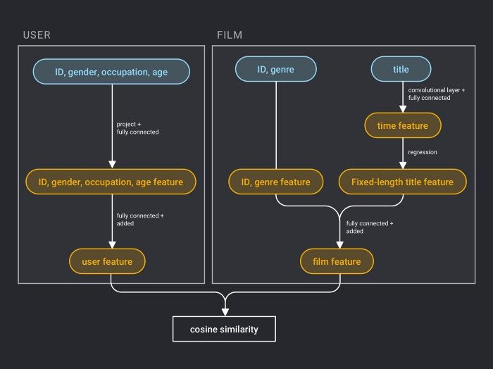

# Recommender System 

The recommender system is a subset of the information filtering system, which can be used in various scenarios including movie, music, product, and feed stream recommendations. The recommender system discovers the user’s personalized needs and interests by analyzing and mining user behaviors, and recommends information or products that may be of interest to the user. Unlike search engines, recommender system do not require users to accurately describe their needs, but model their historical behavior to proactively provide information that meets user interests and needs.

 

Visit the [github repo](https://github.com/milvus-io/bootcamp/tree/master/solutions/recommendation_system) to learn how to build an AI-powered movie recommender system using Milvus paired with PaddlePaddle's deep learning framework.

 

You can also learn more about how to use Milvus to build other systems for various application scenarios in our [bootcamp repo](https://github.com/milvus-io/bootcamp) on Github.
