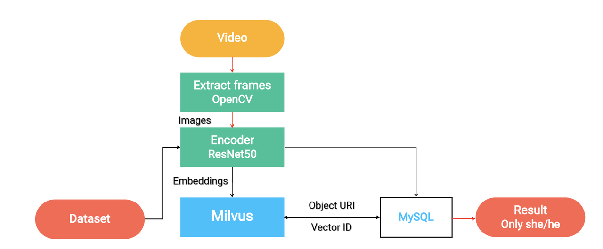

# Video Similarity Search

This tutorial demonstrates how to use Milvus, the open-source vector database, to build a video similarity search system.
- [Open Jupyter notebook](https://github.com/milvus-io/bootcamp/blob/master/solutions/video_similarity_search/video_similarity_search.ipynb)
- [Quick deploy](https://github.com/milvus-io/bootcamp/blob/master/solutions/video_similarity_search/quick_deploy)
The ML models and third-party software used include:
- OpenCV
- ResNet-50
- MySQL

 

Nowadays, after watching a movie or video they like, people can easily take screenshots and share their thoughts by posting on various social networking platforms. When the followers see the screenshots, it can be really difficult for them to tell which movie it is if the movie name is not spelled out explicitly in the post. In order to figure out the name of the movie, people can take advantage of a video similarity search system. By using the system, users can upload an image and get videos or movies that contain key frames similar to the uploaded image.

 
In this tutorial, you will learn how to build a video similarity search system. This tutorial uses approximately 100 animated gifs on Tumblr to build the system. However, you can also prepare your own video datasets. The system first uses OpenCV to extract key frames in videos and then obtains feature vectors of each key frame using ResNet-50. All vectors are stored and searched in Milvus, which will return the IDs of similar vectors. Then map the IDs to the corresponding video stored in MySQL.

 

