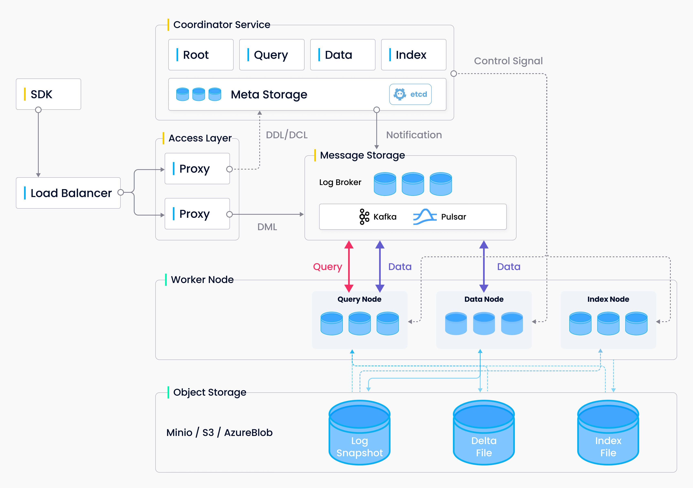

# Milvus 是什么

Milvus 是一款开源向量数据库，赋能 AI 应用和向量相似度搜索。

Milvus 提供以下 2 个版本：
- [Milvus 单机版](install_standalone-docker.md) 
- [Milvus 分布式版](install_cluster-docker.md)

版本兼容: 
| Milvus 版本 | Python SDK 版本 | Java SDK 版本 | Go SDK 版本 |
| ----------- | ----------- | -----------  | ----------- |
| 2.0.0-RC1   | 2.0.0-RC1   | 即将上线  | 即将上线 |

Milvus 2.0.0-RC1 是 2.0.0 的预览版本。 该版本引入 Go 语言搭建分布式系统，并采用了新的云原生分布式设计。 后者大大提高了系统扩展性和系统弹性。

## 系统架构

Milvus 2.0 是一款云原生向量数据库，采用存储与计算分离的架构设计。该重构版本的所有组件均为无状态组件，极大地增强了系统弹性和灵活性。

整个系统分为四个层面：

- 接入层（Access Layer）
- 协调服务（Coordinator Service）
- 执行节点（Worker Node）
- 存储服务 （Storage）

**接入层（Access Layer)：** 系统的门面，包含了一组对等的 proxy 节点。接入层是暴露给用户的统一 endpoint，负责转发请求并收集执行结果。

**协调服务（Coordinator Service）：** 系统的大脑，负责分配任务给执行节点。总共有四类协调者角色，分别为 root 协调者、data 协调者、query 协调者和 index 协调者。

**执行节点（Worker Node）：** 系统的四肢。执行节点只负责被动执行协调服务发起的读写请求。目前有三类执行节点，即 data 节点、query 节点和 index 节点。

**存储服务（Storage）：** 系统的骨骼，是所有其他功能实现的基础。Milvus 依赖三类存储：元数据存储、消息存储（Log Broker）和对象存储。

更多系统原理的相关内容详见 [Milvus 2.0 架构](architecture_overview.md)。

## Milvus 组件

Milvus 单机版中包含 3 个组件：
- Milvus
- etcd
- MinIO

Milvus 分布式版中包含 8 个微服务组件和 3 个第三方基础服务组件。

微服务组件：

- Root coord
- Proxy
- Query coord
- Query node
- Index coord 
- Index node
- Data coord
- Data node

第三方基础服务组件：

- etcd
- MinIO
- Pulsar

## 产品亮点

#### 针对万亿级向量的毫秒级搜索

完成万亿条向量数据搜索的平均延迟以毫秒计。

#### 简化的非结构化数据管理

- 一整套专为数据科学工作流设计的 API。
- 无论是笔记本、本地集群还是云服务器，始终如一的跨平台用户体验。
- 可以在任何场景下实现实时搜索与分析。

#### 稳定可靠的用户体验

Milvus 具有故障转移和故障恢复的机制，即使服务中断，也能确保数据和应用程序的业务连续性。

#### 高度可扩展，弹性伸缩

组件级别的高扩展性，支持精准扩展。

#### 混合查询

除了向量以外，Milvus还支持布尔值、整型、浮点等数据类型。在 Milvus 中，一个 collection 可以包含多个字段来代表数据特征或属性。Milvus 还支持在向量相似度检索过程中进行标量字段过滤。

#### 基于 Lambda 架构的流批一体式数据存储

Milvus 在存储数据时支持流处理和批处理两种方式，兼顾了流处理的时效性和批处理的效率。统一的对外接口使得向量相似度查询更为便捷。

#### 广受社区支持和业界认可
Milvus 项目在 GitHub 上获星超 6,000，拥有逾 1,000 家企业用户，还有活跃的开源社区。Milvus 由 LF AI & DATA 基金会背书，是该基金会的毕业项目。

## 应用场景

#### 生物制药/医疗
药物分子虚拟筛选，病毒结构分析，蛋白质性质预测，药物晶型预测，智能问诊，智能病理分析，高精度图片检索。

#### 电子商务
以图搜图，以商品搜商品，个性化推荐，内容推荐，商品去重。

#### 泛互联网服务
个性化音乐推荐，房地产房源检索和推荐，智能客户服务，浏览器内容搜索，APP 商店检索，相似文本检索/新闻内容推荐，视频去重，视频检索，视频推荐，以图搜商品。

#### 计算机软件/硬件
语料/图片分析和推荐，智能产品设计。

#### 广告/工业设计/制造业
智能海报设计，广告精准投放，产品库存管理。

## Milvus 概念

#### 非结构化数据
非结构化数据指的是数据结构不规则，没有统一的预定义数据模型，不方便用数据库二维逻辑表来表现的数据。非结构化数据包括图片、视频、音频、自然语言等，占所有数据总量的 80%。非结构化数据的处理可以通过各种人工智能（AI）或机器学习（ML）模型转化为向量数据进行。

#### 向量
向量又称为 vector embedding，是各种非结构化数据，如视频、照片、音频的特征抽象。在数学表示上，向量是一个由浮点数或者二值型数据组成的 n 维数组。通过现代的向量转化技术，比如各种人工智能（AI）或者机器学习（ML）模型可以将非结构化数据抽象为 n 维特征向量空间的向量。这样就可以采用最近邻算法（ANN）计算非结构化数据之间的相似度。

#### 向量相似度检索（近似最近邻搜索）
相似度检索是指将目标对象与数据库中数据进行比对，并召回最相似的结果。同理，向量相似度检索返回的是最相似的向量数据。近似最近邻搜索（ANN）算法能够 [计算向量之间的距离](metric.md)。

## 开发工具

#### Milvus Insight

[Milvus Insight](https://github.com/milvus-io/milvus-insight) 是 Milvus 图形化管理工具，包含了集群状态可视化、元数据管理、数据查询等实用功能。Milvus Insight 源码未来也会作为独立项目开源。

#### Milvus DM 数据迁移工具
Milvus 数据迁移工具将尽快上线。

## 加入开发者社区

如果你有任何建议、意见或问题，欢迎加入 Milvus 的 [Slack](https://join.slack.com/t/milvusio/shared_invite/zt-e0u4qu3k-bI2GDNys3ZqX1YCJ9OM~GQ) 社区与我们的工程师团队交流。

你也可以访问 [常见问题](https://milvus.io/cn/docs/v1.1.0/performance_faq.md) 页面查看相关问题。

订阅 Milvus 邮件：

- [Technical Steering Committee](https://lists.lfai.foundation/g/milvus-tsc)
- [Technical Discussions](https://lists.lfai.foundation/g/milvus-technical-discuss)
- [Announcement](https://lists.lfai.foundation/g/milvus-announce)

关注我们的社交媒体：

- [知乎](zhihu.com/org/zilliz-11/columns)
- [CSDN](http://zilliz.blog.csdn.net)
- [Bilibili](http://space.bilibili.com/478166626)
- Zilliz 技术交流微信群

###### 如二维码失效，请加zilliz小助手微信：zilliz-tech
