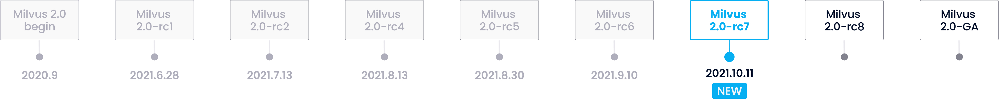

# 产品路线图

## Milvus 2.0 时间表

### 未来重大发布:
- Milvus 2.1: 2021.11
- Milvus 2.2: 2022.2

### 产品功能
#### 数据定义语言 (Data definition language，DDL)
| **版本** | **功能** | **Owner**   | **进度**  | **备注** |
| ----------- | ----------- | ----------- | ----------- | ----------- | 
| 2.0.0-rc      | 支持数字类型的标量数据	       |        | 已完成       |        |
| 2.0   | 增加字符串数据类型         | czs007, dragondriver	     | 开发中       |        |
| 2.0   | Collection 别名        | lsgrep       | 开发中       |        |
| 2.1   | 对于字符串及数字的数据类型支持倒排索引或标量比特图        |        | 待指派       |        |
| 2.1   | 支持数据生命周期管理        |        | 待指派       |        |
| 2.1   | 数据自动分区    |        | 待指派       |        |
| 2.2   | 支持 Collection 重命名        |        | 待指派       |        |

#### 数据操纵语言 (Data manipulation language，DML)

| **版本** | **功能** | **Owner**   | **进度**  | **备注** |
| ----------- | ----------- | ----------- | ----------- | ----------- |
| 2.0.0-rc      | 支持标量字段过滤       |        | 已完成       |        |
| 2.0.0-rc   | 支持根据 ID 查询数据        |         | 已完成        |         |
| 2.0   | 支持根据表达式（predicate expression）查询数据       | fishpenguin/FluorineDog        | in progress        |         |
| 2.0   | 支持根据 ID 删除数据       |         | 待指派        |         |
| 2.1   | 支持根据 ID 查询数据       |         | 待指派         |         |
| 2.1   | 返回符合距离限制的全部向量。       |         | 待指派          |         |
| 2.2   | 对检索或查询结果进行分页	        |         | 待指派        |         |
| 2.2   | 在插入及更新数据时进行主键去重        |         | 待指派        |         |

#### 功能

| **版本** | **功能** | **Owner**   | **进度**  | **备注** |
| ----------- | ----------- | ----------- | ----------- | ----------- |
| 2.0.0-rc      | 支持回溯（time travel）访问历史数据。	       |        | 已完成       |        |
| 2.0.0-rc   | 提供四个级别的一致性，分别是：strong、bounded staleness、session、consistent prefix。       |         | 已完成        |         |
| 2.0      | Segment compaction       | sunby       | 开发中       |        |
| 2.0   | 实现动态负载均衡        | sunby, xige-16        | 开发中        |         |
| 2.0      | 增量Segment到存量Segment的动态切换       | xige-16, bigsheeper       | 开发中       |        |
| 2.0   | 向量距离计算      | yhmo        | 开发中	        |         |
| 2.1      | 提供用户自定义的embedding服务      |        | 待指派       |        |
| 2.2   | 支持变更数据捕获      |         | 待指派        |         |
| 长期      | 采用增量备份      |        | 待指派       |        |
| 长期   | 支持静态数据加密      |         | 待指派        |         |
| 长期      | 通过数据导入及转换实现 embedding-as-service 服务
      |        | 待指派       |        |

#### 性能

| **版本** | **功能** | **Owner**   | **进度**  | **备注** |
| ----------- | ----------- | ----------- | ----------- | ----------- |
| 2.0      | Milvus 2.0 性能基准测试及性能调优       | czs007, dragondriver	       | 开发中       |        |
| 2.1   | 支持使用 GPU 建索引及向量召回       | shengjun1985        | 开发中        |         |
| 2.1      | 批量导入数据       |        | 待指派       |        |
| 2.1   | 采用基于代价的优化查询算法，提高查询效率      |         | 待指派        |         |
| 2.1      | 支持 ScaNN 索引类型       |        | 待指派       |        |
| 2.2   | 支持基于磁盘的向量索引      |         | 待指派        |         |
| 长期      | 支持 FPGA 及其他异构计算硬件设备      |        | 待指派       |        |
| 长期   | 自动索引优化     |         | 待指派        |         |

#### 稳定性

| **版本** | **功能** | **Owner**   | **进度**  | **备注** |
| ----------- | ----------- | ----------- | ----------- | ----------- |
| 2.0.0-rc      | 全托管故障恢复及服务发现       |        | 已完成       |        |
| 2.0.0-rc   | Python SDK 测试        |         | 已完成        |         |
| 2.0      | 混沌测试       |   yanliang567     | 开发中       |        |
| 2.0   | 压力测试       | del-zhenwu        | 开发中        |         |
| 2.1      | 支持 Segment 多内存副本      |        | 已完成       |        |
| 2.1   | 支持流控及背压        |         | 待指派        |         |
| 2.2      | 	查询节点资源隔离     |        | 待指派       |        |

#### 易用性

| **版本** | **功能** | **Owner**   | **进度**  | **备注** |
| ----------- | ----------- | ----------- | ----------- | ----------- |
| 2.0.0-rc    | 使用 Helm 安装 Milvus      |        | 已完成       |        |
| 2.0.0-rc    | 提供 Milvus 可视化管理工具 Milvus Insight     |         | 优化中        |         |
| 2.0      | 支持 Prometheus、Grafana 及 Jaeger        | 	zwd1208       | 文档编写中      |        |
| 2.0   | Milvus Kubernetes Operator       | 	zwd1208, jeffoverflow        | 开发中        |         |
| 2.1      | 多机房多地部署，多云融合      |        | 待指派       |        |
| 2.2   | 提供可在笔记本电脑上运行的内嵌式 Milvus
        |         | 待指派        |         |
| 长期      | 分布式集群动态扩缩容      |        | 待指派      |      |

#### SDK

| **版本** | **功能** | **Owner**   | **进度**  | **备注** |
| ----------- | ----------- | ----------- | ----------- | ----------- |
| 2.0.0-rc      | 提供基于对象关系映射（Obejct Relational Mapping）抽象的 API       |        | 已完成       |        |
| 2.0   | 合并 Pymilvus ORM 及 Pymilvus        | XuanYang-cn        | 开发中     |         |
| 2.0      | 支持 NodeJs 语言的 SDK        | nameczz,shanghaikid       | 开发中      | 当前SDK可用，并将支持更新    https://github.com/milvus-io/milvus-sdk-node       |
| 2.0   | 支持 Java 语言的 SDK        |         | 待指派         |         |
| 2.0      | 支持 Go 语言的 SDK       | congqixia       |  开发中       |        |
| 2.1   | 支持 Restful 语言的 API        |         | 待指派        |         |
| 2.1      | 支持 C++ 语言的 SDK       |        | 待指派        |        |
| 长期   | SQL-like 查询语言       |         | 待指派        |         |

#### 集成

| **版本** | **功能** | **Owner**   | **进度**  | **备注** |
| ----------- | ----------- | ----------- | ----------- | ----------- |
| 2.0      | 集成 S3	       |        | 已完成       |        |
| 2.1  | 集成 Kafka       |       | 待指派        |         |
| 2.1    | 集成 JuiceFS       |        | 待指派       |    |
| 2.1  | 本地或分布式文件系统存储数据      |         | 待指派         |         |
| 2.2     | 集成 HBase、TiKV、FoundationDB等分布式键-值存储（KV store）系统    |        | 待指派      |        |
