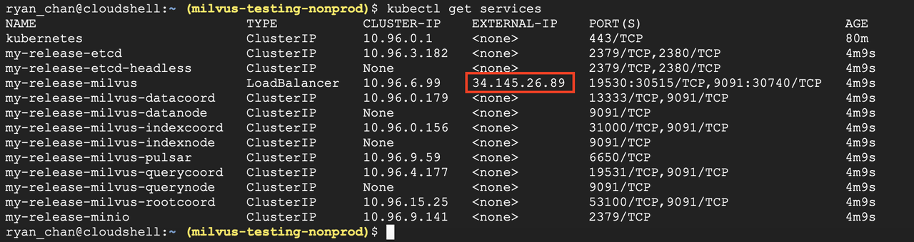

# 在 GCP 部署 Milvus 集群

本文介绍在[谷歌云端平台](https://console.cloud.google.com/) (GCP) 上部署 Milvus 集群的操作步骤。

## 先决条件

确定您想要使用的项目。如果您不确定要使用哪一个，联系你的 GCP 管理员创建一个新的项目。更多信息请参见[创建和管理项目](https://cloud.google.com/resource-manager/docs/creating-managing-projects)。本文中使用的项目名为 <code>milvus-testing-nonprod</code>。在命令中用你的项目名称替换它。

### 所需软件
- [Cloud SDK](https://cloud.google.com/sdk/docs/quickstart#installing_the_latest_version)
- [kubectl](https://kubernetes.io/docs/tasks/tools/)
- [Helm](https://helm.sh/docs/intro/install/)

你也可以使用 [Cloud Shell](https://cloud.google.com/shell)，它预装了 GCP SDK、kubectl和Helm。

<div class="alert note">安装完 Cloud SDK 后，请确保您的身份验证是正确的。</div>

## 设置网络

在为 Milvus 创建防火墙规则之前，需要先创建 VPC 网络。

如果已经创建了 VPC 网络，请直接阅读[为 Milvus 创建防火墙规则](gcp.md#Create-a-firewall-rule-for Milvus)。

### 创建 VPC

打开终端，执行如下命令创建 VPC 网络。

<div class="alert note">
用你的项目名称替换 <code>milvus-testing-nonprod</code> 。
</div>


```shell
gcloud compute networks create milvus-network --project=milvus-testing-nonprod --subnet-mode=auto --mtu=1460 --bgp-routing-mode=regional
```

执行如下命令创建允许 ICMP、内部、RDP 和 SSH 流量的防火墙规则。

```shell
gcloud compute firewall-rules create milvus-network-allow-icmp --project=milvus-testing-nonprod --network=projects/milvus-testing-nonprod/global/networks/milvus-network --description=Allows\ ICMP\ connections\ from\ any\ source\ to\ any\ instance\ on\ the\ network. --direction=INGRESS --priority=65534 --source-ranges=0.0.0.0/0 --action=ALLOW --rules=icmp

gcloud compute firewall-rules create milvus-network-allow-internal --project=milvus-testing-nonprod --network=projects/milvus-testing-nonprod/global/networks/milvus-network --description=Allows\ connections\ from\ any\ source\ in\ the\ network\ IP\ range\ to\ any\ instance\ on\ the\ network\ using\ all\ protocols. --direction=INGRESS --priority=65534 --source-ranges=10.128.0.0/9 --action=ALLOW --rules=all

gcloud compute firewall-rules create milvus-network-allow-rdp --project=milvus-testing-nonprod --network=projects/milvus-testing-nonprod/global/networks/milvus-network --description=Allows\ RDP\ connections\ from\ any\ source\ to\ any\ instance\ on\ the\ network\ using\ port\ 3389. --direction=INGRESS --priority=65534 --source-ranges=0.0.0.0/0 --action=ALLOW --rules=tcp:3389

gcloud compute firewall-rules create milvus-network-allow-ssh --project=milvus-testing-nonprod --network=projects/milvus-testing-nonprod/global/networks/milvus-network --description=Allows\ TCP\ connections\ from\ any\ source\ to\ any\ instance\ on\ the\ network\ using\ port\ 22. --direction=INGRESS --priority=65534 --source-ranges=0.0.0.0/0 --action=ALLOW --rules=tcp:22
```

### 为 Milvus 创建防火墙规则

创建防火墙规则以允许被 Milvus 使用的`19530`端口上的传入流量。

```Apache
gcloud compute --project=milvus-testing-nonprod firewall-rules create allow-milvus-in --description="Allow ingress traffic for Milvus on port 19530" --direction=INGRESS --priority=1000 --network=projects/milvus-testing-nonprod/global/networks/milvus-network --action=ALLOW --rules=tcp:19530 --source-ranges=0.0.0.0/0
```

## 预置 Kubernetes 集群

我们使用 Google Kubernetes Engine (GKE) 来提供一个 K8s 集群。在本文中，我们将创建一个具有两个节点的集群。节点位于 `use-west1-a` 地区，使用 `e2-standard-4` 机器类型，并使用 ` cos_containerd` 节点映像。

<div class="alert note">
根据需要修改以上选项。
</div>

### 选择机器类型

在本文中，我们使用 `e2-standard-4` 机器类型，它有四个 vCPU 和16GB 内存。

<div class="alert note">
你可以根据需要选择机器类型。但是，我们建议选择至少有 16GB 内存的机器类型，以确保稳定性。
</div>

```shell
gcloud beta container --project "milvus-testing-nonprod" clusters create "milvus-cluster-1" --zone "us-west1-a" --no-enable-basic-auth --cluster-version "1.20.8-gke.900" --release-channel "regular" --machine-type "e2-standard-4" --image-type "COS_CONTAINERD" --disk-type "pd-standard" --disk-size "100" --max-pods-per-node "110" --num-nodes "2" --enable-stackdriver-kubernetes --enable-ip-alias --network "projects/milvus-testing-nonprod/global/networks/milvus-network" --subnetwork "projects/milvus-testing-nonprod/regions/us-west1/subnetworks/milvus-network"
```

创建集群可能需要几分钟。创建集群后，运行以下命令获取集群的凭据。

```shell
gcloud container clusters get-credentials milvus-cluster-1
```

上述命令指向集群中的 `kubectl`。

## 部署 Milvus

集群准备完成后，可以安装 Milvus。如果您切换到另一个终端，请再次运行以下命令获取凭据。

```shell
gcloud container clusters get-credentials milvus-cluster-1
```

1. 运行以下命令添加 Milvus 的 Helm chart 仓库。
   
```shell
helm repo add milvus https://milvus-io.github.io/milvus-helm/
```

2. 运行以下命令更新 Milvus 的 Helm chart。
```Apache
helm repo update
```

3. 运行以下命令安装 Milvus。

<div class="alert note">
本节使用 <code>my-release</code> 发布版本名称。将其替换为你的发布版本名称。
</div>

```shell
helm install my-release milvus/milvus --set service.type=LoadBalancer
```

启动 Pod 可能需要几分钟。执行 <code>kubectl get services</code> 查看服务。如果成功，服务列表如下所示。



<div class="alert note"><code>EXTERNAL-IP</code> 列中的<code>34.145.26.89</code>为负载均衡器的 IP 地址。该 IP 地址用于连接 Milvus。
</div>

## 使用 Google 云端存储
Google 云端存储 (GCS) 是 Google Cloud 版本的 Amazon S3。

MinIO GCS 网关允许访问 GCS。本质上，MinIO GCS 网关通过使用 API 转换和转发所有到 GCS 的连接。你可以使用 MinIO GCS 网关代替 MinIO 服务器。

### 设置变量

在使用 MinIO GCS Gateway 之前设置变量。根据需要修改默认值。

#### Secrets

MinIO GCS Gateway 需要 GCS 服务账户凭据和 MinIO 服务账户凭据才能访问 GCS 资源。将账户凭据存储在 K8s Secret 中。 Secret 必须包含以下数据。

- `accesskey`: MinIO 服务账户的访问密钥 。
- `secretkey`: MinIO  服务账户的秘密访问密钥。
- `gcs_key.json`: 包含 GCS 服务帐户凭据的 JSON 文件。

下面的示例创建一个名为 `mysecret` 的 Secret，其中包含 `accesskey=minioadmin`、`secretkey=minioadmin` 和 `gcs_key.json=/home/credentials.json`。

```shell
$ kubectl create secret generic mysecret --from-literal=accesskey=minioadmin --from-literal=secretkey=minioadmin --from-file=gcs_key.json=/home/credentials.json
```

<div class="alert note">
  如果你选择的 <code>accesskey</code> 和 <code>secretkey</code> 值不是默认的 <code>minioadmin/minioadmin</code>，你需要更新 <code>minio.accessKey</code> 和 <code>minio.secretKey</code> 的元数据变量。
</div>

#### 元数据

下表列出了可以配置的元数据。
|选项|描述|默认值|
|:---|:---|:---|
|`minio.gcsgateway.enabled`|设置值为 `true` 启用 MinIO GCS 网关。|`false`|
|`minio.gcsgateway.projectId`|GCP 项目的 ID。|`""`|
|`minio.existingSecret`|先前定义的 Secret 的名称。|`""`|
|`externalGcs.bucketName`|要使用的 GCS 存储桶的名称。与 S3/MinIO bucket 不同，GCS 存储桶必须是全局唯一的。|`""`|

下表列出了您可能希望保留为默认值的元数据。

|选项|描述|默认值|
|:---|:---|:---|
|`minio.gcsgateway.replicas`|用于网关的复制节点的数量。建议使用一个，因为 MinIO 不能很好地支持多个副本。|`1`|
|`minio.gcsgateway.gcsKeyJson`|GCS 服务帐户凭据的文件路径。不要修改默认值。|`/etc/credentials/gcs_key.json`|

继续使用所有预定义的 MinIO 元数据变量。

下面的例子安装了一个名为 `my-release` 的 chart。

```shell
$ helm install my-release milvus/milvus --set minio.existingSecret=mysecret --set minio.gcsgateway.enabled=true --set minio.gcsgateway.projectId=milvus-testing-nonprod --set externalGcs.bucketName=milvus-bucket-example
```

## 更多内容

如果你想学习如何在其他云上部署 Milvus 集群:
- [在 EC2 上部署 Milvus 集群](https://milvus.io/docs/v2.0.0/aws.md)
- [在 EKS 上部署 Milvus 集群](https://milvus.io/docs/v2.0.0/eks.md)
- [在 Azure 上部署 Milvus 集群](https://milvus.io/docs/v2.0.0/azure.md)


