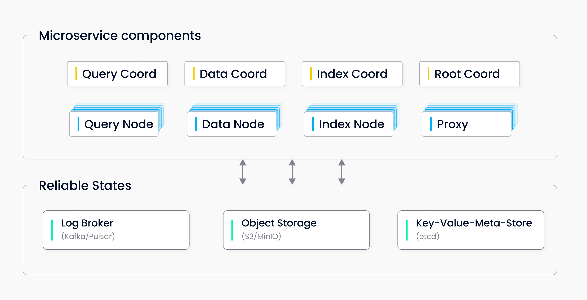

# 分布式版 Milvus 扩缩容指南

分布式版 Milvus 中包含 8 个微服务组件和 3 个第三方依赖。



分布式版 Milvus 采用了存储与计算分离的架构设计，所有组件均为无状态组件，极大地增强了系统弹性和灵活性。你可轻松对 Milvus 以下 4 种无状态节点进行扩容。

- Query node
- Data node
- Index node
- Proxy

<div class="alert note">
Milvus 不支持对 query coord、data coord、index coord 和 root coord 进行扩容。
</div>

## 使用 Helm 安装 Milvus
```
helm repo add milvus https://milvus-io.github.io/milvus-helm/
helm repo update
helm install my-release milvus/milvus --set cluster.enabled=true
```
如果分布式版 Milvus 成功启动，每个 Milvus pod 都将在 `READY` 下显示 `1/1`：

```
kubectl get pods
NAME                                            READY   STATUS       RESTARTS   AGE
my-release-etcd-0                               1/1     Running      0          1m
my-release-milvus-datacoord-7b5d84d8c6-rzjml    1/1     Running      0          1m
my-release-milvus-datanode-665d4586b9-525pm     1/1     Running      0          1m
my-release-milvus-indexcoord-9669d5989-kr5cm    1/1     Running      0          1m
my-release-milvus-indexnode-b89cc5756-xbpbn     1/1     Running      0          1m
my-release-milvus-proxy-7cbcc8ffbc-4jn8d        1/1     Running      0          1m
my-release-milvus-pulsar-6b9754c64d-4tg4m       1/1     Running      0          1m
my-release-milvus-querycoord-75f6c789f8-j28bg   1/1     Running      0          1m
my-release-milvus-querynode-7c7779c6f8-pnjzh    1/1     Running      0          1m
my-release-milvus-rootcoord-75585dc57b-cjh87    1/1     Running      0          1m
my-release-minio-5564fbbddc-9sbgv               1/1     Running      0          1m
```

## 对分布式版 Milvus 执行节点进行扩容

### 扩容 query node
```
helm upgrade my-release milvus/milvus --set queryNode.replicas=3 --reuse-values
NAME                                            READY   STATUS    RESTARTS   AGE
my-release-etcd-0                               1/1     Running   0          2m
my-release-milvus-datacoord-7b5d84d8c6-rzjml    1/1     Running   0          2m
my-release-milvus-datanode-665d4586b9-525pm     1/1     Running   0          2m
my-release-milvus-indexcoord-9669d5989-kr5cm    1/1     Running   0          2m
my-release-milvus-indexnode-b89cc5756-xbpbn     1/1     Running   0          2m
my-release-milvus-proxy-7cbcc8ffbc-4jn8d        1/1     Running   0          2m
my-release-milvus-pulsar-6b9754c64d-4tg4m       1/1     Running   0          2m
my-release-milvus-querycoord-75f6c789f8-j28bg   1/1     Running   0          2m
my-release-milvus-querynode-7c7779c6f8-czq9f    1/1     Running   0          5s
my-release-milvus-querynode-7c7779c6f8-jcdcn    1/1     Running   0          5s
my-release-milvus-querynode-7c7779c6f8-pnjzh    1/1     Running   0          2m
my-release-milvus-rootcoord-75585dc57b-cjh87    1/1     Running   0          2m
my-release-minio-5564fbbddc-9sbgv               1/1     Running   0          2m
```

可以看到有 3 个 query node pod 在运行。

### 扩容 data node
```
helm upgrade my-release milvus/milvus --set dataNode.replicas=3 --reuse-values
NAME                                            READY   STATUS    RESTARTS   AGE
my-release-etcd-0                               1/1     Running   0          5m
my-release-milvus-datacoord-7b5d84d8c6-rzjml    1/1     Running   0          5m
my-release-milvus-datanode-665d4586b9-525pm     1/1     Running   0          5m
my-release-milvus-datanode-665d4586b9-7rjqp     1/1     Running   0          5s
my-release-milvus-datanode-665d4586b9-jwd8w     1/1     Running   0          5s
my-release-milvus-indexcoord-9669d5989-kr5cm    1/1     Running   0          5m
my-release-milvus-indexnode-b89cc5756-xbpbn     1/1     Running   0          5m
my-release-milvus-proxy-7cbcc8ffbc-4jn8d        1/1     Running   0          5m
my-release-milvus-pulsar-6b9754c64d-4tg4m       1/1     Running   0          5m
my-release-milvus-querycoord-75f6c789f8-j28bg   1/1     Running   0          5m
my-release-milvus-querynode-7c7779c6f8-czq9f    1/1     Running   0          2m55s
my-release-milvus-querynode-7c7779c6f8-jcdcn    1/1     Running   0          2m55s
my-release-milvus-querynode-7c7779c6f8-pnjzh    1/1     Running   0          5m
my-release-milvus-rootcoord-75585dc57b-cjh87    1/1     Running   0          5m
my-release-minio-5564fbbddc-9sbgv               1/1     Running   0          5m
```

可以看到有 3 个 data node pod 在运行。


### 扩容 index node
```
helm upgrade my-release milvus/milvus --set indexNode.replicas=3 --reuse-values
NAME                                            READY   STATUS    RESTARTS   AGE
my-release-etcd-0                               1/1     Running   0          10m
my-release-milvus-datacoord-7b5d84d8c6-rzjml    1/1     Running   0          10m
my-release-milvus-datanode-665d4586b9-525pm     1/1     Running   0          10m
my-release-milvus-datanode-665d4586b9-7rjqp     1/1     Running   0          3m45s
my-release-milvus-datanode-665d4586b9-jwd8w     1/1     Running   0          3m45s
my-release-milvus-indexcoord-9669d5989-kr5cm    1/1     Running   0          10m
my-release-milvus-indexnode-b89cc5756-7vp5h     1/1     Running   0          5s
my-release-milvus-indexnode-b89cc5756-r74kd     1/1     Running   0          5s
my-release-milvus-indexnode-b89cc5756-xbpbn     1/1     Running   0          10m
my-release-milvus-proxy-7cbcc8ffbc-4jn8d        1/1     Running   0          10m
my-release-milvus-pulsar-6b9754c64d-4tg4m       1/1     Running   0          10m
my-release-milvus-querycoord-75f6c789f8-j28bg   1/1     Running   0          10m
my-release-milvus-querynode-7c7779c6f8-czq9f    1/1     Running   0          7m35s
my-release-milvus-querynode-7c7779c6f8-jcdcn    1/1     Running   0          7m35s
my-release-milvus-querynode-7c7779c6f8-pnjzh    1/1     Running   0          10m
my-release-milvus-rootcoord-75585dc57b-cjh87    1/1     Running   0          10m
my-release-minio-5564fbbddc-9sbgv               1/1     Running   0          10m
```

可以看到有 3 个 index node pod 在运行。

### 扩容 proxy
```
helm upgrade my-release milvus/milvus --set proxy.replicas=3 --reuse-values
NAME                                            READY   STATUS    RESTARTS   AGE
my-release-etcd-0                               1/1     Running   0          13m
my-release-milvus-datacoord-7b5d84d8c6-rzjml    1/1     Running   0          13m
my-release-milvus-datanode-665d4586b9-525pm     1/1     Running   0          13m
my-release-milvus-datanode-665d4586b9-7rjqp     1/1     Running   0          7m29s
my-release-milvus-datanode-665d4586b9-jwd8w     1/1     Running   0          7m29s
my-release-milvus-indexcoord-9669d5989-kr5cm    1/1     Running   0          13m
my-release-milvus-indexnode-b89cc5756-7vp5h     1/1     Running   0          3m49s
my-release-milvus-indexnode-b89cc5756-r74kd     1/1     Running   0          3m49s
my-release-milvus-indexnode-b89cc5756-xbpbn     1/1     Running   0          13m
my-release-milvus-proxy-7cbcc8ffbc-4jn8d        1/1     Running   0          13m
my-release-milvus-proxy-7cbcc8ffbc-67vkd        1/1     Running   0          5s
my-release-milvus-proxy-7cbcc8ffbc-7bkj2        1/1     Running   0          5s
my-release-milvus-pulsar-6b9754c64d-4tg4m       1/1     Running   0          13m
my-release-milvus-querycoord-75f6c789f8-j28bg   1/1     Running   0          13m
my-release-milvus-querynode-7c7779c6f8-czq9f    1/1     Running   0          11m
my-release-milvus-querynode-7c7779c6f8-jcdcn    1/1     Running   0          11m
my-release-milvus-querynode-7c7779c6f8-pnjzh    1/1     Running   0          13m
my-release-milvus-rootcoord-75585dc57b-cjh87    1/1     Running   0          13m
my-release-minio-5564fbbddc-9sbgv               1/1     Running   0          13m
```

可以看到有 3 个 proxy pod 在运行。

## 对分布式版 Milvus 执行节点进行缩容
### 缩容 query node

```
helm upgrade my-release milvus/milvus --set queryNode.replicas=1 --reuse-values
```

### 缩容 data node

```
helm upgrade my-release milvus/milvus --set dataNode.replicas=1 --reuse-values
```

### 缩容 index node
```
helm upgrade my-release milvus/milvus --set indexNode.replicas=1 --reuse-values
```

### 缩容 proxy

```
helm upgrade my-release milvus/milvus --set proxy.replicas=1 --reuse-values
```
