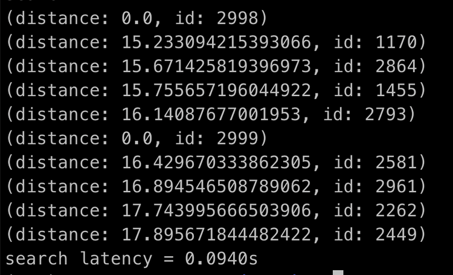

# 通过 Python 使用 Milvus

成功启动 Milvus 服务端后，通过 Python 示例代码使用 Milvus。

1. 安装 pymilvus_orm 及依赖库:
```
pip install pymilvus-orm==2.0.0rc1
```

<div class="alert note">
pymilvus_orm 需要 Python 3.6 版本或以上，详见 <a href="https://wiki.python.org/moin/BeginnersGuide/Download">Python 安装指南</a>。
</div>


2. 下载 **hello_milvus.py** 示例代码:
```
$ wget https://github.com/milvus-io/pymilvus-orm/blob/v2.0.0rc1/examples/hello_milvus.py
```
3. 浏览 **hello_milvus.py**，这个示例程序将：
- 导入 pymilvus 包
```
from pymilvus_orm import *
```

- 连接 Milvus 服务端
```
connections.connect()
```

- 创建一个 collection：
```
dim = 128
default_fields = [
    schema.FieldSchema(name="count", dtype=DataType.INT64, is_primary=True),
    # Change field schema name to distinguish search result score
    schema.FieldSchema(name="random_value", dtype=DataType.DOUBLE),
    schema.FieldSchema(name="float_vector", dtype=DataType.FLOAT_VECTOR, dim=dim)
]
default_schema = schema.CollectionSchema(fields=default_fields, description="test collection")

print(f"\nCreate collection...")
collection = Collection(name="hello_milvus", schema=default_schema)
```
- 向创建的 collection 中插入数据：
```
import random
nb = 3000
vectors = [[random.random() for _ in range(dim)] for _ in range(nb)]
collection.insert(
    [
        [i for i in range(nb)],
        [float(random.randrange(-20,-10)) for _ in range(nb)],
        vectors
    ]
)
```
- 构建 IVF_FLAT 索引并加载 collection 至内存：
```
default_index = {"index_type": "IVF_FLAT", "params": {"nlist": 128}, "metric_type": "L2"}
collection.create_index(field_name="float_vector", index_params=default_index)
collection.load()
```

- 进行向量相似度查询：
```
topK = 5
search_params = {"metric_type": "L2", "params": {"nprobe": 10}}
# define output_fields of search result
res = collection.search(
    vectors[-2:], "float_vector", search_params, topK,
    "count > 100", output_fields=["count", "random_value"]
)
```

4. 运行 **hello_milvus.py**:
```
$ python3 hello_milvus.py
```
*运行结果及查询等待时间如下：*




<br/>


*恭喜！你已成功启动 Milvus，并完成了在 Milvus上的第一次向量查询。*
