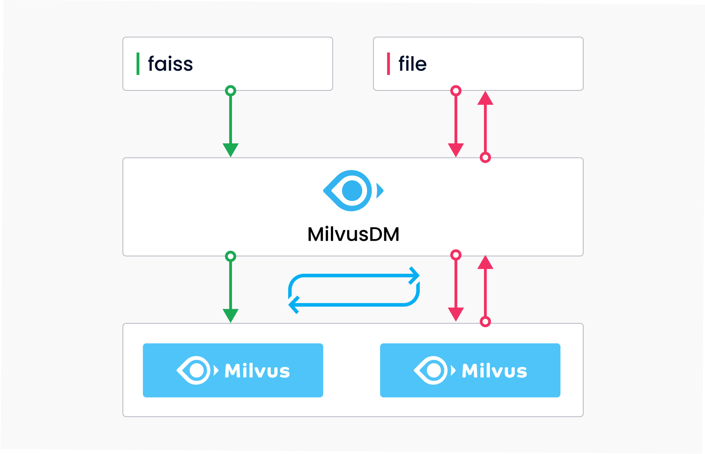
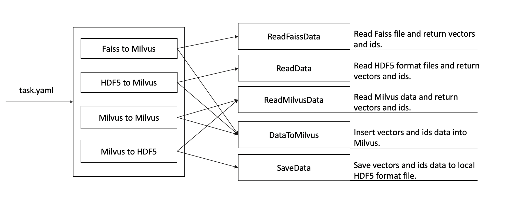

# 概述
[MilvusDM](https://github.com/milvus-io/milvus-tools) 是一款针对 Milvus 研发的数据迁移工具，支持 Milvus 数据传输以及数据文件的导入与导出：

- [Milvus to Milvus](m2m.md): 支持 Milvus 之间的数据迁移
- [Faiss to Milvus](f2m.md): 将未压缩的 Faiss 文件导入 Milvus
- [HDF5 to Milvus](h2m.md): 将 HDF5 格式的文件导入 Milvus
- [Milvus to HDF5](m2h.md): 将 Milvus 数据批量备份为 HDF5 格式的本地文件

开发者使用 MilvusDM 可以提升数据管理效率，降低运维成本。

数据迁移工具 MilvusDM 可以通过指定 Milvus 中的集合或分区，帮助用户更智能地迁移所需数据。MilvusDM 十分易于使用，只需要运行一句 `pip3 install pymilvusdm` 指令即可快速安装。此外，您还可在 [Github](https://github.com/milvus-io/milvus-tools) 上获取本项目的开源代码。

## MilvusDM 文件结构
使用 MilvusDM 时会根据传入的 yaml 文件执行对应的任务，如下图所示：

MilvusDM 文件结构：

- pymilvusdm
  - core
    - **milvus_client.py**，Milvus 客户端相关的操作
    - **read_data.py**，读取本地 HDF5 格式的数据文件（如果有读取其他文件格式的需求，可在此处添加代码）
    - **read_faiss_data.py**，读取 Faiss 的数据文件
    - **read_milvus_data.py**，读取 Milvus 的数据文件
    - **read_milvus_meta.py**，读取 Milvus 的 meta 信息
    - **data_to_milvus.py**:，根据 yaml 文件配置参数，建立集合或分区，并将向量和 ids 导入 Milvus
    - **save_data.py**，将读取到的数据保存为 HDF5 格式的文件
    - **write_logs.py**，在执行操作时写 debug/info/error 日志
  - **faiss_to_milvus.py**，实现将 Faiss 文件数据导入 Milvus
  - **hdf5_to_milvus.py**，实现将 HDF5 格式的文件数据导入 Milvus
  - **milvus_to_milvus.py**，实现将 Milvus 的数据拷贝到另一个 Milvus
  - 
  - **milvus_to_hdf5.py**，实现将 Milvus 的数据导出为 HDF5 格式的文件
  - **main.py**，根据 yaml 文件执行相关任务
  - **setting.py**，执行代码时的相关配置参数
- **setup.py**，将 pymilvusdm 打包并上传到 pypi

我们计划在下个版本的 MilvusDM 中添加以下功能：

- 支持将 Faiss 的 binary 数据文件导入 Milvus
- Milvus to Milvus 时支持指定黑白名单
- Milvus to Milvus 时支持将多个集合或分区的数据合并导入至一个集合中
- 支持 Milvus 数据备份和数据恢复

我们十分欢迎大家为开源项目 MilvusDM 贡献代码。你可以通过代码文件结构了解 MilvusDM 工具的设计构思。如有新的数据迁移需求，你还可以通过修改源码，为社区贡献代码。

MilvusDM 项目地址：https://github.com/milvus-io/milvus-tools

欢迎贡献代码👏，也请给本项目点 star 🌟

