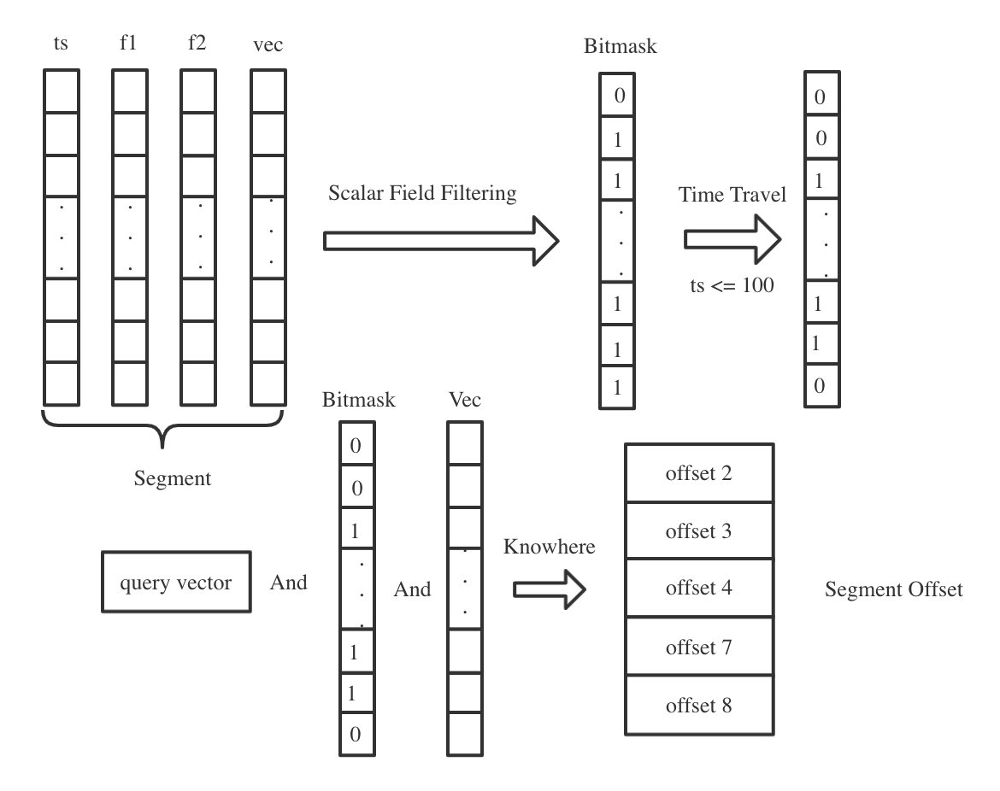

# Time Travel

This topic introduces the Time Travel feature in detail, including how it is designed and how it works in Milvus. See [Search with Time Travel](timetravel.md) for more information about how to use this feature.

Data engineers often need to roll back data to fix dirty data or bugs. Unlike traditional databases that use snapshots or retrain data to achieve data rollback, Milvus maintains a timeline for all data insert or delete operations. Therefore, users can specify the timestamp in a query to retrieve data at a specific point of time, which can significantly reduce maintenance costs.

## Design Details

When the proxy receives a data insert or delete request, it also gets a timestamp from root coord. Then, the proxy adds the timestamp as an additional field to the inserted or deleted data. Timestamp is a data field just like primary key (`pk`). Data in the same insert or delete request share the same timestamp. The timestamp field is stored together with other data fields of a collection.

When you load a collection to memory, all data in the collection, including their corresponding timestamps, are loaded into memory.

During a search, if the search request received by the proxy contains the parameter, `travel_timestamp`, the value of this parameter will be passed to [segcore](https://github.com/milvus-io/milvus/tree/master/docs/design_docs/segcore), the execution engine which supports concurrent insertion, deletion, query, index loading, monitoring and statistics of a segment data in memory. The segcore filters the search results by timestamp.

## Search implementation

Searches with filtering in [knowhere](https://github.com/milvus-io/milvus/blob/master/docs/design_docs/knowhere_design.md) is achieved by bitmap. Bitmap can be applied in the following three aspects:

- Delete data
- Timestamp
- Attribute filtering

When searching in segcore, you can obtain a bitmap indicating if the timestamp meets the condition. Then, the segcore combines the timestamp bitmap with the other two types of bitmaps, data deletion bitmap and attribute filtering bitmap. Finally, a bitmap containing all deletion, attribute filtering, and timestamp information is generated. Then Milvus judges the range of data to query or search based on this bitmap.

All CRUD operations within Milvus are executed in memory. Therefore, you need to [load collection from disk to memory](search.md#Load-collection) before searching with Time Travel.

### Sealed segment

For sealed segments, you need to call `collection.load()` to load the collection to memory before searching with Time Travel. As an additional field of data, timestamps are also loaded to memory when you call `collection.load()`. When loading, segcore builds an index, `TimestampIndex` , on the timestamp field. The index contains information about the smallest and the largest timestamp of this sealed segment, and the offset, or the row number, of each timestamp in the segment.

When you search with Time Travel, Milvus first filters the sealed segment according to the smallest and largest timestamp in the `TimestampIndex`:

- If the value you set for `travel_timestamp` is greater than the largest timestamp of the segment, this means all the data in this segment meets the requirement. Therefore, the bitmap of the data in this segment is marked as 1. 
- If the value you set for `travel_timestamp` is smaller than the smallest timestamp of the segment, this means the data in this segment does not meet the requirement. Therefore, the bitmap of the data in this segment is marked as 0.
- If the value you set for `travel_timestamp` is between the largest and the smallest timestamp of the segment, Milvus compares the timestamps in the segment one by one, and generates a bitmap accordingly. In the bitmap, if the data meet the requirement, they are marked with 1, and 0 if they do not. 

### Growing segment

For growing segments, you do not need to load the collection to memory. All inserted data exists in memory, with the timestamp field attached. Data in growing segments are sorted according to the order of timestamp. When new data are inserted, they are added to the segment in the order of their timestamp. Segment data are organized in segcore memory in the same way. 

When you search with Time Travel, Milvus uses binary search to find the first offset, or the row number data, with their timestamp value greater than the value you set for the `travel_timestamp` parameter. Then subsequent operations including filtering and vector similarity search are conducted within this range of offsets.

## What's next
After learning how Time Travel works in Milvus, you might also want to:

- Learn how to [search with Time Travel](timetravel.md)
- Learn the [architecture](architecture_overview.md) of Milvus.
- Understand [how data are processed](data_processing.md) in Milvus.
