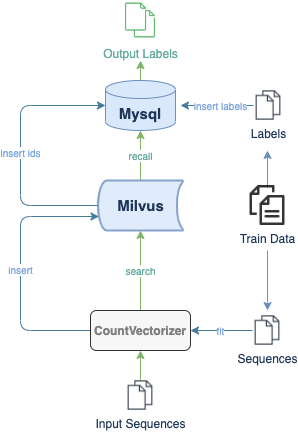

# DNA Sequence Classification 

DNA sequence is a popular concept in both academic research and real world applications, such as gene traceability, species identification, and disease diagnosis. Whereas all industries starve for a more intelligent and efficient research method, artificial intelligence has attracted much attention especially from biological and medical domains. More and more scientists and researchers are contributing to machine learning and deep learning in the field of bioinformatics. To make experimental results more convincing, one common option is to increase sample size. The collaboration with big data in genomics brings more possibilities of application in reality. However, the traditional sequence alignment has limitations, making it unsuitable for large datasets. In order to make less trade-off in reality, vectorization is a good choice for a large dataset of DNA sequences.

 

Milvus, the open-source vector database is capable of handling massive data and can store vectors of nucleic acid sequences and perform high-efficiency retrieval. It can also help reduce the cost of production or research. The DNA sequence classification system built on Milvus can manage gene classification in milliseconds with high accuracy. 

 

Visit the [github repo](https://github.com/milvus-io/bootcamp/tree/master/solutions/dna_sequence_classification) to learn how to build a DNA sequence classification system using Milvus paired with CountVectorizer.

 

You can also learn more about how to use Milvus to build other systems for various application scenarios in our [bootcamp repo](https://github.com/milvus-io/bootcamp) on Github.

