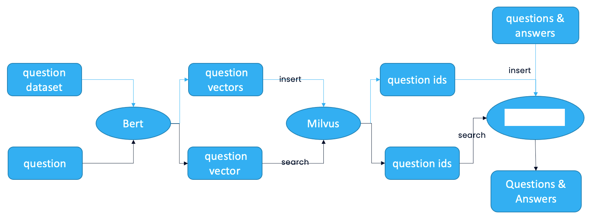
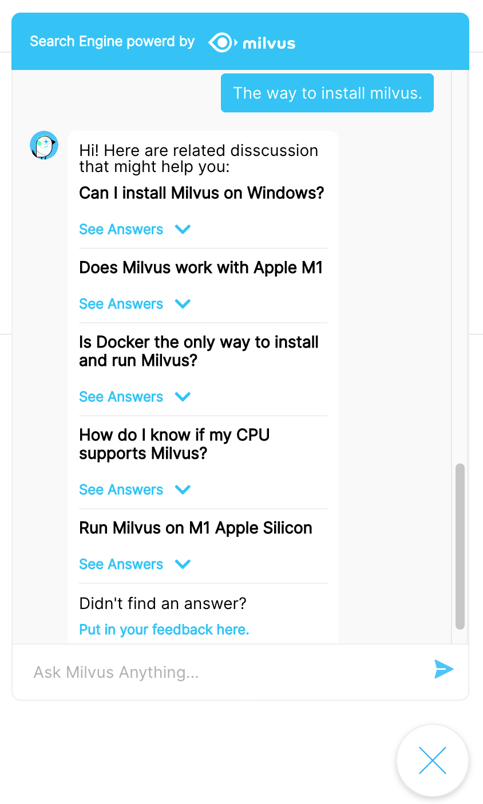

# Question Answering System 
This tutorial demonstrates how to use Milvus, the open-source vector database, to build a question answering (QA) system.
- [Open Jupyter notebook](https://github.com/milvus-io/bootcamp/blob/master/solutions/question_answering_system/question_answering.ipynb)
- [Quick deploy](https://github.com/milvus-io/bootcamp/blob/master/solutions/question_answering_system/quick_deploy)
- [Try online demo](http://35.166.123.214:8005/)

The ML model and third-party software used include:
- BERT
- MySQL

In this tutorial, you will learn how to build a QA system that can link new user questions to massive answers previously stored in the vector database. To build such a chatbot, prepare your own dataset of questions and corresponding answers. Store the questions and answers in MySQL, a relational database. Then use BERT, the machine learning (ML) model for natural language processing (NLP) to convert questions into vectors. These question vectors are stored and indexed in Milvus.  When users input a new question, it is converted into a vector by the BERT model as well, and Milvus searches for the most similar question vector to this new vector. The QA system returns the corresponding answer to the most similar questions.

 

