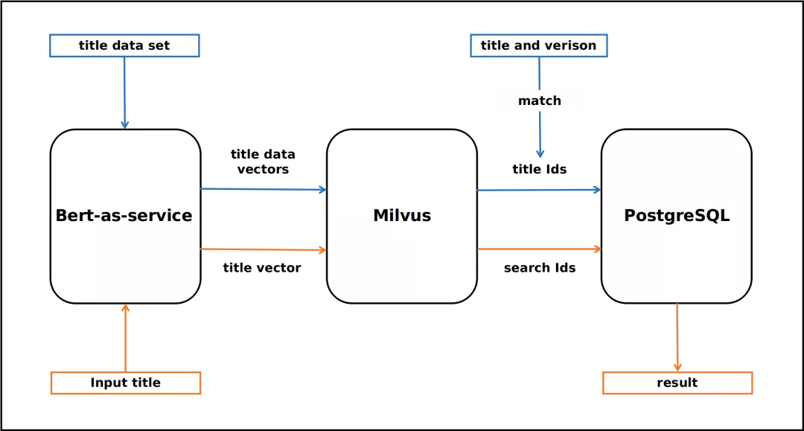

# 文本搜索引擎

本教程将介绍如何使用开源向量数据库 Milvus 搭建一个文本搜索引擎。

- [打开 Jupyter notebook](https://github.com/milvus-io/bootcamp/blob/master/solutions/text_search_engine/text_search_engine.ipynb)
- [快速部署](https://github.com/milvus-io/bootcamp/blob/master/solutions/text_search_engine/quick_deploy)
本教程中使用到的 ML 模型及第三方软件包括：
- BERT
- MySQL

 

Milvus 在自然语言处理（NLP）领域的一个主要应用是文本搜索引擎。 这是一个很棒的工具，可以帮助用户找到他们正在寻找的信息。 它甚至可以显示难以找到的信息。 文本搜索引擎将用户输入的关键字或语义与文本数据库进行比较，然后返回满足特定条件的结果。

 

通过本教程，你将学习到如何构建一个文本搜索引擎。本教程使用 BERT 将文本转换为固定长度的向量。Milvus 作为向量数据库，用于存储和向量相似性搜索。使用 MySQL 存储 Milvus 向量 ID 与文本数据间的映射关系。

 

