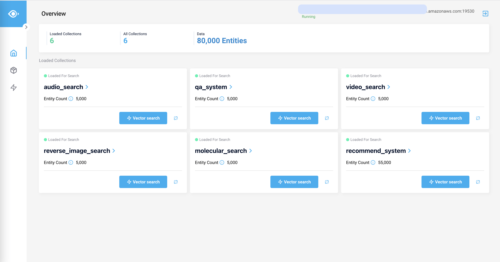
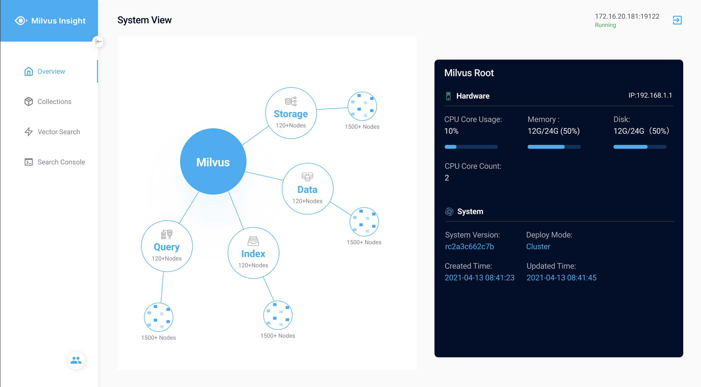
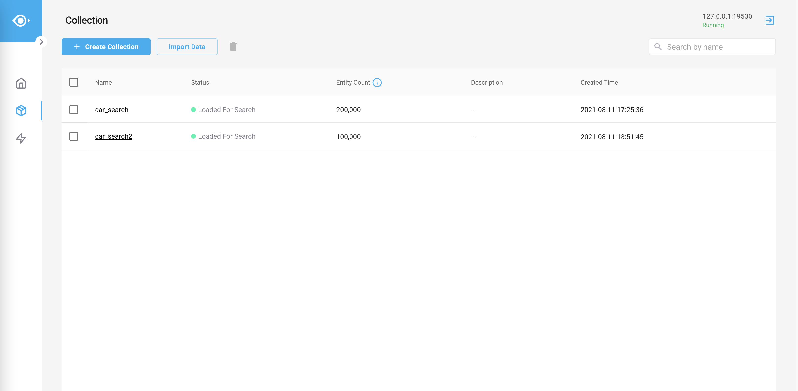
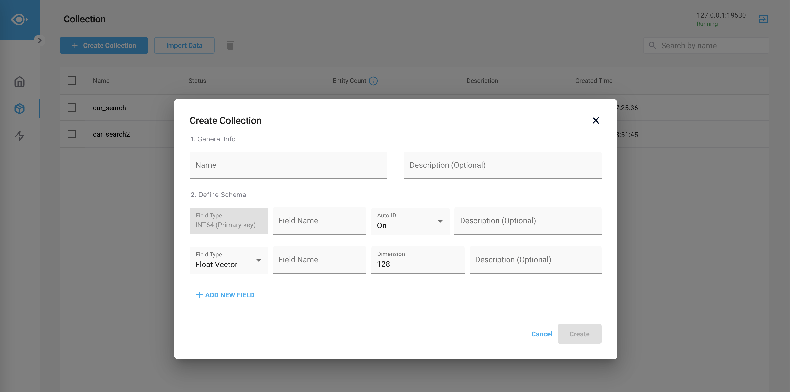
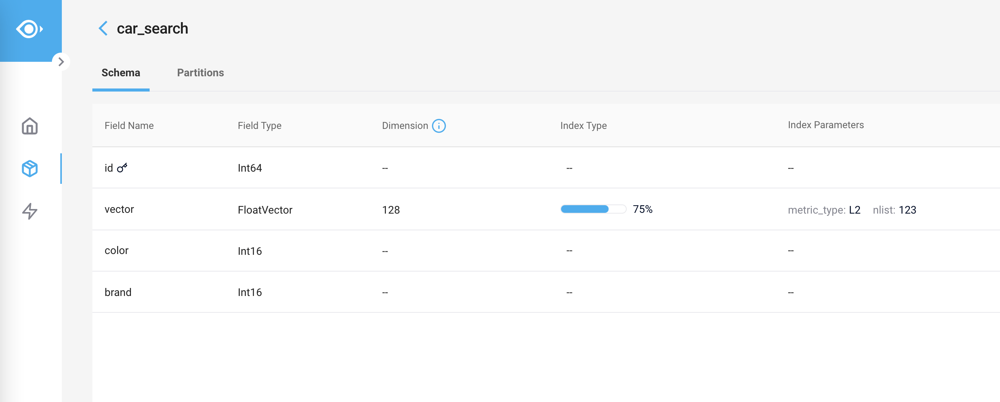
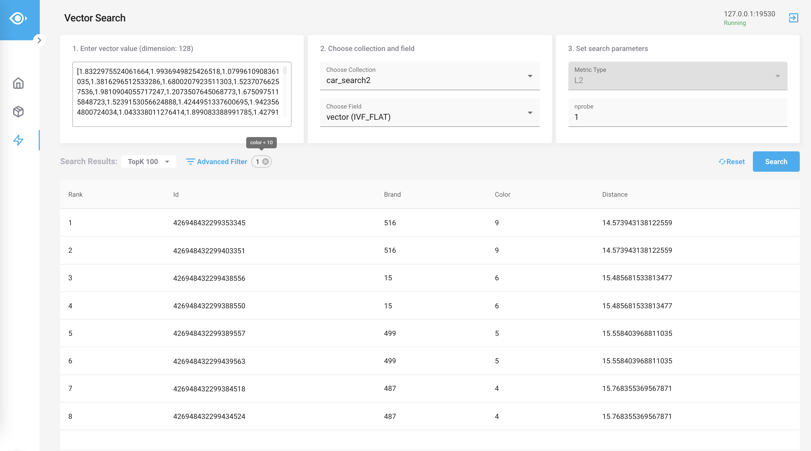
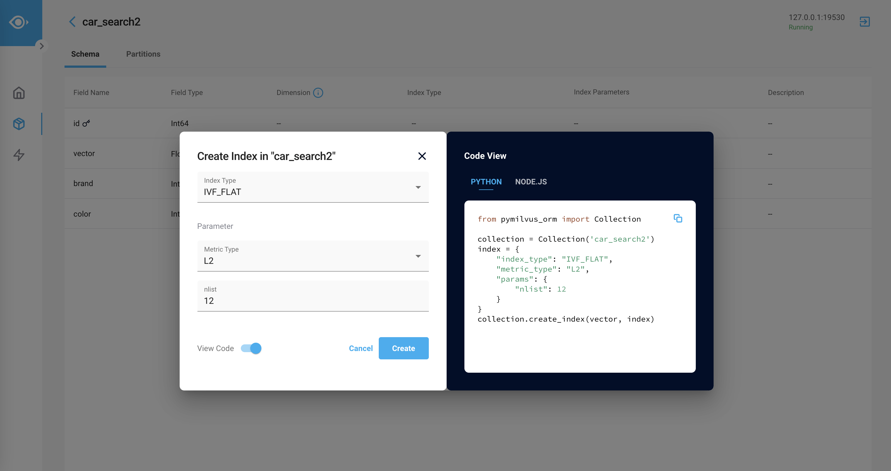

# Milvus Insight 简介

[Milvus Insight](https://github.com/milvus-io/milvus-insight) 是一款专为 Milvus 开发的开源工具，可用于高效管理 Milvus 数据库。通过 Milvus Insight 直观的图形用户界面（GUI），你只需轻松点击鼠标便可查看集群状态、管理元数据、查询数据等。

## 功能
Milvus Insight 目前正处于快速开发的阶段中，我们每周都将发布新版本，推出新功能。

Milvus Insight 提供以下功能：

- 快速掌握 Milvus 集群数据。（开发中）

- 简洁直观地了解、查询、管理 collection。

- 轻松实现数据批量增删改查。

- 迅速创建向量索引。

- 以全新的方式检索向量。

- 代码模式（code-mode）窗口带来更佳的用户体验。

了解如何 [安装 Milvus Insight](insight_install.md)。

## 贡献代码

欢迎向开源项目 Milvus Insight 贡献代码。贡献代码前，请先阅读[贡献指南](https://github.com/milvus-io/milvus-insight#-building-and-running-milvus-insight-andor-contributing-code)。

请通过创建 [GitHub Issue](https://github.com/milvus-io/milvus-insight/issues/new/choose) 来反馈 bug 或建议新功能。请不要重复创建相同的 issue。

