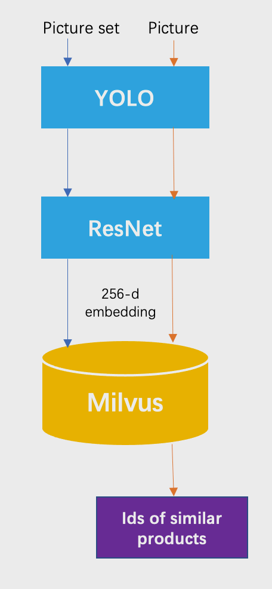
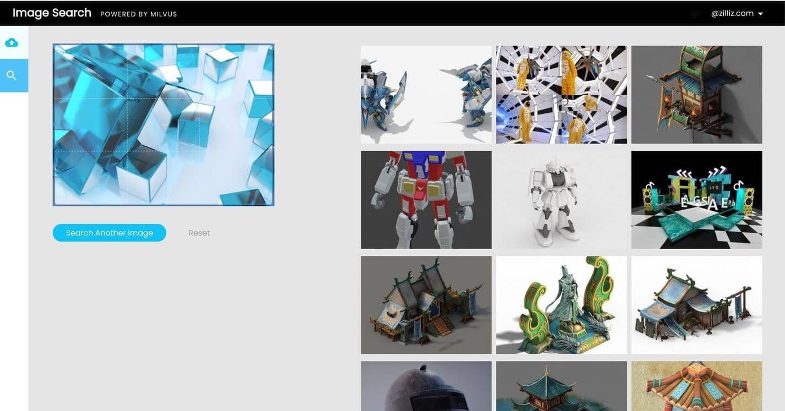

# 图片相似度检索

本教程将介绍如何使用开源向量数据库 Milvus 搭建图片相似度检索系统。

- [打开 Jupyter notebook](https://github.com/milvus-io/bootcamp/blob/master/solutions/reverse_image_search/reverse_image_search.ipynb)
- [快速部署](https://github.com/milvus-io/bootcamp/blob/master/solutions/reverse_image_search/quick_deploy)
- [在线体验](https://milvus.io/milvus-demos/)
本教程中使用到的 ML 模型及第三方软件包括：
- YOLOv3
- ResNet-50
- MySQL

 

像谷歌这样的大型搜索引擎已经为用户提供了按图片搜索的选项。另外，电商平台已经意识到以图搜图功能可以方便网购者，所以亚马逊在其智能手机应用程序中集成了以图搜图功能。

 

在本教程中，你将学会如何构建一个图片相似度检索系统。该系统可以检测图案，并返回与你上传的图片相似的其他图片。为了搭建这样一个图片相似度检索系统，请先下载包含 20 个类别、17125 张图片的 PASCAL VOC 图片数据集。然后使用 YOLOv3 进行目标检测、使用 ResNet-50 进行图像特征提取。 所有图片通过上述两个机器学习（ML）模型被转换为 256 维的向量。将图片向量存储在 Milvus 中，Milvus 自动为每个向量生成唯一的 ID。 然后使用 MySQL 用于存储 向量 ID 及数据集图片间的映射关系。新上传到图片搜索系统中的图片将被转换为新的向量，Milvus 将比较新向量与之前存储在 Milvus 中的所有向量数据的相似度，并返回最相似向量的 ID。随后，你可以在 MySQL 中查询 ID 所对应的图像。

 

