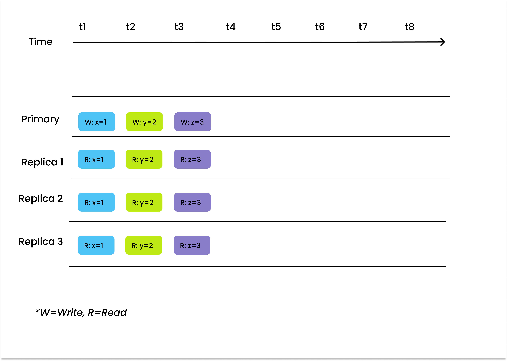
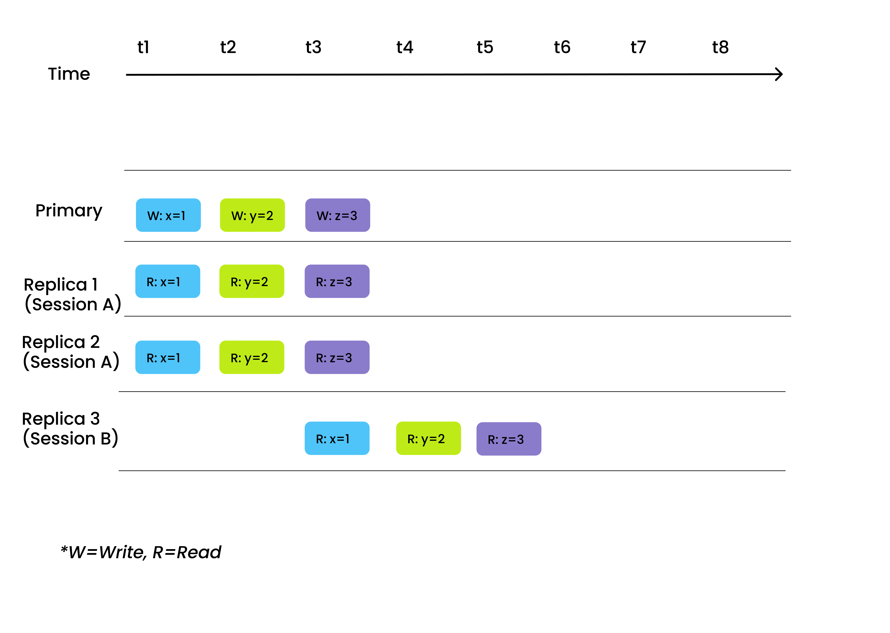

This topic introduces the four levels of consistency in Milvus and their best-suited scenarios. The mechanism behind ensuring consistency in Milvus is also covered in this topic.

## Overview

Consistency in a distributed database specifically refers to the property that ensures every node or replica has the same view of data when writing or reading data at a given time. 

Milvus supports four consistency levels:  strong, bounded staleness, session, and eventual. The default consistency level in Milvus is bounded staleness.  You can easily tune the consistency level when [creating a collection](create_collection.md) or conducting a [vector similarity search](search.md) or [query](query.md) to make it best suit your application.

## Consistency levels

As defined by the [PACELC](https://en.wikipedia.org/wiki/PACELC_theorem) theorem, a distributed database has to trade off among consistency, availability, and latency. High consistency implies high accuracy but also high search latency, while low consistency leads to fast search speed but a certain loss of data visibility. Therefore, different levels of consistency suit different scenarios.

The following explains the differences of the four consistency levels supported by Milvus and the scenarios they each suit.

### Strong

Strong is the highest and the most strict level of consistency. It ensures that users can read the latest version of data. 

According to the PACELC theorem, if the consistency level is set to strong, the latency will increase. Therefore, we recommend choosing strong consistency during functional testings to ensure the accuracy of the test results. Strong consistency is also best suited for applications that have strict demand for data consistency at the cost of search speed. An example can be an online financial system dealing with order payments and billing.

### Bounded staleness

Bounded staleness, as its name suggests, allows data inconsistency during a certain period of time. However, generally, the data are always globally consistent out of that period of time.

Bounded staleness is suitable for scenarios that need to control search latency and can accept sporadic data invisibility. For instance, in recommender systems like video recommendation engines, data invisibility sometimes has small impact on the overall recall rate, but can significantly boost the performance of the recommender system. 

### Session

Session ensures that all data writes can be immediately perceived in reads during the same session. In other words, when you write data via one client, the newly inserted data instantaneously become searchable. 

We recommend choosing session as the consistency level for those scenarios where the demand for data consistency in the same session is high. An example can be deleting the data of a book entry from the library system, and after confirmation of the deletion and refreshing the page (a different session), the book should no longer be visible in the search results.

### Eventual

There is no guaranteed order of reads and writes, and replicas eventually converge to the same state given that no further write operations are done. Under eventual consistency, replicas start working on read requests with the latest updated values. Eventual consistency is the weakest level among the four. 

However, according to the PACELC theorem, search latency can be tremendously shortened upon sacrificing consistency. Therefore, eventual consistency is best suited for scenarios that do not have a high demand for data consistency but require blazing-fast search performance. An example can be retrieving reviews and ratings of Amazon products with eventual consistency. 

## Guarantee timestamp

Milvus realizes different consistency levels by introducing the [Guarantee timestamp](https://github.com/milvus-io/milvus/blob/f3f46d3bb2dcae2de0bdb7bc0f7b20a72efceaab/docs/developer_guides/how-guarantee-ts-works.md) (GuaranteeTs).

A GuaranteeTs serves to inform query nodes that a search or query request will not be performed until all the data before the GuaranteeTs can be seen by the query nodes. When you specify the consistency level, the consistency level will map to a specific GuaranteeTs value. Different GuaranteeTs values correspond to different consistency levels:

- **Strong**: GuaranteeTs is set as identical to the newest system timestamp, and query nodes wait until all the data before the newest system timestamp can be seen, before processing the search or query request.

- **Bounded staleness**: GuaranteeTs is set relatively smaller than the newest system timestamp, and query nodes search on a tolerable, less updated data view.

- **Session**: The client uses the timestamp of the latest write operation as the GuaranteeTs, so that each client can at least retrieve the data inserted by the same client.

- **Eventual**: GuaranteeTs is set to a very small value to skip the consistency check. Query nodes search immediately on the existing data view.

See [How GuaranteeTs Works](https://github.com/milvus-io/milvus/blob/f3f46d3bb2dcae2de0bdb7bc0f7b20a72efceaab/docs/developer_guides/how-guarantee-ts-works.md) and [All The Things You Should Know About Time Synchronization](https://github.com/milvus-io/milvus/blob/master/docs/design_docs/milvus_timesync_en.md?from=from_parent_mindnote) for more information about the mechanism behind ensuring different levels of consistency in Milvus.
