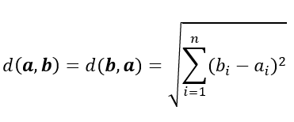

# Similarity Metrics

In Milvus, similarity metrics are used to measure similarities among vectors. Choosing a good distance metric helps improve the classification and clustering performance significantly.

The following table shows how these widely used similarity metrics fit with various input data forms and Milvus indexes.

<a href="#floating">Floating point embeddings</a> <a href="#binary">Binary embeddings</a>

<table class="tg">
<thead>
  <tr>
    <th class="tg-0pky" style="width: 204px;">Similarity Metrics</th>
    <th class="tg-0pky">Index Types</th>
  </tr>
</thead>
<tbody>
  <tr>
    <td class="tg-0pky"><ul><li>Euclidean distance (L2)</li><li>Inner product (IP)</li></td>
    <td class="tg-0pky" rowspan="2"><ul><li>FLAT</li><li>IVF_FLAT</li><li>IVF_SQ8</li><li>IVF_PQ</li><li>HNSW</li><li>IVF_HNSW</li><li>RHNSW_FLAT</li><li>RHNSW_SQ</li><li>RHNSW_PQ</li><li>ANNOY</li></ul></td>
  </tr>
</tbody>
</table>

<table class="tg">
<thead>
  <tr>
    <th class="tg-0pky" style="width: 204px;">Distance Metrics</th>
    <th class="tg-0pky">Index Types</th>
  </tr>
</thead>
<tbody>
  <tr>
    <td class="tg-0pky"><ul><li>Jaccard</li><li>Tanimoto</li><li>Hamming</li></ul></td>
    <td class="tg-0pky"><ul><li>BIN_FLAT</li><li>BIN_IVF_FLAT</li></ul></td>
  </tr>
  <tr>
    <td class="tg-0pky"><ul><li>Superstructure</li><li>Substructure</li></ul></td>
    <td class="tg-0pky">BIN_FLAT</td>
  </tr>
</tbody>
</table>

### Euclidean distance (L2)

Essentially, Euclidean distance measures the length of a segment that connects 2 points.

The formula for Euclidean distance is as follows:

where **a** = (a1, a2,..., an) and **b** = (b1, b2,..., bn) are two points in n-dimensional Euclidean space

It's the most commonly used distance metric and is very useful when the data are continuous.

Milvus only caculates the value before applying square root when Euclidean distance is chosen as the distance metric.

### Inner product (IP)

The IP distance between two embeddings are defined as follows: 

Where A and B are embeddings, `||A||` and `||B||` are the norms of A and B.

IP is more useful if you are more interested in measuring the orientation but not the magnitude of the vectors.

 If you use IP to calculate embeddings similarities, you must normalize your embeddings. After normalization, the inner product equals cosine similarity.

Suppose X' is normalized from embedding X: 

The correlation between the two embeddings is as follows: 

### Jaccard distance

Jaccard similarity coefficient measures the similarity between two sample sets and is defined as the cardinality of the intersection of the defined sets divided by the cardinality of the union of them. It can only be applied to finite sample sets.

Jaccard distance measures the dissimilarity between data sets and is obtained by subtracting the Jaccard similarity coefficient from 1. For binary variables, Jaccard distance is equivalent to the Tanimoto coefficient.

### Tanimoto distance

For binary variables, the Tanimoto coefficient is equivalent to Jaccard distance:

In Milvus, the Tanimoto coefficient is only applicable for a binary variable, and for binary variables, the Tanimoto coefficient ranges from 0 to +1 (where +1 is the highest similarity).

For binary variables, the formula of Tanimoto distance is:

The value ranges from 0 to +infinity.

### Hamming distance

Hamming distance measures binary data strings. The distance between two strings of equal length is the number of bit positions at which the bits are different.

For example, suppose there are two strings, 1101 1001 and 1001 1101.

11011001 ⊕ 10011101 = 01000100. Since, this contains two 1s, the Hamming distance, d (11011001, 10011101) = 2.

### Superstructure

The Superstructure is used to measure the similarity of a chemical structure and its superstructure. When the value equals 0, this means the chemical structure in the database is the superstructure of the target chemical structure.

Superstructure similarity can be measured by:

Where

- B is the superstructure of A
- NA specifies the number of bits in the fingerprint of molecular A.
- NB specifies the number of bits in the fingerprint of molecular B.
- NAB specifies the number of shared bits in the fingerprint of molecular A and B.

### Substructure

The Substructure is used to measure the similarity of a chemical structure and its substructure. When the value equals 0, this means the chemical structure in the database is the substructure of the target chemical structure.

Substructure similarity can be measured by:

Where

- B is the substructure of A
- NA specifies the number of bits in the fingerprint of molecular A.
- NB specifies the number of bits in the fingerprint of molecular B.
- NAB specifies the number of shared bits in the fingerprint of molecular A and B.

## FAQ

Why is the top1 result of a vector search not the search vector itself, if the metric type is inner product?

This occurs if you have not normalized the vectors when using inner product as the distance metric.

What is normalization? Why is normalization needed?

Normalization refers to the process of converting an embedding (vector) so that its norm equals 1. If you use Inner Product to calculate embeddings similarities, you must normalize your embeddings. After normalization, inner product equals cosine similarity.

See <a href="https://en.wikipedia.org/wiki/Unit_vector">Wikipedia</a> for more information.

Why do I get different results using Euclidean distance (L2) and inner product (IP) as the distance metric?

Check if the vectors are normalized. If not, you need to normalize the vectors first. Theoretically speaking, similarities worked out by L2 are different from similarities worked out by IP, if the vectors are not normalized.

## What's next

- Learn more about the supported [index types](index.md) in Milvus.
