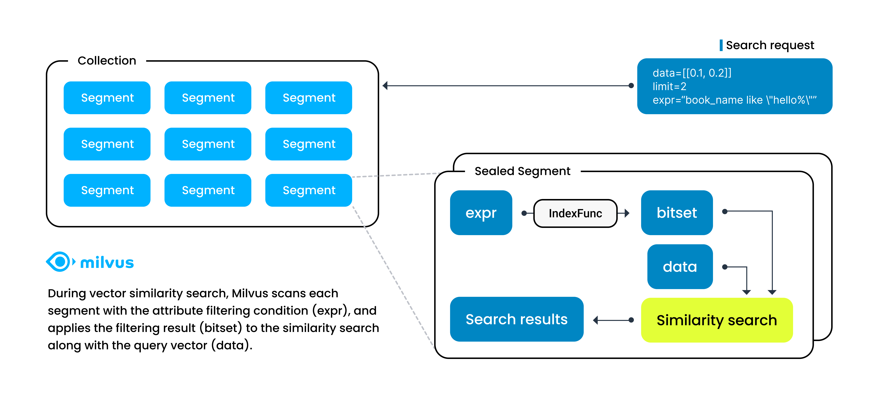

# Scalar Index

Milvus supports [hybrid searches](hybridsearch.md) using both scalar and vector fields. To speed up searching among entities by scalar fields, Milvus introduced scalar field indexing in version 2.1.0. This article helps you understand scalar field indexing in Milvus.

## Overview

Once conducting vector similarity searches in Milvus, you can use logical operators to organize scalar fields into boolean expressions. 

When Milvus receives a search request with such a boolean expression, it parses the boolean expression into an abstract syntax tree (AST) to generate a physical plan for attribute filtering. Milvus then applies the physical plan in each segment to generate a [bitset](bitset.md) as the filtering result and includes the result as a vector search parameter to narrow down the search scope. In this case, the speed of vector searches relies heavily on the speed of attribute filtering.

Scalar field indexing is a way of ensuring the speed of attribute filtering by sorting scalar field values in a particular way to accelerate information retrieval. 

## Scalar field indexing algorithms

Milvus implements scalar field indexing with the goal of low memory usage, high filtering efficiency, and short loading time.

Specifically, indexing algorithms for scalar fields vary with field data types. The following table lists the data types that Milvus supports and their corresponding default indexing algorithms.

| Data type                     | Default indexing algorithm        |
| ----------------------------- | --------------------------------- |
| VARCHAR                       | MARISA-trie                       |
| INT16                         | STL sort                          |
| INT32                         | STL sort                          |
| INT64                         | STL sort                          |
| FLOAT                         | STL sort                          |
| DOUBLE                        | STL sort                          |

## Performance recommandations

To take full advantage of Milvus' capability in scalar field indexing and unleash its power in vector similarity searches, you may need a model to estimate the size of memory required based on the data you have.

The following tables list the estimation functions for all the data types that Milvus supports.

- Numeric fields

    | Data type                      | Memory estimation function (MB)      |
    | ------------------------------ | ------------------------------------ |
    | INT8                           | numOfRows * **12** / 1024 / 1024     |
    | INT16                          | numOfRows * **12** / 1024 / 1024     |
    | INT32                          | numOfRows * **12** / 1024 / 1024     |
    | INT64                          | numOfRows * **24** / 1024 / 1024     |
    | FLOAT32                        | numOfRows * **12** / 1024 / 1024     |
    | DOUBLE                         | numOfRows * **24** / 1024 / 1024     |

- String fields

    | String length                  | Memory estimation function (MB)      |
    | ------------------------------ | ------------------------------------ |
    | (0, 8]                         | numOfRows * **128** / 1024 / 1024    |
    | (8, 16]                        | numOfRows * **144** / 1024 / 1024    |
    | (16, 32]                       | numOfRows * **160** / 1024 / 1024    |
    | (32, 64]                       | numOfRows * **192** / 1024 / 1024    |
    | (64, 128]                      | numOfRows * **256** / 1024 / 1024    |
    | (128, 65535]                   | numOfRows * **strLen * 1.5** / 1024 / 1024    |

## What's next

- To index a scalar field, read [Build an Index on Scalars](index-scalar-fields.md).
- To learn more about the related terms and rules mentioned above, read

    - [Bitset](bitset.md)
    - [Hybrid search](hybridsearch.md)
    - [Boolean expression rules](boolean.md)
    - [Supported data types](schema.md#Supported-data-type)
