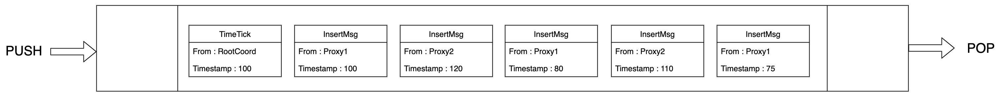

# Time Synchronization

This topic introduces the time synchronization mechanism in Milvus.

## Overview

The events in Milvus can be generally categorized in to two types:

- Data definition language (DDL) events: create/drop a collection, create/drop a partition, etc.

- Data manipulation language (DML) events: insert, search, etc.

Any event, no matter it is DDL or DML event, is marked with a timestamp that can indicate when this event occurs.

Suppose there are two users who initiate a series of DML and DDL events in Milvus in the time order shown in the following table.

| Timestamp |                  User 1                  |                 User 2                 |
|:---------:|:----------------------------------------:|:--------------------------------------:|
|     t0    |     Created a collection named `C0`.     |                    /                   |
|     t2    |                     /                    | Conducted a search on collection `C0`. |
|     t5    | Inserted data `A1` into collection `C0`. |                    /                   |
|     t7    |                     /                    | Conducted a search on collection `C0`. |
|    t10    | Inserted data `A2` into collection `C0`. |                    /                   |
|    t12    |                     /                    |  Conducted a search on collection `C0` |
|    t15    |  Deleted data `A1` from collection `C0`. |                    /                   |
|    t17    |                     /                    |  Conducted a search on collection `C0` |

Ideally, user 2 should be able to see:

- An empty collection `C0` at `t2`.

- Data `A1` at `t7`.

- Both data `A1` and `A2` at `t12`.

- Only data `A2` at `t17` (as data `A1` has been deleted from the collection before this point).

This ideal scenario can be easily achieved when there is only one single node. However, Milvus is a distributed vector database, and to ensure all DML and DDL operations in different nodes are kept in order, Milvus needs to address the following two issues:

1. The time clock is different for the two users in the example above if they are on different nodes. For instance, if user 2 is 24 hours behind user 1, all operations by user 1 are not visible to user 2 until the next day.

2. There can be network latency. If user 2 conducts a search on collection `C0` at `t17`, Milvus should be able to guarantee that all the operations before `t17` are successfully processed and completed. If the delete operation at `t15` is delayed due to network latency, it is very likely that user 2 can still see the supposedly deleted data `A1` when conducting a search at `t17`.

Therefore, Milvus adopts a time synchronization system (timetick) to solve the issues.

## Timestamp oracle (TSO)

To solve the first issue mentioned in the previous section, Milvus, like other distributed systems, provides a timestamp oracle (TSO) service. This means that all events in Milvus must be allocated with a timestamp from TSO rather than from the local clock. 

The TSO service is provided by the root coordinator in Milvus. Clients can allocate one or more timestamps in a single timestamp allocation request. 

A TSO timestamp is a type of `uint64` value that is made up of a physical part and a logical part. The figure below demonstrates the format of a timestamp.

.

As illustrated, the 46 bits at the beginning is the physical part, namely the UTC time in milliseconds. The last 18 bits is the logical part.

 

## Time synchronization system (timetick)

This section uses the example of a data insertion operation to explain the time synchronization mechanism in Milvus. 

When proxy receives a data insertion request from SDK, it divides the insert messages into  different message streams (`MsgStream`) according to the hash value of the primary keys. 

Each insert message (`InsertMsg`) is assigned a timestamp before being sent to the `MsgStream`.

  <code>MsgStream</code> is a wrapper of the message queue, which is Pulsar by default in Milvus 2.0.

One general principle is that in the `MsgStream`, the timestamps of the`InsertMsgs` from the same proxy must be incremental. However, there is no such rule for those of the `InsertMsgs` from different proxies.

The following figure is an example of `InsertMsgs` in a `MsgStream`. The snippet contains five `InsertMsgs`, three of which are from `Proxy1` and the rest from `Proxy2`.

The timestamps of the three `InsertMsgs` from `Proxy1` are incremental, and so are the two `InsertMsgs` from `Proxy2`. However, there is no particular order among `Proxy1` and `Proxy2` `InsertMsgs` .

One possible scenario is that when reading a message with timestamp `110` from `Proxy2`, Milvus finds that the message with timestamp `80` from `Proxy1` is still in the `MsgStream`. Therefore, Milvus introduces a time synchronization system, timetick, to ensure that when reading a message from `MsgStream`, all messages with smaller timestamp values must be consumed. 

As shown in the figure above,

- Each proxy periodically (every 200 ms by default) reports the largest timestamp value of the latest `InsertMsg` in the `MsgStream`to root coord. 

- Root coord identifies the minimum timestamp value on this `Msgstream`, no matter to which proxy does the `InsertMsgs` belong. Then root coord  inserts this minimum timestamp into the `Msgstream`. This timestamp is also called timetick.

- When the consumer components reads the timetick inserted by root coord, they understand that all insert messages with smaller timestamp values have been consumed. Therefore, relevant requests can be executed safely without interrupting the order.

The following figure is an example of the `Msgstream` with a timetick inserted.

`MsgStream` processes the messages in batches according to the time tick to ensure that the output messages meet the requirements of timestamp. 

## What's next
- Learn about the concept of [timestamp](timestamp.md).
- Learn about the [data processing workflow](data_processing.md) in Milvus.
