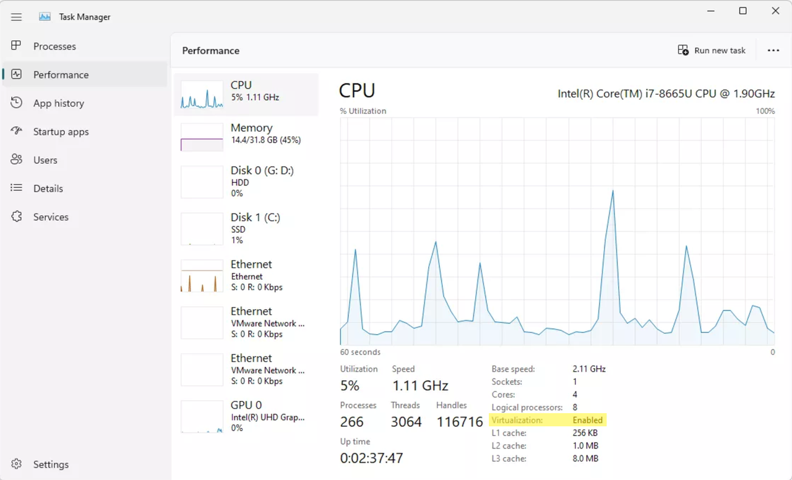
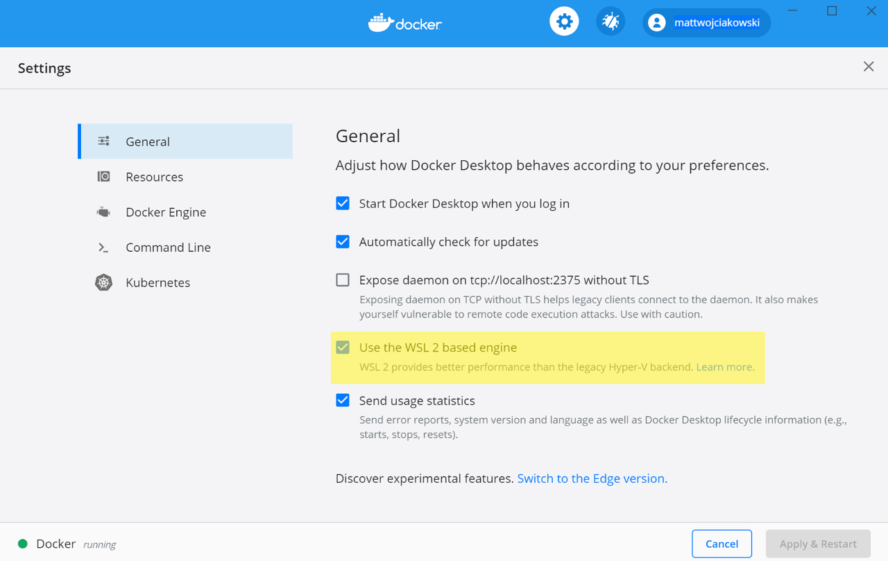
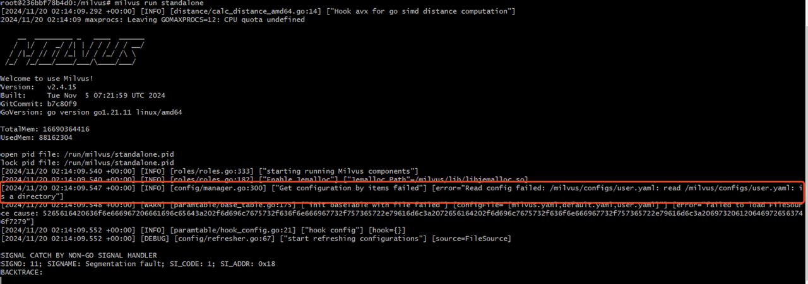

# Run Milvus in Docker (Windows)

This page demonstrates how to run Milvus on Windows using Docker Desktop for Windows.​

## Prerequisites​

- [Install Docker Desktop](https://docs.docker.com/desktop/setup/install/windows-install/).​

- [Install Windows Subsystem for Linux 2 (WSL 2)](https://learn.microsoft.com/en-us/windows/wsl/install#install-wsl-command).​

- Install Python 3.8+.​

## Run Milvus in Docker​

Milvus provides an installation script to install it as a Docker container. Once you have installed Docker Desktop on Microsoft Windows, you can access the Docker CLI from PowerShell or Windows Command Prompt in **administrator** mode and from WSL 2. ​

### From PowerShell or Windows Command Prompt​

If you are more familiar with PowerShell or Windows Command Prompt, the command prompt is as follows.​

1. Open Docker Desktop in administrator mode by right-clicking and selecting **Run as administrator**.​

2. Download the installation script and save it as `standalone.bat`.​

    ```powershell
    C:\>Invoke-WebRequest https://github.com/milvus-io/milvus/blob/master/scripts/standalone_embed.bat -OutFile standalone.bat​

    ```

3. Run the downloaded script to start Milvus as a Docker container.​

    ```powershell
    C:\>standalone.bat start​
    Wait for Milvus starting...​
    Start successfully.​
    To change the default Milvus configuration, edit user.yaml and restart the service.​

    ```

    After running the installation script:​

    - A docker container named **milvus-standalone** has been started at port **19530**.​

    - An embed etcd is installed along with Milvus in the same container and serves at port **2379**. Its configuration file is mapped to **embedEtcd.yaml** in the current folder.​

    - The Milvus data volume is mapped to **volumes/milvus** in the current folder.​

    You can use the following commands to manage the Milvus container and stored data.​

    ```powershell
    # Stop Milvus​
    C:\>standalone.bat stop​
    Stop successfully.​
    ​
    # Delete Milvus container​
    C:\>standalone.bat delete​
    Delete Milvus container successfully. # Container has been removed.​
    Delete successfully. # Data has been removed.​

    ```

### From WSL 2​

If you prefer to start Milvus using Linux commands and shell scripts on Windows, ensure that you already have installed the WSL 2 command. For details on how to install WSL 2 command, you can refer to this [Microsoft article](https://learn.microsoft.com/en-us/windows/wsl/install#install-wsl-command).​

1. Start WSL 2.​

    ```powershell
    C:\>wsl --install​
    Ubuntu already installed.​
    Starting Ubuntu...​

    ```

2. Download the installation script​

    ```bash
    # Download the installation script​
    $ curl -sfL https://raw.githubusercontent.com/milvus-io/milvus/master/scripts/standalone_embed.sh -o standalone_embed.sh​
    ​
    # Start the Docker container​
    $ bash standalone_embed.sh start​

    ```

3. Start Milvus as a docker container.​

    ```bash
    $ bash standalone_embed.sh start​
    Wait for Milvus Starting...​
    Start successfully.​
    To change the default Milvus configuration, add your settings to the user.yaml file and then restart the service.​

    ```

    You can use the following commands to manage the Milvus container and stored data.​

    ```bash
    # Stop Milvus​
    $ bash standalone_embed.sh stop​
    Stop successfully.​
    ​
    # Delete Milvus data​
    $ bash standalone_embed.sh stop​
    Delete Milvus container successfully.​
    Delete successfully.​

    ```

## Run Milvus with Docker Compose​

Once you have installed Docker Desktop on Microsoft Windows, you can access the Docker CLI from the PowerShell or Windows Command Prompt in **administrator** mode. You can run Docker Compose either in PowerShell, Windows Command Prompt, or WSL 2 to start Milvus.​

### From PowerShell or Windows Command Prompt​

1. Open Docker Desktop in administrator mode by right-clicking and selecting **Run as administrator**.​

2. Run the following commands in PowerShell or Windows Command Prompt to download the Docker Compose configuration file for Milvus Standalone and start Milvus.​

    ```powershell
    # Download the configuration file and rename it as docker-compose.yml​
    C:\>Invoke-WebRequest https://github.com/milvus-io/milvus/releases/download/v2.4.15/milvus-standalone-docker-compose.yml -OutFile docker-compose.yml​
    ​
    # Start Milvus​
    C:\>docker-compose up -d​
    Creating milvus-etcd  ... done​
    Creating milvus-minio ... done​
    Creating milvus-standalone ... done​

    ```

    Depending on your network connection, downloading images for the Milvus installation may take a while. Once the containers named **milvus-standalone**, **milvus-minio**, and **milvus-etcd** are up, you can witness that ​

    - The **milvus-etcd** container does not expose any ports to the host and maps its data to **volumes/etcd** in the current folder.​

    - The **milvus-minio** container serves ports **9090** and **9091** locally with the default authentication credentials and maps its data to **volumes/minio** in the current folder.​

    - The **milvus-standalone** container serves ports **19530** locally with the default settings and maps its data to **volumes/milvus** in the current folder.​

You can also call the Linux version of the Docker Compose commands if you have WSL 2 installed.​

### From WSL 2​

The procedure is similar to using Docker Compose to install Milvus in Linux systems.​

1. Start WSL 2.​

    ```powershell
    C:\>wsl --install​
    Ubuntu already installed.​
    Starting Ubuntu...​

    ```

2. Download the Milvus configuration file.​

    ```shell
    $ wget https://github.com/milvus-io/milvus/releases/download/v2.4.17/milvus-standalone-docker-compose.yml -O docker-compose.yml​

    ```

3. Start Milvus.​

    ```shell
    $ sudo docker-compose up -d​
    ​
    Creating milvus-etcd  ... done​
    Creating milvus-minio ... done​
    Creating milvus-standalone ... done​

    ```

## FAQs​

### How can I deal with the `Docker Engine stopped` error?​

Once you install Docker Desktop in Windows, you may encounter the `Docker Engine stopped` error if your computer are not configured properly. In this case, you may need to make the following checks:​

1. Check whether virtualization is enabled.​

    You can check whether virtualization is enabled by looking at the **Performance** tab in the **Task Manager**.​

    

    If virtualization is disabled, you may need to check the BIOS settings of your motherboard firmware. The way to enable virtualization in BIOS settings varies with motherboard vendors. For the ASUS motherboard, for example, you can refer to [this article](https://www.asus.com/support/faq/1043786/) on enabling virtualization.​

    Then, you need to restart your computer and enable Hyper-V. For details, refer to this [Microsoft article](https://learn.microsoft.com/en-us/virtualization/hyper-v-on-windows/quick-start/enable-hyper-v#enable-the-hyper-v-role-through-settings).​

2. Check whether the Docker Desktop Service has been started.​

    You can run the following command to start the Docker Desktop Service.​

    ```powershell
    C:\>net start com.docker.service​
    The Docker for Windows Service service is starting.​
    The Docker for Windows Service service was started successfully.​

    ```

3. Check whether WSL has been installed properly.​

    You can run the following command to install or update the WSL 2 command.​

    ```powershell
    C:\>wsl --update​
    Checking for updates.​
    The most recent version of Windows Subsystem for Linux is already installed.​

    ```

4. Check whether Docker Daemon has been started.​

    You need to go to the installation directory of Docker Desktop and run `.\DockerCli.exe -SwitchDaemon` to start Docker Daemon.​

    ```powershell
    C:\>cd "C:\Program Files\Docker\Docker"​
    C:\Program Files\Docker\Docker>.\DockerCli.exe -SwitchDaemon​
    Switching to windows engine: Post "http://ipc/engine/switch": open \\.\pipe\dockerBackendApiServer: The system cannot find the file specified.​

    ```

5. Check whether you have started Docker Desktop in **administrator** mode.​

    Ensure that you have started Docker Desktop in administrator mode. To do so, right-click on **Docker Desktop** and choose **Run as administrator**.​

    

### How can I deal with WSL-related issues while deploying Milvus?​

If you have encountered WSL-related issues while running Milvus from WSL 2, you may need to check whether you have configured Docker Desktop to use the WSL 2-based engine as follows:​

1. Ensure that "Use the WSL 2 based engine" is checked in **Settings** > **General**. ​

    

2. Select from your installed WSL 2 distributions which you want to enable Docker integration on by going to: **Settings** > **Resources** > **WSL Integration**.​

    

### How can I deal with the volume-related errors prompted during Milvus startup that reads `Read config failed`?​



To deal with the error prompted during Milvus startup that reads "Read config failed," you need to check whether the volume mounted into the Milvus container is correct. If the volume is correctly mounted into the container, you can use the `docker exec` command to go into the container and list the **/milvus/configs** folder as follows:​


​

