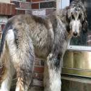

# Image Search with Milvus

<a href="https://colab.research.google.com/github/milvus-io/bootcamp/blob/master/bootcamp/tutorials/quickstart/image_search_with_milvus.ipynb" target="_parent"></a>

In this notebook, we will show you how to use Milvus to search for similar images in a dataset. We will use a subset of the [ImageNet](https://www.image-net.org/) dataset, then search for an image of an Afghan hound to demonstrate this.


## Dataset Preparation
First, we need to load the dataset and unextract it for further processing.


```python
!wget https://github.com/milvus-io/pymilvus-assets/releases/download/imagedata/reverse_image_search.zip
!unzip -q -o reverse_image_search.zip
```

## Prequisites

To run this notebook, you need to have the following dependencies installed:
- pymilvus>=2.4.2
- timm
- torch
- numpy
- sklearn
- pillow 

To run Colab, we provide the handy commands to install the necessary dependencies.


```python
$ pip install pymilvus --upgrade
$ pip install timm
```

<div class="alert note">

If you are using Google Colab, to enable dependencies just installed, you may need to **restart the runtime**.

</div>

## Define the Feature Extractor
Then, we need to define a feature extractor which extracts embedding from an image using timm's ResNet-34 model.


```python
import torch
from PIL import Image
import timm
from sklearn.preprocessing import normalize
from timm.data import resolve_data_config
from timm.data.transforms_factory import create_transform


class FeatureExtractor:
    def __init__(self, modelname):
        # Load the pre-trained model
        self.model = timm.create_model(
            modelname, pretrained=True, num_classes=0, global_pool="avg"
        )
        self.model.eval()

        # Get the input size required by the model
        self.input_size = self.model.default_cfg["input_size"]

        config = resolve_data_config({}, model=modelname)
        # Get the preprocessing function provided by TIMM for the model
        self.preprocess = create_transform(**config)

    def __call__(self, imagepath):
        # Preprocess the input image
        input_image = Image.open(imagepath).convert("RGB")  # Convert to RGB if needed
        input_image = self.preprocess(input_image)

        # Convert the image to a PyTorch tensor and add a batch dimension
        input_tensor = input_image.unsqueeze(0)

        # Perform inference
        with torch.no_grad():
            output = self.model(input_tensor)

        # Extract the feature vector
        feature_vector = output.squeeze().numpy()

        return normalize(feature_vector.reshape(1, -1), norm="l2").flatten()
```

## Create a Milvus Collection
Then we need to create Milvus collection to store the image embeddings.


```python
from pymilvus import MilvusClient

# Set up a Milvus client
client = MilvusClient(uri="example.db")
# Create a collection in quick setup mode
client.create_collection(
    collection_name="image_embeddings",
    vector_field_name="vector",
    dimension=512,
    auto_id=True,
    enable_dynamic_field=True,
    metric_type="COSINE",
)
```

## Insert the Embeddings to Milvus
We will extract embeddings of each image using the ResNet34 model and insert images from the training set into Milvus.


```python
import os

extractor = FeatureExtractor("resnet34")

root = "./train"
insert = True
if insert is True:
    for dirpath, foldername, filenames in os.walk(root):
        for filename in filenames:
            if filename.endswith(".JPEG"):
                filepath = dirpath + "/" + filename
                image_embedding = extractor(filepath)
                client.insert(
                    "image_embeddings",
                    {"vector": image_embedding, "filename": filepath},
                )
```


```python
from IPython.display import display

query_image = "./test/Afghan_hound/n02088094_4261.JPEG"

results = client.search(
    "image_embeddings",
    data=[extractor(query_image)],
    output_fields=["filename"],
    search_params={"metric_type": "COSINE"},
)
images = []
for result in results:
    for hit in result[:10]:
        filename = hit["entity"]["filename"]
        img = Image.open(filename)
        img = img.resize((150, 150))
        images.append(img)

width = 150 * 5
height = 150 * 2
concatenated_image = Image.new("RGB", (width, height))

for idx, img in enumerate(images):
    x = idx % 5
    y = idx // 5
    concatenated_image.paste(img, (x * 150, y * 150))
display("query")
display(Image.open(query_image).resize((150, 150)))
display("results")
display(concatenated_image)
```


    'query'


    

    


    'results'


    

    


We can see that most of the images are from the same category as the search image, which is the Afghan hound. This means that we found similar images to the search image.
